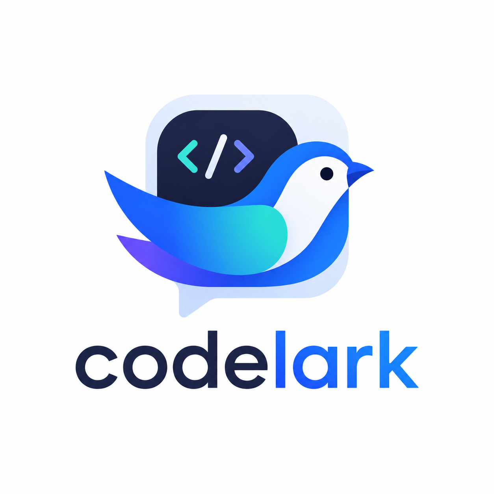
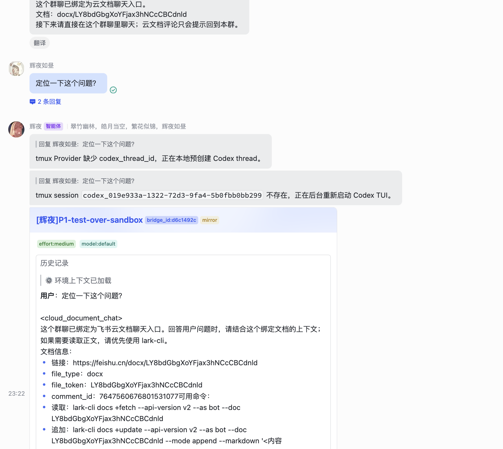
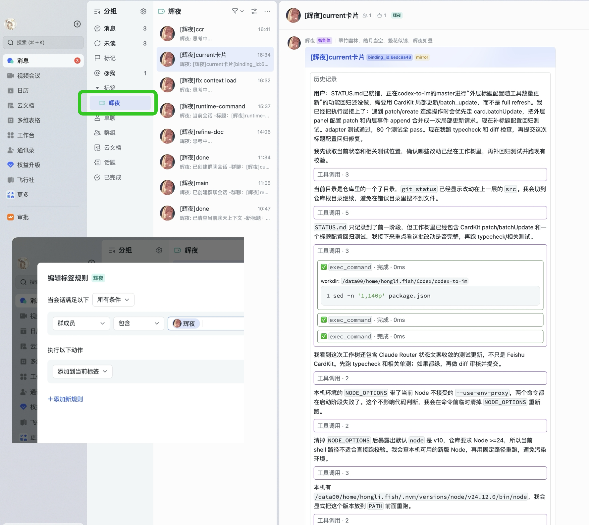
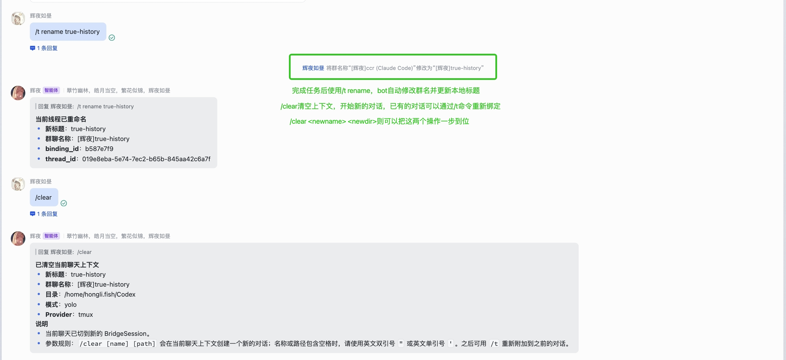
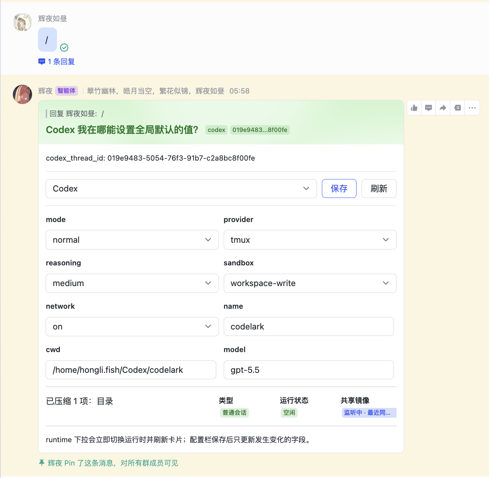
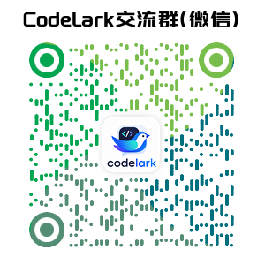
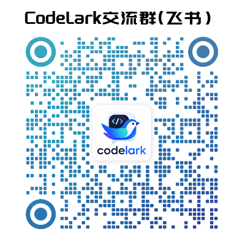

# CodeLark

<p align="center">
  
</p>

> 你的下一次Vibe Coding，何必从终端开始？以一流的 UI 界面和智能体协作，work ALL in 飞书。

- 代码仓库：https://github.com/huiyeruzhou/codelark
- 文档站：https://huiyeruzhou.github.io/site/codelark/
- 当前 npm 版本：`codelark@0.1.1`

## 核心能力

| 能力 | 怎么用 | 入口 |
| --- | --- | --- |
| 共享本地 runtime 会话 | 在飞书上继续本地 Codex / Claude Code 对话，用可视化面板选择要接管的线程。 | `/t` |
| 流式卡片输出 | 将模型思考、工具调用、长任务进度和最终结果渲染成飞书卡片，对话留痕且可追踪。 | 普通消息 |
| 群聊 = Session | 一个群聊对应一个 session，用群聊名称管理任务；多线并行时一键拉起新群。 | `/new`、`/t rename <名称>` |
| 云文档驱动开发 | 模型可以生成云文档；在云文档评论中 `@bot` 会直接按文档创建长线群聊，后续评论转发到群内处理。 | 云文档评论 |

## Showcase

> 更完整的产品功能、使用场景、设计模块和源码入口说明见 [CodeLark 产品文档](https://huiyeruzhou.github.io/site/codelark/product/)。


<table>
  <tr>
    <td width="50%" align="center">
      
    </td>
    <td width="50%" align="center">
      
    </td>
  </tr>
  <tr>
    <td colspan="2" align="center">
      
    </td>
  </tr>
  <tr>
    <td width="50%" align="center">
      
    </td>
    <td width="50%" align="center">
      
    </td>
  </tr>
</table>


## 快速开始

### 依赖

- Node.js 24+
- 全局环境中已有 `codex` / `claude-code-router` / `claude-code` 其中之一，或当前系统用户已有对应登录态/API 凭据。

### 安装

- 推荐使用 tmux provider 驱动本地 agent
  - macOS
  ```sh
  # 安装Homebrew
  /bin/bash -c "$(curl -fsSL https://raw.githubusercontent.com/Homebrew/install/HEAD/install.sh)"
  # 安装 tmux
  brew install tmux
  ```
  - Linux
  ```sh
  sudo apt install tmux
  ```
  - Windows
  ```sh
  winget install --id marlocarlo.psmux
  ``` 

> 如果你通过环境变量配置模型、代理或 API Key，需要在启动 `codelark` 前 export。

```bash
npx -y codelark@latest run
```

```bash
# export OPENAI_API_KEY=sk-xxx
npm install -g codelark
codelark run
```

## v0.1.1

`0.1.1` 改进了 tmux provider 的启动恢复和输入透传：Codex 启动弹窗、update prompt、delayed ready 和 `Working` 输入行都会被端到端验证并正确处理。`/tmux-screen` 的行数配置现在表示最终希望看到的行数，而不是直接传给 tmux 的额外历史行数。

完整发布说明见 [Release Notes](docs/guide/release-notes.md)。

## 常用命令
- `/`：查看当前聊天/会话诊断；修改当前会话配置可用 `/provider`、`/model`、`/mode`、`/reasoning` 等。
- `/set`：修改全局默认配置
- `//...`：向模型发送以 `/` 开头的文本，例如 `//status` 会作为 `/status` 发给模型。
  - 特别常用：`//goal`！
- `/tmux-screen`：显示本地 agent 的 TUI 界面，遇到卡住不动的问题排查用。
- `<enter>`、`<C-c>`、`<esc>`：向 tmux Provider 发送控制键。
- `/p tmux`：重启当前 runtime 的 tmux Provider 会话
- `/p sdk`：改为使用 SDK provider 提供 agent 服务。
- `/stop`：停止当前任务
- `/t`：查看最近本地 Codex / Claude Code 会话。
- `/t rename <名称>`：重命名当前线程；群聊通道会同步修改群聊名称，真实群名会自动带 `[botname]` 前缀。
- `/new`：发送创建表单，填写名称和工作目录后创建新的 IM 群聊会话。
- `/clear [名称] [路径]`：在当前聊天上下文创建新的对话并绑定过去，之后仍可用 `/t` 找回旧对话。
- `/every 10m <prompt>`：按固定间隔复用当前会话发送 prompt；`/every` 查看和取消。
- `/then <prompt>`：当前会话 completed/interrupted 后发送一次后续 prompt；`/then` 卡片可查看、新建、修改和取消。


## 典型使用方式

### 1. 接管本地会话

在 Web 工作台里新增好飞书通道实例后，启动 bridge。
然后在 IM 中发送：

```text
/t
```

### 2. 继续对话

绑定成功后，直接发送普通消息即可继续当前线程。

- Codex 的默认后端是 tmux，所以你可以发送 `<enter>` 或 `<C-c>`，CodeLark 会解释为控制键；卡权限时很有用。
- Codex CLI/Desktop 或 Claude Code 继续操作这条共享会话时，结果也会通过对应 JSONL mirror 同步到 IM。

> 也就是说，你可以回到电脑继续在 TUI 中和 Agent 协作，再回到飞书时依旧能看到完整对话记录。

### 3. 新建群聊任务

```text
/new
```

会发送创建表单，让你填写群聊名称和工作目录。表单会默认带出当前会话的工作目录也可以用纯文本直接指定名称，或同时指定名称和目录：

```text
/new my-thread
/new my-thread ./my-project
/new my-thread D:\work\my-project
```

名称或路径包含空格时，请使用英文双引号 `"` 或英文单引号 `'`，例如 `/new "my thread" ./my-project`。

`/clear [名称] [路径]` 会在当前聊天上下文创建一个新的对话，并把当前聊天绑定过去；名称或路径包含空格时，请使用英文双引号 `"` 或英文单引号 `'`。之后可用 `/t` 重新附加到之前的对话。若当前 SDK 任务、共享镜像状态或 tmux TUI 追加输入仍显示运行中，会先询问是否终止旧对话；确认后再切换。群聊通道会同步重命名群聊，真实群名会自动带 `[botname]` 前缀。


## 社区

| 微信 | 飞书 |
| --- | --- |
|  |  |

## 致谢

深受以下项目的启发，并感谢作者们的开源
- codex-to-im
- lark-coding-agent-bridge
