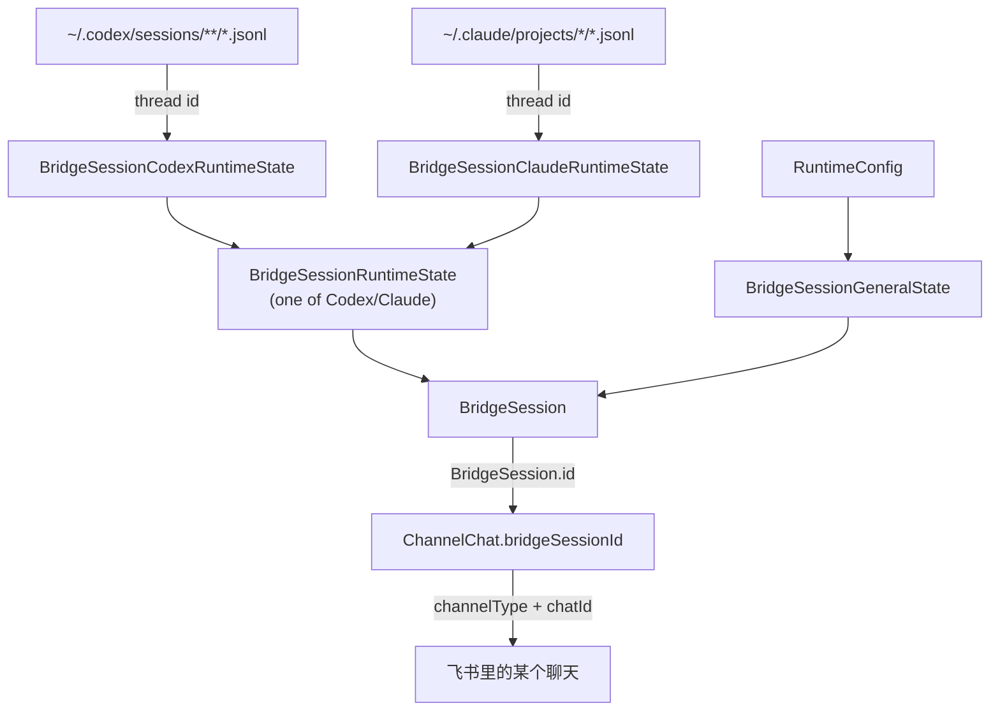

# 后端体系

CodeLark 自己的核心运行数据当前已经主要使用 JSON 文件存储。位于 `~/.codelark/data` 目录下。  

## 业务模型

CodeLark 的核心不是“一个 IM 聊天等于一个 Codex 线程”。正确链路是：

```text
Codex thread
  -> BridgeSession
  -> ChannelChat
  -> IMChannel / IM chat
```

更具体地说：



### Codex thread

Codex 自己的对话线程。CodeLark 不拥有它，只记录它的 id。
Codex thread 可以来自不同入口：

- IM 里发起的一次 SDK turn。
- 本地 Codex CLI / TUI 会话。
- 本地 Codex Native 客户端产生的会话。
- 被 `/t` 从本地 Codex session 列表接管的已有线程。


### BridgeSession

`BridgeSession` 是本地会话容器，负责承载一次可持续对话的业务状态。

保留职责：

- 本地 session id。
- 会话名、工作目录、模型、默认模式、reasoning 设置。
- 运行态：running/queued/idle、health、mirror 状态、stream UI 状态。
- 消息缓存：`messages/<sessionId>.json`。
- 唯一 Codex thread 身份：`codex_thread_id`。
语义规则：
- 没有 `codex_thread_id`：这是一个尚未创建 Codex thread 的本地 session。
- 有 `codex_thread_id`：这是一个已经关联 Codex thread 的本地 session。
- 这个 thread 可能来自普通 IM 对话，也可能来自用户接管已有 Codex 会话

### ChannelChat

`ChannelChat` 只表示“某个 IM chat 当前绑定到哪个本地 session”。

保留职责：

- channel instance：`channelType`、`channelProvider`、`channelAlias`。
- chat 身份：`chatId`、`chatKind`、`chatUserId`。
- 本地 session 指针：`bridgeSessionId`。

字段收敛：

- 一个 IM chat 只有一个 ChannelChat，一个 BridgeSession 也只保留一个聊天绑定。
- 删除旧 `workingDirectory`、`model`、`mode`、`chatDisplayName`；这些运行时和展示字段归属 `BridgeSession`。
- ChannelChat 不再缓存 Codex thread id。
- 所有 thread id 读取都必须从 `store.getSession(channelChat.bridgeSessionId)?.codex_thread_id` 获取。

### IMChannel

`IMChannel` 是配置好的 IM 入口。当前支持飞书。

一个通道实例包含：

- provider：飞书。
- 实例 id。
- 别名。
- 是否启用。
- 平台凭据和连接配置。
- 运行期 adapter 状态。

多个通道实例可以同时存在，例如：

- 飞书主号。
- 飞书备份号。

通道实例不是会话。它只是让某个平台的消息进入 bridge，并把 bridge 输出送回平台。真正的会话身份仍然在 `BridgeSession`，聊天到会话的关系仍然在 `ChannelChat`。

### 线程相关能力

以下能力都基于 `BridgeSession.codex_thread_id`：

- 普通 IM 对话 resume。
- `/t` 选择或接管已有 Codex 会话。
- history 读取。
- mirror 订阅。
- reuse 当前 Codex thread。
- tmux provider resume。

## 当前 JSON 存储

`src/storage/json-store.ts` 中的 `JsonFileStore` 是当前 Bridge 运行期数据的主存储实现，数据目录位于 `CODELARK_HOME/data`。

主要文件包括：

- `sessions.json`：Bridge session 记录。
- `channel-chats.json`：IM channel chat 与 session 的绑定关系。
- `channel-default-targets.json`：通道默认目标。
- `permissions.json`：权限回调链接。
- `offsets.json`：消费偏移量。
- `dedup.json`：去重键。
- `audit.jsonl`：审计日志，当前新记录按 JSONL 追加；旧 `audit.json` 仍可读取。
- `messages/<sessionId>.json`：单个 Bridge session 的消息缓存。

其它模块也有独立 JSON 状态文件：

- `config.json`：结构化配置文件。
- `ui-session-meta.json`：旧 UI session 名称元数据；启动迁移会合并进 `sessions.json.name` 并删除该文件。
- `thread-table-messages.json`：线程表格消息置顶/展示记录。
- `runtime/status.json`、`runtime/ui-server.json`：服务运行状态。

## 存储边界

CodeLark 自有数据：

- 使用 JSON/JSONL。
- 支持人工检查和修复。
- 先保证业务字段清晰，再考虑统一 storage helper。
- 后续可以增加 schema version、迁移、备份和损坏恢复策略。

Codex 外部数据：

- Codex Native session JSONL：只读解析。
- Codex Native `state_*.sqlite`：只读兼容读取。
- Codex CLI/SDK thread id：写入本地 session 的 `codex_thread_id`，不再写入 ChannelChat。

### 5. API 层

目标：让 UI server 和 IM 命令共享更清晰的本地后端契约。

计划：

- 为 UI server 的本地接口定义 typed request/response。
- 修改类接口增加输入校验。
- 错误返回统一为：

```json
{
  "ok": false,
  "code": "ERROR_CODE",
  "message": "Human readable message",
  "details": {}
}
```

- UI 只依赖 API DTO，不直接理解存储文件结构。

### 6. Runtime 层

目标：统一 bridge、UI server、mirror、health 和 hot update 的状态表达。

计划：

- 梳理 `runtime/status.json`、`runtime/ui-server.json` 等状态文件。
- 统一字段：`running`、`pid`、`port`、`startedAt`、`lastError`、`updatedAt`。
- doctor 脚本读取 runtime 状态、配置文件和日志，输出可执行的修复建议。
- 状态查询保持只读，不承担运行态修复动作。
