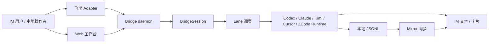
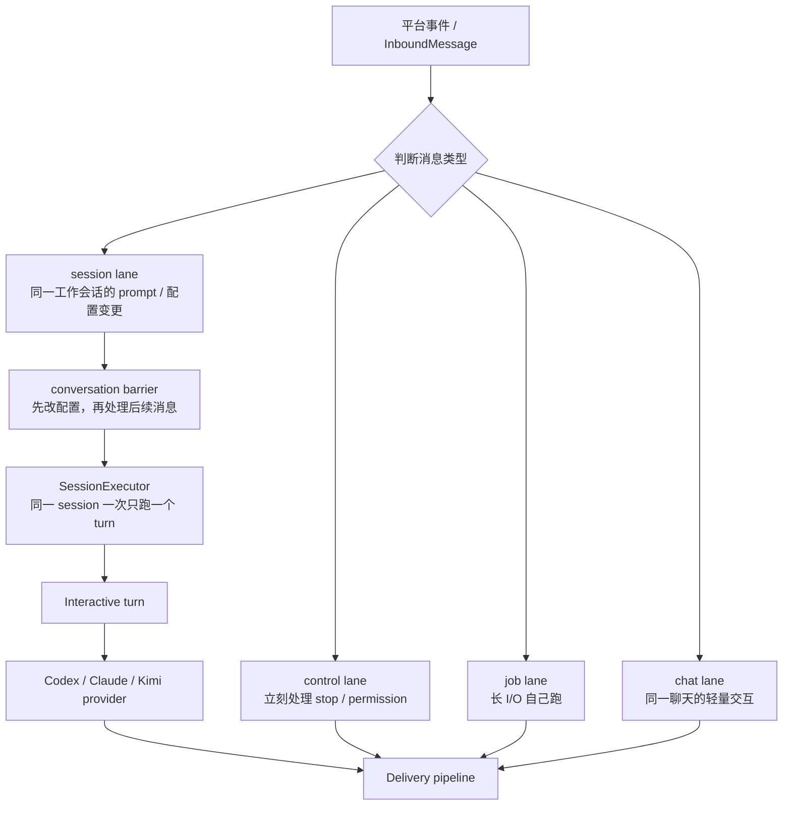
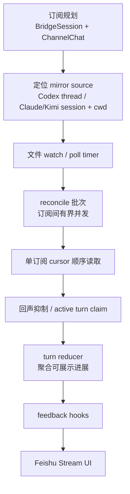
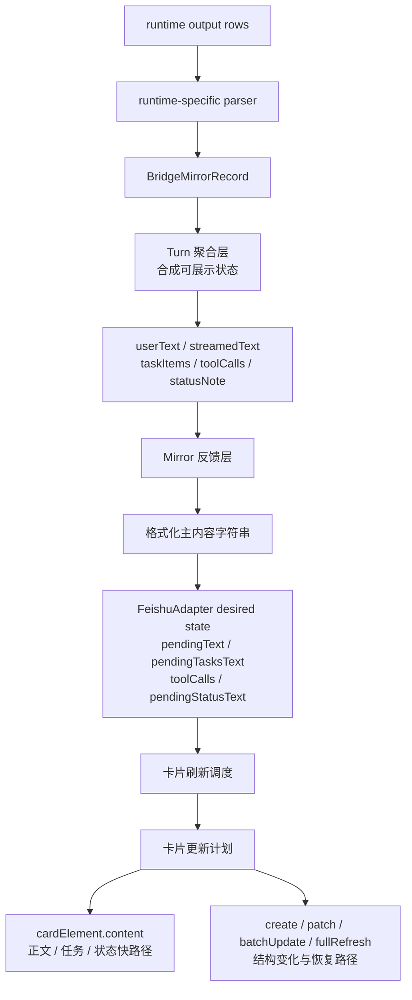
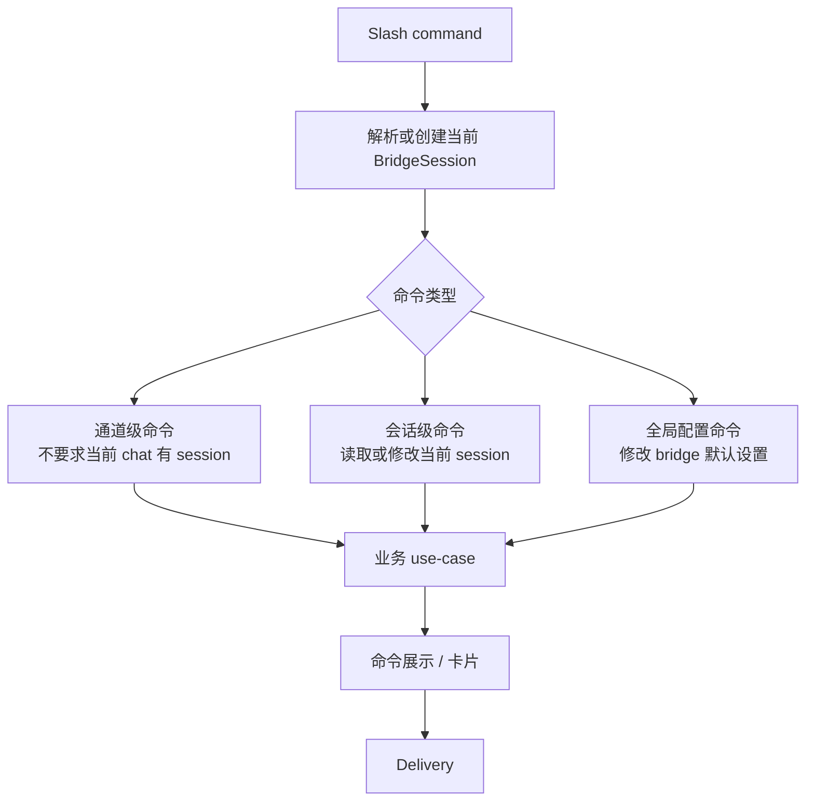

# CodeLark 当前架构

## 一眼看整体

CodeLark 的核心不是“把 IM 消息转发给一个模型 API”，而是把 IM、Web 工作台、本地 Codex / Claude Code / Kimi Code / Cursor Agent / ZCode 会话和飞书卡片都收敛到同一个 `BridgeSession` 生命周期里。IM 只是入口，`BridgeSession` 是 CodeLark 自己维护的会话边界，各 agent 的 thread/session 才是底层 runtime 的真实会话。



设计上有三条主线：

- 会话边界先于平台边界：聊天、Web 页面和本地 runtime 都先落到 `BridgeSession`，再决定路由到哪个 provider。
- 并发边界先于代码入口：所有入口都先进入 lane，确保控制命令、长任务、普通 prompt 和会话变更不会互相重排。
- 展示边界先于平台实现：SDK stream 和 JSONL mirror 都进入统一 turn progress，再由 Feishu adapter 决定如何做卡片增量更新。

重要模块按职责分组。这里只先讲责任，不列源码入口；具体入口放到各模块小节里。

| 模块 | 设计职责 |
| --- | --- |
| 通道 adapter | 把平台事件转换成统一消息，把输出转换成平台文本、卡片或附件。 |
| Bridge host | 维护 daemon 生命周期，并把通道、命令、turn、mirror、权限和健康检查装配在一起。 |
| BridgeSession | 表达“当前聊天对应哪条本地工作会话”，承载 runtime 身份、工作目录和会话级设置。 |
| Lane 调度 | 表达“这条消息要和谁互相等待”，决定控制命令、长任务、普通命令和 prompt 的并发关系。 |
| Runtime provider | 屏蔽 Codex SDK/pty/tmux、Claude SDK/pty/tmux、Kimi tmux、Cursor tmux 与 ZCode tmux 的底层差异。 |
| Mirror 与 Stream UI | 把本地 JSONL 变化聚合为 turn progress，并用卡片 diff 推送到 IM。 |

## 消息投递到后端

普通 IM 文本进入后端前，先被归一成平台无关的内部消息。后端接着要解决的核心问题不是“调用哪个函数”，而是“这条消息要不要等别人”。有些消息必须保持顺序，比如同一个工作会话里的两个 prompt；有些消息应该马上处理，比如 `/stop`；有些消息可以和 prompt 同时跑，比如看状态、看 screen、跑 shell。lane 就是 CodeLark 用来表达这组等待关系的名字。

每日版本检查也不进入这些 lane。Bridge 成功启动 adapter、但尚未开启入站消费循环时，先把 `~/.codelark/version-check.json` 读入进程缓存。当天第一条非 callback 消息只 fire-and-forget 发起 npm 查询；host manager 不等待查询或提示卡投递。进程会在请求 registry 前 claim 本地日期，查询失败也会持久化当天日期，避免并发首条消息或后续消息形成检查风暴。

版本提示与更新执行保持分层：host manager 只分流普通消息和 `clk-version-update:*` callback；update runtime 负责状态验证、卡片与按钮生命周期；独立 Node worker 负责 `npm install -g --yes` 和 stop/start。按钮回调先立即 ACK 并替换卡片，再派发 detached worker；worker 不执行 repo hot update 的 pull/build/test。

版本更新也必须遵守 long-running 操作的统一反馈纪律，不能把“worker 已派发”当作完成：旧 bridge 每 3 秒读取任务日志，检测 running/completed/error、worker 提前退出和超时，并持续更新原卡；派发前还会持久化 operation receipt（原 chat、原 card、目标版本和 update key）。安装失败且 bridge 仍在线时，旧 bridge 把原卡收口为红色失败终态并清除 receipt；安装成功导致进程重启时，新 bridge 消费 receipt，用原 message id 恢复并把同一张卡收口为绿色“更新完成”。若平台不能恢复原卡，rich-card delivery 自己降级为发送新卡，仍必须让用户看到终态。

全局服务发现不引入中心 broker。每个 daemon 在 Home 无关的当前用户临时目录写一份原子 descriptor，并监听随机 loopback 端口；descriptor 保存 Home、run id、端点和随机 token。查询方读取 descriptor 后直接向目标 Bridge 获取实时 session catalog 或提交手动输入。目标端把文本构造成 `InboundMessage` 放进 adapter queue，继续使用同一套分类与 lane；全局目录不复制 session 数据，也不承担消息队列。

这条约束适用于所有可能跨秒、跨进程或跨重启的后台动作：入口要快速 ACK，进行态要可观察，恢复所需状态要先于破坏性动作持久化，最终必须只有一个明确的成功或失败终态。环境变量由 detached child 和后续启动命令正常继承；不能用无关的环境分支代替任务状态检测。



### 先区分三个问题

`BridgeSession` 回答“这条聊天现在连着哪条工作会话”。它保存底层 Codex thread、Claude/Kimi/Cursor/ZCode session、tmux provider 会话名、运行健康和消息生命周期等身份/状态；当前工作目录、模型、provider、sandbox、reasoning 等用户配置覆盖已经迁到 Session TOML。一个 IM 群聊、Web 工作台入口或本地接管动作，最后都要落到某个 `BridgeSession`，再按 scoped TOML 解析 effective runtime 配置。

Lane 回答“这条消息要和谁互相等待”。同一条 lane 里的消息按顺序执行；不同 lane 里的消息，默认认为互不影响，可以同时执行。它解决的是并发边界：哪些事情必须排队，哪些事情不应该互相拖慢。

`SessionExecutor` 回答“同一条工作会话里怎么保证一次只跑一个 prompt 或短配置变更”。普通 prompt 和 `/provider sdk`、`/model` 这类能在一个短处理周期内完成的会话变更进入 `session:<session_id>` 后，还要经过这个会话锁。不同 session 可以并行；同一 session 保持顺序，并维护 queued/running/idle 状态。`/provider tmux` 是例外：启动 TUI、readiness 轮询和等待用户选择都属于外部等待，走独立 job lifecycle，不能跨这些等待持有 session lock。

### Lane 是什么

Lane 可以理解成“等待关系的名字”。调度层会给每条消息一个 lane 名字：名字相同，说明它们碰的是同一块状态，要按顺序来；名字不同，说明它们大概率互不影响，可以并行。

这套模型的重点是“并发可以发生，但只发生在不会破坏语义的地方”。例如两个不同工作会话的 prompt 可以一起跑；同一个工作会话的两个 prompt 必须一个接一个跑；`/stop` 不应该排在长任务后面；短 provider 配置变更后的 prompt 必须使用新配置，而 `/provider tmux` 等待用户时又不能挡住 `/clear`。

当前主要有四类 lane：

- `control:*`：控制通道。`/stop`、结构化权限 callback、screen stop callback 走这里。它们的价值是“马上生效”，所以不等普通对话和长任务。
- `job:*`：长 I/O 通道。`/shell`、`/tmux-screen`、`/pty-screen`、`/provider tmux` 走这里。它们可能跑很久，所以不占住同一 session 的 prompt 队伍；其中 `/tmux-screen`、`/pty-screen` 是监控命令，不等待普通 conversation barrier，避免排在卡住的普通对话后面；`/provider tmux` 也不建立 conversation barrier，允许 `/clear` 抢占并废止尚未完成的旧启动，但会建立仅针对普通消息的 routing barrier，避免下一句话抢跑到旧 Provider。其他普通 job 仍会先等同一聊天前面的会话配置变更或普通 prompt barrier 完成。
- `chat:<channel>:<chat>`：聊天通道。只读命令、普通 callback、状态查询这类不改 session 状态的交互走这里。`channel` 和 `chat` 的作用是把不同平台、不同群聊或私聊隔开：A 群的状态查询不会挡住 B 群，飞书群聊也不会和别的通道混在一起。
- `session:<session_id>`：工作会话通道。普通 prompt、会话配置变更、会切换绑定的 callback 走这里。它按 `BridgeSession.id` 区分，而不是按群聊区分，因为聊天可以重新绑定，后台任务也可能在绑定切换后继续收尾；只要操作的是同一个 session，就必须保持同一份上下文和配置的顺序。

`chat` 和 `session` 分开，是因为它们保护的东西不同。`chat` 保护的是“这一个聊天里的轻量交互不要互相打架”；`session` 保护的是“这条工作会话的上下文、provider、模型、cwd 和底层 runtime 身份不要乱序”。一个聊天可以重新绑定到别的 session，但一个 `BridgeSession` 同一时间只能绑定一个聊天。存储写入和接管入口都必须执行这条唯一性约束，不能让建群半成功或旧数据污染变成多个聊天同时操作、镜像同一会话。

### Barrier 是什么

conversation barrier 是 lane 之上的保护规则，用来处理“这条命令会改变后面消息应该怎么解释”的场景。模型、provider、工作目录、runtime 设置、thread 绑定等变化完成前，同一聊天里后续非 control 的 command/job/prompt 都要等待。

直观例子：

```text
/provider sdk
请继续刚才的任务
```

如果没有 barrier，第二条普通 prompt 可能先进入旧 provider。barrier 的作用就是让这类“先改配置，再发任务”的用户意图保持顺序。它按聊天生效，而不是全局生效，所以不会让别的群聊一起停住。

### 处理步骤

普通 IM 文本消息进入当前 runtime 的主路径：

1. 平台 adapter 接收飞书事件，转换成内部消息。
2. adapter loop 从队列取消息，先识别它是平台事件、callback、命令、控制输入，还是普通 prompt。
3. 调度层为消息选择 lane。控制消息直接走 control lane；长 I/O 走 job lane；只读命令走 chat lane；prompt 和会话变更进入 session lane。
4. 如果消息会改变会话配置或绑定，它会声明 conversation barrier，阻止同一聊天后续非 control 消息抢跑。
5. session lane 进入同一 session 的串行队伍，更新 queued/running/idle 状态，并在相邻 turn 之间保留短 cooldown。
6. 普通 prompt 解析当前聊天绑定的 `BridgeSession`，建立本次 turn 的任务状态、abort controller、stream UI 和最终 delivery。
7. provider 路由根据 session 上的 runtime/provider 设置选择 Codex、Claude、Kimi、Cursor 或 ZCode 的具体执行方式。
8. provider 创建或继续底层 runtime 会话，并把必要身份写回 session。
9. 主路径把最终文本、卡片、附件等转换为 delivery intent，按 adapter + chat 入有序队列后立即释放 lane；远端 IM ACK、重试和 message id 回填在队列 worker 中完成。

`/provider tmux` 的长启动完成前还必须重新校验聊天仍绑定启动时的 session。若 `/clear` 已经改绑，旧启动只能清理自己创建的 tmux，不能把 provider 或 runtime identity 写回旧 session，也不能影响新 session。

这里的“有序”只约束同一 adapter/chat 的同类队列。普通回复与交互卡片使用独立 queue class，确认卡、按钮和 stream finalize 不会被前面的慢普通消息挡住；各自内部仍保序。CardKit create → send、stream finalize → fallback 回复、附件 caption → 附件等存在数据依赖的动作留在同一个 worker job 内串行；不同聊天互不等待。session/chat 主 lane 禁止等待普通 reply、权限/选择卡、reaction、callback answer、CardKit create/update/finalize、群名同步或全局 mirror reconcile 的远端回执。adapter 入站阶段也遵循同一边界：正文、引用和附件等构造内部消息必需的数据可以等待，兼容提示和云文档群转发 notice 必须后台启动或入 delivery 队列后先放行内部消息；slash/控制命令在进入命令处理时添加的 Get，以及 tmux prompt 提交成功后添加的 Get，都只做异步确认。权限卡的 `message_id` 与 permission link 在 delivery receipt continuation 中回填；callback 先到时由 pending-callback 状态在 link 建立后对账，投递最终失败则 fail-closed 结束 pending permission 和 selection waiter。`/new` 必须等待建群结果才能取得 chat id，但文本命令和卡片 command callback 都被隔离到不阻塞 conversation 的 long-I/O job lane；远端完成后才提交新群 binding，不能把这段等待放回当前聊天的 session/chat 主 lane。

### 模块入口

- adapter 队列和 lane 调度：`src/channels/adapter-runtime/runtime.ts`
- bridge host 装配与消息处理：`src/bridge/host/manager.ts`
- 会话串行执行：`src/bridge/session/session-executor.ts`
- 普通 prompt turn：`src/bridge/turn/interactive/runner.ts`
- provider 路由：`src/runtime/codex/routing-provider.ts`

## `/t` 接管本地 runtime 会话

列表 query、聊天 attach、runtime identity 和运行中停止的完整不变量见 [Chat 与 Session 接管契约](chat-session-attachment.md)。

`/t` 命令用于把本机可发现的 Codex thread、Claude Code session、Kimi Code session、Cursor chat 或 ZCode session 接入 IM。它展示的是本地 runtime 历史和当前聊天绑定关系，而不是单一 provider 的内部列表。

典型过程：

1. 用户发送 `/t`。
2. local session index 按 runtime 扫描本地历史：Codex 读 `~/.codex/sessions/**/*.jsonl`，Claude Code 读项目目录下的 Claude JSONL，Kimi Code 读 `~/.kimi-code/sessions/wd_*/session_*/agents/main/wire.jsonl`，Cursor 读 `~/.cursor/projects/*/agent-transcripts/**/*.jsonl`，ZCode 只读其 SQLite session store。
3. bridge 返回最近的本地 runtime 会话列表，并标出 runtime、底层 id、cwd 和当前绑定状态。
4. 用户发送 `/t 1`。
5. 被选中的本地 runtime 会话会被 materialized 成一个 `BridgeSession`，或复用已有同底层身份的 `BridgeSession`。
6. 当前 IM chat 创建或更新 `ChannelChat`，让它指向这个 `BridgeSession.id`。
7. 后续普通消息通过 ChannelChat 找到 session，再根据 `runtime.codex.threadId`、`runtime.claude.sessionId + cwd` 或 `runtime.kimi.sessionId + cwd` 继续同一条底层 runtime 会话。

会话索引热路径只能读取目录、文件元信息和小型持久缓存，禁止为了表格里的“用户输入轮数”同步整文件读取 JSONL。轮数缓存以 `runtime + path + size + mtime` 为键：冷缓存和新增后缀由单并发异步流统计，命令先返回；下一次刷新显示精确值。单次接管解析出的候选列表应复用于同 runtime 的卡片刷新，不能为同一个动作重复扫描。

因此 `/t` 不是“把某个 thread id 写到聊天上”，而是“把底层 runtime 会话纳入 BridgeSession，再让聊天绑定这个 BridgeSession”。新增 agent 时必须同时定义它的本地 session index、materialize 身份、archive 语义和 mirror source；只新增 provider stream 不足以让 `/t` 可恢复、可切换、可观察。

## Mirror 运行时

Mirror 是对本地 runtime 持久输出的持续观察。它让 IM 能看到本地 Codex TUI、Codex Native、Claude Code、Kimi Code、Cursor Agent 或 ZCode 在同一条会话里继续产生的输出；JSONL、wire、transcript 或 SQLite 进入 CodeLark 后都转换成统一 `BridgeMirrorRecord`。

Mirror 不支持把同一个 `BridgeSession` 同时投递到多个聊天。正常写入会在存储层拒绝第二个 binding；如果升级前的持久化数据已经包含重复 binding，订阅规划只保留创建时间最早的一项，移除其余 mirror 订阅并记录明确错误。它不会为重复目标拆分卡片 key，也不会把污染状态解释为合法的一对多功能。



### 设计理念

Mirror 不是子线程，也不是独立 worker。它运行在 bridge daemon 内：`fs.watch` 只负责标记 dirty 和唤醒 debounce；poll timer 负责兜底；真正处理发生在 reconcile 批次里。批次对不同 subscription 使用有界并发，同一个 subscription 内部按 JSONL cursor 顺序读取、过滤、reduce、触发 hook，避免一张 mirror 卡片的局部更新乱序。已经绑定的 subscription 必须先对已知 `filePath` 做 stat，并用 inode/size/mtime 判断无变化或只读新增区间；不能在 stat 之前重新 list 全部 runtime sessions。只有文件路径缺失、失效或 runtime identity 改变时，才允许重新调用 runtime-specific source discovery。

tmux pane 抓屏也必须由活动状态驱动，不能随 mirror poll 永久扫描所有历史 subscription。通用 selection/reconnect probe 只覆盖当前 hot chat、有 pending turn，或刚向 tmux 注入消息后的短 follow-up window；turn completed 后的异常方块由 finalized-status 路径单独抓屏，idle baseline 只在需要建立基线时抓一次。这样既保留当前聊天的 selection、reconnecting 和异常终态检测，也避免每 5 秒为每个 cold 历史 pane 启动 `display-message` / `capture-pane` 子进程。

Mirror 的身份分两层，不应混用。第一层是“哪个本地会话文件”，由 `BridgeSession`、runtime identity 和 cwd 决定；第二层是“文件内哪一轮 turn”，由 runtime-specific parser 从 JSONL 记录关系里推断。文件名只回答“观察哪个会话”，不能回答“这是第几轮输出”。

Mirror 和主动 IM turn 之间有显式归属规则。当前 IM 发起的 prompt 会产生本地 JSONL 回声，suppression 会过滤重复回显；如果新增记录包含可被 active turn 接受的 `task_complete` / `task_aborted`，`routeRuntimeRecords` 会通过 `TurnCoordinator.claimRuntimeTerminal` 把终态归还给 active turn。未被 claim 的记录才作为独立 mirror delivery。

### 重要模块

Mirror 主路径：

1. 订阅规划找到有本地 runtime 身份的 `BridgeSession`，再找到绑定这些 session 的 `ChannelChat`。
2. 订阅 runtime 根据绑定关系建立或更新 subscription。
3. 新 subscription 通过当前 runtime source 定位对应 JSONL 文件；稳定 subscription 复用已验证路径。
4. 文件监听和定时 reconcile 先 stat 已知文件，无变化即结束，增长时只读取新增记录；路径失效才重新 discover。订阅间有界并发，单订阅内部按 cursor 顺序处理。
5. suppression 去掉当前 IM 发起 turn 造成的重复回显。
6. turn reducer 把 JSONL 事件合并成可展示 turn。
7. feedback controller 更新流式卡片或发送最终 fallback 消息。

Codex mirror 的身份链路是：

```text
runtime.codex.threadId -> BridgeSession -> ChannelChat -> channel/chat
```

Claude Code mirror 的身份链路是：

```text
runtime.claude.sessionId + runtime.claude.cwd -> BridgeSession -> ChannelChat -> channel/chat
```

Kimi Code mirror 的身份链路是：

```text
runtime.kimi.sessionId + runtime.kimi.cwd -> BridgeSession -> ChannelChat -> channel/chat
```

如果 mirror source 连续多次无法定位，mirror 订阅层会通过 runtime-neutral
identity cleanup hook 清理当前 runtime 身份：Codex 清理
`runtime.codex.threadId`，Claude Code 清理 `runtime.claude.sessionId` /
`runtime.claude.cwd`，Kimi Code 清理 `runtime.kimi.sessionId` /
`runtime.kimi.cwd`。这样 dangling 本地会话不会在 subscription registry
里反复重建。

Mirror subscription registry 采用兴趣驱动分层策略。bridge 会为最近触达的
`ChannelChat` 保持热订阅并低延迟 reconcile；长期未触达的绑定仍保留 mirror
订阅，但按低频冷检查节奏调度，避免冷群抢占热群预算。用户消息或卡片回调会刷新
`lastActivityAt`，让该聊天重新进入热同步窗口。

`routeCodexRecords` 和 `claimCodexTerminal` 仍作为兼容入口保留；新代码应优先
使用 runtime-neutral 的 `routeRuntimeRecords` 和 `claimRuntimeTerminal`。

源码入口：

- 订阅规划：`src/bridge/mirror/subscription-registry.ts`
- 订阅、watch、poll 和 reconcile：`src/bridge/mirror/runtime.ts`
- reconcile 细节与有界并发：`src/bridge/mirror/reconcile-core.ts`、`src/bridge/mirror/reconcile-batch.ts`
- 回声抑制：`src/bridge/mirror/suppression.ts`
- active turn 终态归属：`src/bridge/turn/turn-coordinator.ts`

### Mirror 消息渲染链路

当前 mirror 卡片渲染链路以 `BridgeMirrorRecord` 为输入，以 Feishu CardKit 局部更新为输出。先看完整链路：



#### 设计理念

Mirror 渲染不把每条 record 直接投递到飞书。record 先被 reducer 合并为一轮可展示进展，再通过 hook 推给 stream UI，最后由 Feishu adapter 把“期望状态”和“已渲染状态”做 diff。这样可以把高频 runtime 文件写入折叠成低频卡片更新，并且只更新发生变化的 element。

`cardElement.content` 是固定正文、任务、状态区的正常快路径，不是唯一更新手段。工具和 history 结构变化需要 create/patch；多条结构更新可合并为 `card.batchUpdate`；metadata、actions、layout signature、shadow trust 或失败恢复不安全时走 full refresh。

#### 重要模块

Turn reducer 会按 record 类型更新同一个 `BridgeMirrorTurnState`：

- `message:user`：写入 `userText`，同时写入 unified history user item。
- `message:assistant` 和 `message:commentary`：普通 record 去掉近距离重复文本后追加到 `streamedText`，记录 `lastContentResponseAt`，并写入 unified history model item。带 `replacementKey` 的 assistant record 表示同一逻辑正文的新版快照，必须替换该 key 的上一版，而不是追加。`reasoningKind=thinking` 是只进入运行状态的瞬时思考，`reasoningKind=summary` 是需要保留但弱于正文的思考摘要，统一映射为 `history_item` 的 `thinking_summary` 变体并由卡片 renderer 显示为引用；`reasoningKind=history` 保留完整的历史思考内容。runtime parser 负责从各客户端私有协议恢复这些结构，renderer 不解析 Cursor 等客户端的私有文本。
- `message:system`：写入 unified history system item。
- `reasoning`：写入 `statusNote`。
- `plan_update`：写入 `taskItems`。
- `tool_started` / `tool_finished`：转换成 Codex turn event 后写入 `toolCalls`。
- `context_usage`：写入 `contextUsage`。
- `goal_status`：写入 `goalStatus`；如果当前 turn 已经有正文、用户文本、工具或任务进展，才触发正文区域刷新。只有 active goal 状态、没有可见进展的空 turn 不会启动 mirror stream。
- `task_complete` / `task_aborted`：结束当前 pending turn，形成 `FinalizedBridgeMirrorTurn`；当 Codex 版本在 `task_complete.error` 中提供结构化错误时，必须保留为 runtime-neutral `errorText` 并把终态设为 `error`，不能因为事件名仍叫 complete 就画成成功。旧版 Codex 若只在 tmux TUI 输出 `■`，CodeLark 会先把屏幕诊断分成 operation / turn / session：只有明确的 turn/session 终止模式补齐 `errorText`，goal、配置等局部操作失败则通过 `RuntimeNoticeInfo` 放进正文且不改变 completed 终态。如果 active turn 能 claim 这个终态，则交给 active IM turn，否则作为 mirror final delivery。连续 3 个只有 active goal 状态、没有可见进展的空 turn 会产生一次 goal loop warning，避免无限重启时刷出空镜像卡片。

Runtime source adapter 必须先把底层事件规范化，再交给上述 reducer。Kimi Code 会按 `step.end → usage.record` 写入终态统计；adapter 必须把这条 usage 归回刚结束的同一 turn（同一增量内排到 terminal 前，跨增量且 terminal 已消费时丢弃孤立 usage），不能让它创建一张没有后续 terminal 的 `Thinking...` 卡。Kimi `context.append_message` 中 `origin.kind=injection` 的内部 reminder 也必须在 source adapter 过滤，不能进入通用 history 或飞书卡片。这个约束属于 provider 解析层；统一 turn reducer 和 Feishu renderer 不应增加 Kimi 特判。

Feedback controller 把 reducer hook 映射到 stream UI：

- `onStreamText` 调 `formatMirrorMessage(baseTitle, userText, streamedText, ...)` 生成主内容字符串，并推给 `pushStreamFeedbackText()`；同时推 history 和 status。
- `onTaskProgress` 推 `pushStreamFeedbackTasks()`。
- `onToolProgress` 推 `pushStreamFeedbackTools()` 和 history。
- `onStatusProgress` 只刷新状态区；长时间无正文时，`refreshMirrorStreamingStatus()` 会按 idle/heartbeat 配置补心跳状态。

这些 push 最终进入 Feishu adapter 的流式接口。adapter 不立即对每个事件发远端请求，而是更新本地 desired state：

- `onStreamText` -> `pendingText`
- `onStreamStatus` -> `pendingStatusText`
- `onTaskEvent` / `onStreamTasks` -> `pendingTasksText`
- `onToolEvent` / `onStreamTools` -> `toolCalls`
- `onStreamHistory` -> `historyItems`
- `onStreamMetadata` -> `metadata`
- `onStreamActions` -> `actionRows`

状态栏和 CardKit 更新也遵循公共渲染契约：从 turn 开始按 5 秒心跳刷新，所有可见事件都更新活动时间，系统时区只在进程启动时解析一次；新增工具与 `streaming_status` 分成两个 CardKit 动作。字段顺序、紧凑时长格式、续接/异常前缀和具体投递边界统一记录在[流式卡片的“状态栏与活动时间”](streaming-card.md#状态栏与活动时间)，这里不再维护第二份细则。

通道配置变化可能替换整个 adapter 实例。`streamStarted` 只说明某个 turn 曾经启动过，不能证明新实例持有原 CardKit stream；feedback controller 必须按 adapter 实例记录 stream owner。实例不变时启动动作去重，实例替换后必须先重发 title、runtime tags 和 bridge id，再恢复正文、工具与状态。否则 `/set` 修改通道配置会让进行中的 mirror 卡片在 adapter 重建后丢失 header。

adapter 重建不能把正在路上的平台 UI 资源当成新消息重建。adapter runtime 在 config fingerprint 变化时先调用旧实例的 `takeRuntimeHandoff()`，再 stop/start，并在新实例加入 active map 前调用 `restoreRuntimeHandoff()`。Feishu 会等待已发出的 card create/send 和 flush 完成，然后移交原 `cardId`、`messageId`、CardKit sequence 和 desired/shadow state；新实例对同一 card 做全量刷新。这个顺序同时保证 header 恢复和“只有一张卡”，避免旧卡永久停在“思考中”。如果 handoff 准备失败，runtime 保留旧 adapter，不在资源归属不明时强行重启。

每次 desired state 变化都会标记 `desiredRevision` 并调用 `scheduleCardFlush()`。`flushCardUpdate()` 只在 flush tick 读取一份 desired snapshot，构造 desired render，再和本地 remote shadow 比较：

- 正文、任务、状态内容变化且布局没变时，生成 `content` 更新，通常只对 `streaming_content`、`streaming_tasks`、`streaming_status` 调 `cardElement.content`。
- history/tool 追加或 patch 时，生成 `create` / `patch` 更新；多条 create/patch 可合并为 `card.batchUpdate`。
- 为降低 CardKit `batchUpdate` 被服务端接受但客户端不重绘的风险，planner 会把两类增量直接改判为 full refresh：history 中出现用户文本更新；desired card 组件数不超过 20 且本轮 create/patch 原本会形成实际 `card.batchUpdate`。
- metadata、actions、layout signature、shadow trust 或 history/tool 结构不再可证明安全时，走 full refresh，即 `card.update:streaming_refresh`。
- 组件数接近上限时，先 rollover 到 continuation card，失败后再 full refresh。
- 连续工具在公共 history 中始终保留为一个 runtime-neutral `tool_panel`；Feishu continuation cursor 同时记录 history item index 和 panel 内 tool index，因此分页原子是单个工具调用，外层“工具调用 · N”只是每张卡对当前可见工具的重新分组。不能预先把公共 panel 改写成若干大块，也不能为了让整组塞进一张卡而降低 apply_patch 的 8,000 字符/160 行详情上限。
- 用户输入由同一个 runtime-neutral history item 渲染：不超过 800 个 Unicode 字符时保持普通 markdown；超过后使用无边框、默认收起的 panel，标题展示规范化后的前 240 字符，展开内容保留完整原文。该规则属于 Feishu 展示层，不改写 Codex、Claude 或 Kimi 的 history 数据。
- final renderer 判断正文是否存在时必须同时考虑 `text`、legacy `tools` 和 runtime-neutral `historyItems`。已有 stream message 的 mirror finalize 会故意传空 text 以避免重复；若漏掉 history，工具-only / history-only 卡会在终态 full update 时被错误替换成只有 footer 的空卡。

因此“只对变化 element 调 `cardElement.content`”是正文、任务、状态这类固定元素的正常快路径；当前实现还保留 create/patch、batchUpdate、direct full refresh 和 rollover 作为工具/history/结构变化与失败恢复路径。sync plan 日志会记录 desired component count、direct refresh 阈值、增量 action 类型/element IDs、是否命中用户文本更新和 direct refresh rule，便于核对 planner 分流。

源码入口：

- turn reducer：`src/bridge/mirror/turns.ts`
- mirror 正文格式化：`src/bridge/mirror/formatters.ts`
- feedback hooks：`src/bridge/mirror/feedback-controller.ts`
- stream UI 抽象：`src/channels/delivery/stream-feedback.ts`
- Feishu desired/shadow diff：`src/channels/feishu/adapter.ts`

### Mirror 文件索引与 turn 索引

第一层是文件索引，用来定位要读哪个本地会话文件：

```text
BridgeSession + runtime identity + cwd
  -> runtime output file
```

Codex 主要使用 `runtime.codex.threadId` 定位 Codex JSONL。Claude Code 使用
`runtime.claude.sessionId + cwd` 定位 Claude JSONL：

```text
~/.claude/projects/<encoded-cwd>/<claude-session-id>.jsonl
```

Kimi Code 使用 `runtime.kimi.sessionId + cwd` 定位 Kimi `wire.jsonl`：

```text
~/.kimi-code/sessions/wd_<encoded-cwd>/session_<kimi-session-id>/agents/main/wire.jsonl
```

这一层不使用 Claude 的 `uuid` / `parentUuid`，也不使用 Kimi `wire.jsonl` 内部记录顺序来猜文件归属。文件名、runtime identity 和 cwd 只回答“这个 BridgeSession 应该观察哪个本地会话文件”。

第二层是文件内 turn 索引，用来判断同一个 JSONL 文件里哪些行属于同一次用户请求。
一个 Claude Code prompt 通常不是单行，而是一条链：

```text
user prompt                  uuid=A
skill listing attachment     uuid=B parentUuid=A
assistant text               uuid=C parentUuid=B
assistant tool_use           uuid=D parentUuid=C
tool_result                  uuid=E parentUuid=D
interrupt / continuation     uuid=F parentUuid=E
```

这些行都属于同一轮 turn，mirror 应合成同一张卡。文件名只能说明“同一个会话”，
不能说明“这是第几轮”，因此仍需要文件内 turn identity。

Claude JSONL parser 曾经用局部 `activeTurnId` 推断当前 turn。整文件读取时，
这通常能靠顺序凑对；增量读取时，parser 每次只拿到新增片段，局部状态会从空开始。
如果新增片段刚好从 attachment、assistant 或 tool result 开始，parser 就可能把
`uuid` / `parentUuid` 当成新的 turn root，导致同一轮 Claude 输出被拆成多个
`mirror:<bridge-session-id>:<turn-id>` streamKey，用户会看到重复或碎片化 mirror 卡片。

Claude source 应维护 provider-specific parser state，并把所有相关记录映射到一个
稳定的 `rootTurnId`：

- 真实 user prompt：创建 root，优先使用 `promptId`，否则使用 user `uuid`。
- attachment：通过 `parentUuid` 继承 root，并登记自身 `uuid -> root`。
- assistant text / assistant tool_use：通过 `parentUuid` 继承 root，并登记自身
  `uuid -> root`。
- tool_use：同时登记 `tool_use.id -> root`。
- tool_result：优先通过 `tool_use_id` 找 root；否则通过 `parentUuid` 继承 root。
- interrupt、permission、synthetic user message：如果 `promptId` 或 parent chain 命中
  已有 root，继续归入同一个 root，不创建新的业务 turn。

parser state 至少需要保存：

```text
activeTurnId
uuidToRootTurnId
promptIdToRootTurnId
toolUseIdToRootTurnId
```

增量读取必须返回下一次读取所需的 state。整文件读取和任意分段增量读取应生成相同的
record turnId 序列。

Mirror suppression 不应承担 turn identity 推断。它只处理 bridge 发起 turn 的回声：

1. IM 发起 prompt 时，登记 `BridgeSession + normalized prompt`。
2. Claude JSONL source 首次识别到对应 root turn 后，所有该 root 的 records 都带同一个
   turnId。
3. `routeRuntimeRecords` 或 suppression 决定这些 records 是 active turn 的终态，还是
   应丢弃的回声。

这样同一 Claude turn 不会在主 `im:` 卡片完成后，又以多个 `mirror:` streamKey 再发一次。

相关源码：

- Claude JSONL source：`src/runtime/claude/session-jsonl.ts`
- Mirror reconcile：`src/bridge/mirror/reconcile-core.ts`
- Mirror delivery reducer：`src/bridge/mirror/turns.ts`
- Mirror suppression：`src/bridge/mirror/suppression.ts`

## 命令应用层

命令层负责把用户输入的 slash command 解释成明确的业务动作。它不拥有会话生命周期，也不直接拥有通道连接；它读取当前聊天和会话状态，决定要执行哪个 use-case，再把展示结果交给 delivery。



### 设计理念

命令层的边界是“解释用户意图和组织展示”，不是“承载所有业务状态”。会话、绑定、线程接管、归档和工作目录等规则归会话模块负责；命令层只做 slash 解析、参数校验、调用 use-case 和生成用户可读结果。

命令也要服从 lane。slash 文本进入 adapter 后，必须先解析或创建当前 BridgeSession，再决定 chat/session/control lane；否则新聊天的首条会话修改命令无法进入正确的 session lane。只读状态查询仍可走 chat lane；会改变会话绑定或运行配置的命令必须进入 session lane 并声明 barrier；停止和结构化权限 callback 这类控制动作走 control lane。

命令生成展示结果后只负责 enqueue，不等待平台回复 ACK。需要 `message_id` 的置顶、记录和 post-delivery 动作挂在 delivery receipt continuation 上，不能为了回填 id 继续占用 session lane。群名同步、callback answer 和 mirror reconcile 也属于后台副作用；失败必须独立记录或提示，不能把远端状态塞回同步命令返回值。只有必须先取得远端主键才能落本地状态的事务可以在专用 job lane 内等待，例如 `/new` 建群取得 chat id；该 job 不得阻塞当前聊天继续处理普通消息。

### 命令类型

命令分为三类：

- 通道级命令：不要求当前 chat 已经有 session，例如 `/status`、`/t`。
- 会话级命令：读取或修改当前 chat 的 ChannelChat/session，例如 `/new`、`/t 1`、`/provider`、`/his`、`/stop`。
- 全局配置命令：通过某个 chat 触发，但实际修改全局设置，例如 `/ui`、`/his limit`。

当前命令重构的完成标准是模块边界优先，而不是继续把每条命令拆得很细：

- `bridge/host` 是生产代码里唯一直接调用 `bridge/command` 的上层 owner。
- `channels`、`bridge/turn`、`runtime`、`storage`、`operator-ui` 不直接依赖 `bridge/command`。
- 跨命令和 turn 共用的回调协议放在共享 callback 边界里，避免 turn 反向依赖 command。
- command 不直接 import host 实现；全局 context、会话绑定 router 和 startup target 都有 host 外的共享入口，host 下同名文件只保留兼容 facade。

### 模块入口

- 命令分发入口：`src/bridge/command/dispatch.ts`
- 会话命令聚合：`src/bridge/command/session-thread.ts`
- 会话 use-case：`src/bridge/session/command-use-cases/`
- runtime 设置命令：`src/bridge/command/runtime-settings.ts`
- provider 切换命令：`src/bridge/command/provider-settings.ts`
- 终端与本地工具命令：`src/bridge/command/tmux.ts`、`src/bridge/command/pty.ts`、`src/bridge/command/shell.ts`
- 定时输入命令：`src/bridge/command/every.ts`
- 命令展示：`src/bridge/command/presentation/`
- 共享 callback 协议：`src/bridge/callbacks/`
- 全局 context 与会话绑定：`src/bridge/context.ts`、`src/bridge/session/channel-router.ts`、`src/bridge/startup-notice-target.ts`

## 本地工作台

本地 Web 工作台是 bridge 的管理面。它不替代 IM 工作流，而是提供更适合浏览、配置和诊断的本地页面：看所有 session、检查通道实例、编辑配置、查看历史和确认服务状态。

### 设计理念

工作台里的可变操作仍然围绕 `BridgeSession.id`。本机 Codex thread、Claude session 和 Kimi session 在未接管前只是只读候选项；一旦用户要重命名、绑定、配置或删除，就先 materialize 成 `BridgeSession`，再进入同一套会话生命周期。绑定必须选择一个已经建立身份的具体群聊或单聊，不允许用“下一条未知聊天”代替明确的 chat id。

### 主要页面

- 概览：显示 UI、bridge、通道数量和进程状态。
- Sessions：列出 Bridge 会话和本机可发现的 Codex、Claude、Kimi、Cursor、ZCode 本地会话。
- Session History：查看某个 session 的历史。
- Channels：管理飞书通道实例、具体 ChannelChat 绑定和测试。
- Config：编辑全局默认设置。
- 命令：展示 IM 命令帮助。

### 模块入口

- UI server：`src/operator-ui/server.ts`
- 页面 shell：`src/operator-ui/shell.ts`
- session 应用层：`src/operator-ui/application/session.ts`
- channel 应用层：`src/operator-ui/application/channel.ts`
- config 应用层：`src/operator-ui/application/config.ts`

## 数据归属

CodeLark 自有数据位于 `~/.codelark`：

- `config.toml`：全局主配置，使用 v2 TOML shape。
- `config/sessions/`、`config/channels/`：Session / Channel 级 TOML 覆盖，复用同一套 shape。
- `config.json` / `config.env`：旧版 v1 迁移输入，迁移成功后归档，不再作为运行时配置来源。
- `data/sessions.json`：BridgeSession，只保存本地工作会话身份、运行状态和 provider runtime identity；用户配置覆盖保存在 scoped TOML。
- `data/channel-chats.json`：ChannelChat，只保存 IM chat 身份和 `bridgeSessionId`。
- `data/channel-routing-recovery.jsonl`：升级时移除的危险通配入口和重复 binding 的完整恢复记录；只在确有修复时追加。
- `data/messages/<sessionId>.json`：Bridge 消息缓存。
- `data/permissions.json`：权限回调链接。
- `data/offsets.json`：adapter 消费偏移。
- `data/dedup.json`：去重时间戳。
- `data/audit.jsonl`：审计记录，按行追加；旧 `data/audit.json` 仍作为 legacy 数组读取。
- `thread-table-messages.json`：线程卡片消息记录。
- bridge 和 UI 的 runtime 状态文件。

Codex 自有数据仍位于 `~/.codex`，Claude Code 自有 JSONL 由 Claude Code 生成，Kimi Code 自有 `wire.jsonl` 位于 `~/.kimi-code`。CodeLark 只读使用这些本地 runtime 文件。

启动迁移会删除旧版 `data/channel-default-targets.json`，因为该文件按通道记录“下一条任意新聊天”的目标会话，无法证明新聊天就是用户原本想绑定的聊天。若同一个 `bridgeSessionId` 已经绑定到多个聊天，迁移优先移除审计中标记为 `auto_create_prebound` 的 binding；其余冲突保留更早创建的 binding。被移除的数据会先写入恢复记录，被解绑的群聊之后再收到消息时会创建自己的独立临时会话。

### 系统日志契约

`logs/bridge.log` 是一行一条 JSON 的默认诊断日志。核心事件顶层字段统一使用 snake_case；同一个概念不再同时写 `duration_ms/durationMs`、`card_id/cardId` 或 `stream_key/streamKey`。不同语义不能因为值偶尔相同而合并：`perf.feishu.request.card_id` 表示请求发生时的 active card，`response_card_id` 表示 API 响应返回的新卡。

默认日志保留每一次 Feishu 请求的成功、失败、超时和耗时，也保留卡片 payload 的既有受限 preview、markdown preview、hash、组件统计与逐次同步计划。不能用聚合、采样或额外环境变量把这些证据移出默认排障路径。日志文件本身按 10 MiB 轮转并保留 3 个历史文件，因此默认磁盘占用有界；优化目标是语义清晰、可定位和无重复，不是单纯减少字节。

核心事件使用以下共同字段：

- `event`：稳定事件名。
- `operation`：本次执行的 API 或计划动作；不再同时写同义 `target`/`kind`。
- `status`：本次结果；不再同时写同义 `phase`。生命周期自身的结束原因使用 `terminal_status`。
- `duration_ms`：一次操作或完整生命周期耗时。等待使用 `wait_ms`，预算使用 `budget_ms`。
- `channel`、`chat`、`session_id`、`message_id`、`stream_key`、`card_id`：关联身份。
- `detail`、`error`、`response_msg` 和 payload preview：默认保留的原始诊断信息，继续经过脱敏与已有长度上限。

`scripts/analyze-bridge-log.js` 读取上述 canonical 字段，同时兼容轮转文件中的旧 camelCase、`phase` 和 `target`。真实 Feishu E2E checkpoint 是独立测试协议，仍由 dump 层兼容读取，不反向约束生产日志字段。

## 迁移边界

启动迁移负责把旧 session thread 身份字段收敛到 `BridgeSession.codex_thread_id`。旧 `data/bindings.json` 到 `data/channel-chats.json` 的迁移使用显式脚本执行，不在运行时代码中保留兼容读取：

- session 上旧的 `sdk_session_id`、`desktop_thread_id`、`thread_id` 会迁移成 `codex_thread_id`。
- `scripts/migrate-bindings-to-channel-chats.js` 只保留旧 binding 中 `active: true` 的记录，并把旧 binding 上的运行时字段迁到它指向的 session 空字段；成功写入 `channel-chats.json` 后会删除旧 `data/bindings.json`。
- 旧 selector 字符串只允许作为迁移输入；运行时代码应使用 `BridgeSession.id` 和显式的 Codex thread import。

迁移后的不变量：

- Codex thread 身份只在 session。
- ChannelChat 只指向 session。
- channel 只负责平台入口和消息投递。

## 术语规则

- 使用 `codex_thread_id` 表示唯一持久化的 Codex thread 身份。
- 不新增 `thread_id` 作为替代字段。
- 不把 `sdk_session_id`、`desktop_thread_id`、`thread_origin` 当运行时 fallback。
- 用户文案可以使用“本地 Codex 会话”或“Codex 线程”。
- 内部业务模型围绕 `BridgeSession`、`ChannelChat`、`IMChannel` 和 `codex_thread_id` 表达。
- `ChannelChat` 是 chat 到 BridgeSession 的关系，不是 chat 到 Codex thread 的关系。
