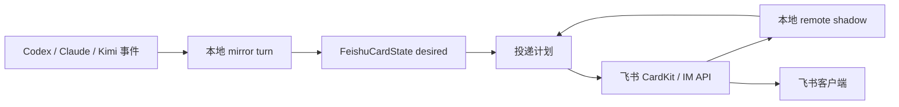

# 流式卡片

飞书的流式卡片功能非常强大，其丰富的前端效果组合是 CodeLark 能够实现精美交互的关键。使用中，有时会遇到流失卡片更新加载不及时，或者弱网环境下卡片更新较慢的情况。为此引入了大量面向用户体验和性能的优化、埋点分析。本文说明 CodeLark 把 runtime 输出投递到飞书流式卡片的完整链路及响应机制的模块归属。

> 飞书文档：
>
> - [富文本](https://open.feishu.cn/document/feishu-cards/card-json-v2-components/content-components/rich-text)
> - [标题](https://open.feishu.cn/document/feishu-cards/card-json-v2-components/content-components/title)
> - [表单容器](https://open.feishu.cn/document/feishu-cards/card-json-v2-components/containers/form-container)
> - [折叠面板](https://open.feishu.cn/document/feishu-cards/card-json-v2-components/containers/collapsible-panel)

## 总览



核心原则：

- runtime、mirror、工具进度、任务进度和状态文本只改本地 desired state。
- `scheduleCardFlush()` 负责把细碎变化合并到下一轮 flush。
- `flushCardUpdate()` 在 flush 时读取一份 desired snapshot，和本地 shadow 比较后生成投递计划。
- 只有投递计划执行器能调用飞书 CardKit API。
- 本地 shadow 表示“飞书服务端接受过什么”，不表示“用户客户端已经完成重绘”。

## 生命周期

### 首屏创建

入口是 `FeishuAdapter.createStreamingCard()`，实际创建在 `_doCreateStreamingCard()`。

1. 用当前正文、任务、状态、工具、actions 和 metadata 渲染初始 CardKit JSON，日志为 `Streaming card create payload`。
2. 调用 `cardkit.v1.card.create` 创建 CardKit 卡片，payload 是 `{ type: "card_json", data: <card json> }`。
3. 把返回的 `card_id` 包成 interactive 消息内容。
4. 如果是回复已有消息，调用 `im.message.reply`；否则调用 `im.message.create`，消息类型都是 `interactive`。
5. 把 `cardId`、`messageId`、sequence、desired 字段、rendered 字段和 perf 统计写入 `activeCards`。

需要观察：

- `card.create` 耗时、超时次数、payload bytes、component count。
- `im.message.*:interactive` 耗时和超时次数。
- 从 `onMessageStart` 到 card message id 可见的首屏耗时。

### 流式更新

运行中的入口包括：

- `updateCardContent()`：正文。
- `updateCardStatus()`：状态和 context usage。
- `updateToolProgress()`：工具面板。
- `updateTaskProgress()`：任务列表。
- `updateStreamingHistory()`：history-driven transcript。
- `updateCardMetadata()`：runtime、model、effort 和 bridge 标签；runtime 以无前缀的 `codex`/`claude`/`kimi` 橙色 tag 展示在 model/effort 前。
- `updateCardActions()`：按钮和表单 actions。

这些函数只更新 desired 字段，递增 `desiredRevision`，然后调用 `scheduleCardFlush()`。真正远端请求在 `flushCardUpdate()` 中执行。

调度规则：

- 同一张卡同时只允许一个 `flushInFlight` 或 `backgroundFlushInFlight`。
- 请求进行中又有新状态到来，只设置 `flushQueued=true`。
- 成功后下一次最早 flush 间隔默认 2s。
- 第一次失败后最早间隔默认 5s。
- 多次失败后封顶默认 10s。
- 单个飞书请求默认 timeout 为 15s。

需要观察：

- 每个 stream 的 flush attempt 数、成功数、失败数、timeout 数。
- 每次 flush 的 plan：`noop`、`batchUpdate`、`fullRefresh`。
- `flushQueued` 发生次数，表示请求期间又有新状态进来。
- 每次 flush 从 schedule 到发起、从发起到结束的耗时。

### 增量更新

flush 阶段分四步：

```text
snapshotStreamingDesiredState(state)
  -> buildDesiredRenderSnapshot(state, snapshot)
  -> planStreamingSync(state, desiredRender)
  -> executeStreamingSyncPlan(...) 或 flushFullCardRefresh(...)
```

`planStreamingSync()` 只产出三类计划：

| 计划            | 触发条件                                                                          | 投递方式                                                                                |
| ------------- | ----------------------------------------------------------------------------- | ----------------------------------------------------------------------------------- |
| `noop`        | desired 和 shadow 已一致                                                          | 不调用飞书 API                                                                           |
| `batchUpdate` | 只有可证明安全的局部差异                                                                  | `cardElement.content`、`cardElement.create`、`cardElement.patch` 或 `card.batchUpdate` |
| `fullRefresh` | shadow 不可信、metadata/action/layout 变化、history/tool 结构风险、周期性校正、小卡片直接刷新或用户文本边界更新 | `card.update` 写整张卡                                                                  |

`executeStreamingSyncPlan()` 可能调用：

- `card.batchUpdate`：批量 create/patch 元素。
- `cardElement.create`：追加元素。
- `cardElement.patch`：局部 patch 元素。
- `cardElement.content`：更新单个元素内容，常见目标是 `streaming_content`、`streaming_tasks`、`streaming_status`。

需要观察：

- 按 target 分组的耗时：`streaming_content`、`streaming_tasks`、`streaming_status`、tool/history element。
- `cardElement.content:streaming_status` 的频率和耗时，判断状态刷新是否占用预算。
- `batchUpdate` 的 action count、payload bytes、耗时。
- `patch` 是否导致 `shadowTrust=weak`，以及随后是否触发 full refresh。

### Full Refresh

入口是 `flushFullCardRefresh()`，底层调用 `card.update:streaming_refresh` 更新整张卡 JSON。Full refresh 通常比单 element update 更重，但在 shadow 不可信或结构变化时更可靠。

常见触发条件：

- `shadowTrust !== "trusted"`，例如 timeout、失败、慢 batch 或 patch 后进入 `shadow_unknown` / `shadow_weak`。
- actions、metadata、正文 layout signature 或 history signature 变化。
- history/tool append 需要 full refresh。
- 用户文本边界更新走 `direct_refresh_user_text`。
- 小卡片里如果本来要形成 batch，优先 `direct_refresh_small_card`。
- 非 historyDriven 卡片周期性 refresh。

需要观察：

- fullRefresh 次数和原因：`shadow_unknown`、`shadow_weak`、`direct_refresh_user_text`、`direct_refresh_small_card`、`periodic_refresh` 等。
- full refresh payload bytes、component count、耗时、超时次数。
- full refresh 后是否立即又有 `flushQueued`，表示刷新期间新状态继续堆积。

### 状态栏与活动时间

状态栏从 turn 开始显示，默认每 5 秒刷新一次。每次正文、思考、工具、任务或状态事件都算一次可见活动，并把“上次响应”归零；若这些事件本身已经触发卡片更新，状态栏必须使用同一个时刻立即重算，不能等下一次心跳。

所有运行中、续接和最终卡片共用同一套 footer 格式。状态字段（例如异常原因、已续接到下一条）排在最前，公共字段固定为“当前时刻 `HH:mm:ss` · 已运行时长 · 上次响应时长 · Context 使用 · 上一轮输入输出”；缺失字段省略，分隔符统一为 ` · `。时长使用紧凑格式并省略零值高位，例如 `3m11s`、`1h2m10s`、`0s`，不得补 `00h` 或混用中英文单位。

`stream_status_idle_start_seconds = 0` 表示从任务开始立即显示状态栏；`stream_status_check_interval_seconds = 5` 是默认心跳间隔。进程启动时只解析一次系统时区：shell `TZ` 优先，macOS/Windows 使用 runtime 系统时区，Linux 在 runtime 默认与系统文件冲突时读取 `/etc/timezone` 或 `/etc/localtime`；后续刷新只复用缓存的时区和 formatter，不得重复文件 I/O。这个 formatter 也是所有用户可见绝对时刻的唯一来源，包括 `/every`、`/then`、`/status`、会话活动时间、tmux/pty screen、hot-update 和 Web 状态页；不得再直接使用 `Date#getHours()` 或未指定时区的 `toLocaleString()`。持续时长仍使用 duration formatter，不参与时区换算。

### 卡片交互响应边界

飞书 `card.action.trigger` 必须在 2 秒内返回。SDK 回调只允许完成 callback data 解析、构造内部消息、入队并返回 toast；按钮、下拉、表单和确认卡共享这一条边界。文件扫描、配置写盘、命令执行、CardKit 恢复和卡片更新全部在返回后执行。`perf.feishu.card_action_response` 单独记录这段耗时，不能用后台命令的 `adapter.message.finished` 冒充 ACK 耗时。

CardKit create/update/settings/element 与 interactive/rich-card message 请求使用 10 秒上限；`card.idConvert` 只是恢复旧卡的优化路径，最多等待 2 秒，失败后立即创建替代卡。interactive delivery queue 仍按聊天保序，但任何可降级恢复请求都不得长期占住队头；`perf.delivery.queue_wait.queue_class` 用于区分 interactive 与 ordinary 排队。

新增工具与状态栏刷新必须保持为两个 CardKit 动作：先原子创建或更新工具 history，再单独更新 `streaming_status`。这既保持工具调用的原子边界，也让 footer 保留流式效果；不能为了合并请求而把工具正文和状态栏一起重绘成整张卡。

### 流式出站附件

`<clk-send>` 不等待 turn completed。SDK runtime 从只包含 assistant answer 的累积快照检测完整块；tmux/mirror runtime 只从 assistant/commentary 正文检测。thinking、reasoning、状态栏和工具预览即使包含合法的 `<clk-send>`，也不得触发附件发送。

协议块只存在于附件解析所需的原始 answer 中，不属于用户可见历史。SDK 正文和 mirror `StreamingHistoryItem` 在送入卡片前都要经过同一 final-only block 清理；原始 turn 文本继续保留到附件控制器和终态解析完成。这样中间卡、终态卡和 continuation 都不会显示 `<clk-send>`/`<clk-ask>` 或本地路径，同时不会因过早改写原始事件而丢失附件。

每个 turn 使用一个流式附件交付控制器：新发现的附件进入同聊天 interactive delivery queue，模型事件消费不等待远端发送；控制器按附件类型、路径、caption 和 name 去重。若结构化流式卡片仍在异步创建，附件 worker 必须先等待 adapter 返回真实 message id，再把附件回复到该卡片；不能用同步查询得到的空值把附件发成脱离当前 turn 的根消息。卡片创建失败时才沿用通道原有的降级发送。终态处理先等待已排队的附件发送收口，再从 final response 中删除已经成功发送的项，因此 completed 不会重复发送。中间发送失败的项不标记为成功，仍保留给终态交付重试。

### Finalize

入口是 `finalizeCard()`。

1. 等待已有 flush 完成，等待时间是请求超时加一个额外缓冲。
2. 调用 `card.settings`，写入 `{ streaming_mode: false }`，sequence 递增。
3. 渲染最终卡片 JSON，包括最终正文、任务、工具、footer、actions 和 metadata。
4. 如果组件数超过上限，裁剪较早 history/tool 内容。
5. 调用 `card.update` 写最终卡。
6. 成功后按 completed/error 添加终态 reaction。

final full update 必须以 desired history 为权威。`responseText` 为空不代表卡片没有正文：mirror 在流式卡已包含正文时会传空 text 防止重复，工具和消息仍可能全部存在于 `historyItems`。因此 final renderer 的 content gate 同时检查 text、legacy tools 和 history；history-only 的 apply_patch 也必须在关闭 streaming mode 后完整保留。

error 终态不能只靠红色边框或泛化的 `Error` footer。runtime adapter 把真实错误写入 `FinalizedBridgeMirrorTurn.errorText`；feedback controller 从 JSON 中提取 type/message（非 JSON 则保留原文），压成最多 600 个 Unicode 字符的单行状态，先更新“当前步骤：❌ 原因 + 已运行时间 + context/token usage”，再关闭 streaming mode。final footer 复用同一条原因，并继续追加 adapter 计算的真实耗时和 context；错误、时间、token 信息不能互相覆盖。history 不再重复插入错误块。新版结构化 JSONL error 与旧版 TUI `■` fallback 共用这个字段，channel renderer 不识别 Codex 专属格式。

mirror source 可以提供独立于主 JSONL 的补充增量事件源，但补充事件仍必须归一化成 `BridgeMirrorRecord`，由同一个 reconcile、turn 和 delivery 生命周期消费。Kimi 的 `wire.jsonl` 在 provider 失败时可能没有 terminal；此时 source 增量读取同 session 的 `kimi-code.log`，只在完整 `ERROR turn failed` 及错误详情出现后合成 `task_complete(isError=true)`。active provider stream 与 mirror 必须复用这一个终态 parser；可重试的 `WARN llm request failed` 不代表终态，不能由任一路径提前终止 turn。补充游标与主 wire 游标分离，主 wire 未变化也会检查补充源，channel renderer 不解析 Kimi 日志。

mirror 冷启动分为两种语义。新 attach 没有 `mirror_last_event_at` 水位，首次 reconcile 只建立 cursor，不回放已有历史；Bridge 重启恢复已有 binding 时带有持久化水位，首次 reconcile 必须交付时间严格晚于该水位的记录，追回停机窗口内已经写入 source、但尚未投递的 turn。不能把两种情况统一成“首次全部忽略”或“首次全部回放”。

需要观察：

- finalize 前等待 flush 的耗时和是否超时。
- `card.settings` 耗时。
- final `card.update` payload bytes、component count、耗时。
- background finalize 触发次数：`Streaming card finalize exceeded blocking budget`。

## 卡片结构

流式卡片按“稳定分区 + 局部元素 ID”组织，目标是让 adapter 能用 diff 决定低成本局部更新，必要时回退到 full refresh。

| 分区                 | 主要元素 ID                        | 数据来源                                    | 正常更新方式                                   | 失效时回退                              |
| ------------------ | ------------------------------ | --------------------------------------- | ---------------------------------------- | ---------------------------------- |
| Header             | header title、`streaming_tag_*` | stream metadata、bridge 标签 | metadata 变化触发 `card.update` full refresh | 关闭流式后 final `card.update`          |
| Metadata body tags | `runtime_meta_tags`            | runtime、model、effort tags；runtime 为无前缀 `codex`/`claude`/`kimi` 橙色 tag | full refresh                             | final `card.update`                |
| History / 正文容器     | `stream_history`               | `historyItems` 或正文 + tools              | 追加 markdown/tool panel 子元素               | full refresh 或续接新卡片                |
| 正文 markdown        | `streaming_content`            | `pendingText`                           | `cardElement.content`                    | full refresh                       |
| 工具面板               | `stream_tool_N`                   | `toolCalls` 或 history tool panel        | create/append；工具结构变化倾向 full refresh      | full refresh 或续接新卡片                |
| 任务区                | `streaming_tasks`              | task progress                           | `cardElement.content`                    | full refresh                       |
| 状态区                | `streaming_status`             | elapsed/status/context usage            | `cardElement.content`                    | final status append 或 full refresh |
| Actions            | action rows                    | stream actions                          | full refresh                             | 关闭流式后 final `card.update`          |

这个分区不是 CardKit 原生概念，是 CodeLark adapter 的同步边界。`renderedHistoryElementJson`、`renderedToolSnapshots`、`renderedComponentCount` 等状态只表示“本地认为已经提交到飞书服务端的结构”，不能证明用户客户端已经完成重绘。

## 工具调用呈现契约

工具卡片的输入不是 Codex/Kimi 原始事件，而是公共中间层：runtime adapter 先生成 `ToolCallEvent` 和 `ToolCallDetail`，reducer 合成 `ToolCallInfo`，`ToolPresentation` 再给出标题动作、对象、证据摘要、图标和边框语义。Feishu renderer 不判断 runtime，也不解析 Codex wrapper 或 Kimi wire。

沿用既有的“历史记录”外层容器，并在每批工具事件上保留共用的“工具调用 · N”折叠栏；展开工具调用组后，每个工具仍有自己的折叠面板，即“历史记录 → 工具调用组 → 单工具”。单工具内部不再为长输出增加折叠。标题由代码拼成一行，依次显示动作图标、动作、对象和范围/命中数/输出行数/耗时/非零 exit code；过长时由 Feishu 自然换行。完成态使用 `📖/🔎/🛠️/💻` 等动作图标，运行中和异常仍使用状态图标；标题和详情不再重复 `Success`、`Completed` 或“完成”。

展开后必须能审计真实调用参数：command 使用 `bash` fence，read/search/generic 工具显示结构化参数。shell 中的 `rg`/`grep` 即使位于复合命令里，也保留搜索语义和完整原始 command；解析 query/path 时必须按带引号 token 的原始源码长度推进，不能把引号误当成路径。普通工具的 output 仍可在中间层用于标题的行数、命中数、exit code 等摘要，但默认不把 output 正文放进卡片；`apply_patch` 是例外，显示真实修改内容。多文件 patch 按文件分成独立代码块，每块按自己的目标文件后缀选择语言；所有文件共同使用一份 8000 字符/160 行预算，而不是每个文件各获得一份预算。`Script completed`、`Wall time`、`Chunk ID`、`Original token count` 等 transport envelope 在 adapter 层消费，不进入详情。

飞书 CardKit Markdown 对 fenced code 有一个客户端兼容问题：当 fence 正文包含字面 `${...}` 表达式时，即使完全没有内部反引号，整个代码块也可能被布局成一行。公共 `ToolCallDetail` 和 Markdown renderer 不得为此改写内容；只在 Feishu 出站预处理边界，把命中 `${` 的完整 fenced block 改成 CommonMark 四空格缩进代码块。该异常块会失去语言高亮，但换行和可复制正文必须保持；普通反引号、单独 `$`、单独 `{...}` 和其他 block 继续保留文件语言高亮。禁止使用零宽字符、反斜杠或 HTML entity 替换正文，因为这些方案会污染用户看到和复制的 patch。

若一次工具结果明确返回仍在运行的 background session/cell id，当前工具标题追加一次“后台终端 N”，方便后续等待工具与终端关联；详情不再重复该 id。这个标记属于产生 background id 的历史工具事件，不跨事件维护动态状态，也不因为后续 `wait` 完成而回写旧标题。普通已完成工具以及只消费既有 session 的 `wait` 不显示该标记。

所有长内容在生成 Markdown 之前调用同一个预览 helper，并同时受字符数和行数两个 hard upper bound 约束；任何一个先达到就停止。普通输入/输出上限为 4000 Unicode code points 和 80 行，patch 上限为 8000 code points 和 160 行；多文件分块不能乘算这份预算。省略提示写在代码块外。禁止对已经生成的 Markdown 盲切，否则会切掉 closing fence。工具标题同样不能把已经包好的 inline-code Markdown 交给通用字符截断：文件名全部放得下就完整显示，放不下全部但能放下首个完整文件名时显示“`文件名` 等 N 个文件”，连一个完整文件名也放不下时只显示文件数量。Feishu 兼容层的缩进代码降级必须发生在预览完成之后，并覆盖完整 block。

## 本地镜像

创建后的 `FeishuCardState` 同时保存两类状态：

| 类型            | 代表字段                                                                                                                                                                                                                  | 含义                  |
| ------------- | --------------------------------------------------------------------------------------------------------------------------------------------------------------------------------------------------------------------- | ------------------- |
| Desired state | `pendingText`、`pendingTasksText`、`pendingStatusText`、`toolCalls`、`historyItems`、`metadata`、`actionRows`、`desiredRevision`                                                                                             | 本地现在希望卡片长什么样        |
| Remote shadow | `renderedText`、`renderedTasksText`、`renderedStatusText`、`renderedHistoryElementIds`、`renderedHistoryItemCount`、`renderedHistoryElementJson`、`renderedToolSnapshots`、`rendered*Signature`、`renderedComponentCount`、`shadowRevision`、`shadowTrust` | 本地认为已经被飞书服务端接受的卡片状态 |

Remote shadow 不是从飞书客户端反查出来的真实 DOM，而是 CodeLark 在每次 API 成功后提交的本地账本：

- `cardElement.content` 成功后，只更新对应 element 的 rendered 内容。
- `cardElement.create` / `patch` / `card.batchUpdate` 成功后，更新对应 history/tool element 的快照。
- `card.update` full refresh 成功后，用完整 desired render 覆盖 shadow。
- 慢 batch 或 patch 成功后，`shadowTrust` 会降级为 `weak`，下一轮优先整卡校正。
- 失败或 timeout 会把 shadow 视为不可信，后续投递倾向 full refresh。

这层 shadow 的价值是抑制重复投递：如果 desired snapshot 和 shadow 已一致，planner 直接返回 `noop`。

## 抑制碎片投递

CodeLark 不会让每个 mirror record 都触发一次远端请求。抑制碎片投递靠三层机制完成。

第一层是 desired 覆盖写。正文、任务、状态、工具和 history 事件到来时只覆盖本地最新状态；flush 还没发生时，中间态自然被合并。

第二层是 per-card flush gate。同一张卡同时只允许一个 `flushInFlight` 或 `backgroundFlushInFlight`。请求进行中又来了新状态，只设置 `flushQueued=true`，当前请求结束后再排下一轮。

第三层是拥塞窗口。成功后下一轮最早 flush 间隔使用基础间隔；失败后进入第一次失败间隔，再进入最大失败间隔。飞书请求默认也有超时保护，timeout 会进入失败路径。

这个设计牺牲了逐事件可见性，换来三个稳定性收益：

- 远端 API 频率受控。
- 飞书客户端弱网或慢刷新时，不会堆积大量过期更新。
- 每轮投递都基于最新 desired snapshot，而不是 replay 一串已经过时的事件。

## 打字机模式

CardKit 的 `streaming_mode` 只影响文本流式上屏的表现，不应成为卡片内容可靠同步的前提。CodeLark 当前的主要用户可见内容集中在正文区和工具区，各区域都允许用 full refresh 或最终普通卡片更新：

- 正文区：不强制流式。可以用 `cardElement.content` 更新固定 `streaming_content` 元素，也可以用 `card.update` / full refresh 直接写入全文。
- 状态区：不需要严格流式。`streaming_status` 可以用 `cardElement.content` 低频更新；如果结构变化或客户端不同步，可以接受 full refresh。
- 任务区：不需要严格流式。`streaming_tasks` 可以低频更新；多任务结构变化可以接受 full refresh。
- 工具区：不需要严格流式。历史记录内的单工具面板和 history/tool panel 追加不应依赖高频 `batchUpdate` 保证每个中间态都上屏。
- header、tag、actions、按钮、表单：不需要流式。运行中可以低频 full refresh；最终交互组件应在关闭流式后再更新。

飞书文档中的 `streaming_config.print_frequency_ms`、`print_step`、`print_strategy` 控制的是流式更新文本的打字机上屏，不控制 `batchUpdate` 组件树同步。因此不要把 `batchUpdate` 当成正文流式刷新机制。

## 长连接刷新

飞书侧的长连接负责把用户消息、云文档评论、群生命周期和卡片交互回调推到本地 bridge。CodeLark 订阅的关键事件和回调包括：

- `im.message.receive_v1`：IM 消息入口。
- `drive.notice.comment_add_v1`：云文档评论入口。
- `im.chat.member.bot.deleted_v1`：bot 被移出群。
- `im.chat.disbanded_v1`：群被解散。
- `card.action.trigger`：卡片按钮、表单和交互动作。

长连接刷新和流式卡片刷新是两条不同链路：

- 长连接刷新解决“飞书事件如何到达本地 bridge”。
- CardKit 刷新解决“本地 bridge 如何把 stream UI 状态写回飞书卡片”。

如果长连接断开，bridge 收不到新的用户输入或按钮回调；如果 CardKit 刷新失败，bridge 仍可能继续执行 runtime，但用户看到的卡片会停留在旧状态。排障时需要分别看 WebSocket/事件日志和 `perf.card.sync_plan`、`cardElement.*`、`card.update:*` 日志。

## 续接与飞书限制

飞书流式卡片有 200 个组件的限制，当前 adapter 使用 `STREAMING_CARD_COMPONENT_LIMIT=160` 作为组件软上限。组件数不是唯一风险，实际 CardKit 写入还会受 payload 大小、字符数和 markdown element 数影响；因此运行中还会用 `payload_bytes`、`payload_chars`、`markdown_count` 做提前续接判断。

接近或超过任一安全线时，优先执行续接：

1. 尝试用 `cardElement.content` 把旧卡状态区改成“已续接到下一条”。
2. 对旧卡调用 `card.settings` 关闭服务端 `streaming_mode`。
3. 从 remote shadow 只重建旧卡最后一次成功渲染的内容，调用 `card.update` 写回不含 `streaming_mode:true` 的静态卡片 JSON。客户端只有收到这一步后，旧卡文本才会恢复为可选中状态。
4. 用相同 stream key 创建 continuation card。
5. continuation card 从 `historyItemOffset` 或 `toolCallOffset` 后继续渲染。
6. 如果续接失败，再尝试运行中的 `card.update` full refresh。

续接依赖 shadow 中记录的已渲染 history/tool offset。history offset 按 canonical `StreamingHistoryItem` 数计算，不能用 CardKit element 数代替：一个 `tool_panel` history item 可能扁平渲染成多个 `stream_tool_N`。旧卡静态定稿只能使用 shadow 中已经成功写入的范围，不能使用 desired/pending 的完整内容，否则会把下一张卡的开头重复写回旧卡。新卡从当前正在更新的 item 开始，避免因一对多渲染跳过内容。由于 shadow 不是客户端 ACK，慢 batch 或弱确认场景下要保守降级，避免 offset 跳过用户没看到的内容。

如果飞书返回 `code=200850`，adapter 会直接触发强制 continuation rollover，不再等待下一轮 full refresh。这个错误通常说明 payload 维度已触及飞书实际限制，即使 `componentCount` 仍低于组件软上限，也应该把当前 group 切到新卡。

## 底层飞书 API

| 阶段           | SDK 调用                           | 关键参数                                                                                                  | 用途                                           |
| ------------ | -------------------------------- | ----------------------------------------------------------------------------------------------------- | -------------------------------------------- |
| 创建 CardKit 卡 | `cardkit.v1.card.create`         | `data.type="card_json"`、`data.data=<card json>`                                                       | 在 CardKit 创建可复用卡片，获得 `card_id`               |
| 发送卡片消息       | `im.message.reply`               | `msg_type="interactive"`、`content={"type":"card","data":{"card_id":...}}`                             | 回复已有 IM 消息                                   |
| 发送卡片消息       | `im.message.create`              | `receive_id_type="chat_id"`、`msg_type="interactive"`、`content={"type":"card","data":{"card_id":...}}` | 主动向 chat 发送卡片                                |
| 更新固定文本区      | `cardkit.v1.cardElement.content` | `card_id`、`element_id`、`content`、`sequence`                                                           | 更新正文、任务、状态等固定 element                        |
| 追加元素         | `cardkit.v1.cardElement.create`  | `card_id`、`type="append"`、`target_element_id`、`elements`、`sequence`                                   | 追加 history/tool 子元素                          |
| 局部 patch     | `cardkit.v1.cardElement.patch`   | `card_id`、`element_id`、`partial_element`、`sequence`                                                   | 更新工具面板等结构的一部分                                |
| 批量更新         | `cardkit.v1.card.batchUpdate`    | `actions`、`sequence`                                                                                  | 合并 `add_elements` 和 `partial_update_element` |
| 整卡刷新         | `cardkit.v1.card.update`         | `card={type:"card_json",data:<card json>}`、`sequence`                                                 | full refresh 或最终定稿                           |
| 关闭流式         | `cardkit.v1.card.settings`       | `settings={"streaming_mode":false}`、`sequence`                                                        | 定稿；续接状态写入后关闭 streaming mode             |
| 终态 reaction  | `im.messageReaction.create`      | `message_id`、emoji type                                                                               | completed/error 结果提示                         |

所有 CardKit 更新都依赖递增的 `sequence`。关闭 streaming mode 本身也占用一个 sequence；普通 finalize 会先关闭 streaming mode 再写最终普通卡，rollover 会依次写“已续接到下一条”状态、关闭 streaming mode、写静态旧卡，然后才创建下一张卡。禁止把 `card.settings` 当成客户端静态化的最后一步。

## 日志与性能观测

已经有的日志：

- `Request start/success/timeout/error`：所有 `withFeishuRequestTimeout()` 包裹的飞书 API 请求。
- `Streaming card create payload`：首屏卡片 payload 摘要。
- `Streaming sync plan`：每次 flush 的计划类型和原因。
- `Streaming card full refresh payload`：full refresh payload 摘要。
- `Streaming card threshold reached; opening continuation card`：组件或 payload 安全线触发续接，包含 `reason`、`component_count`、`payload_bytes`、`payload_chars`、`markdown_count`。
- `Final card update payload`：最终卡 payload 摘要。
- `cardElement.* failed`、`card.update streaming refresh failed`：更新失败。
- `Streaming batch shadow downgraded`：慢 batch 或 patch 导致 shadow trust 降级。
- `Streaming card perf summary` / `perf.card.lifecycle`：单张流式卡片生命周期汇总。

`Streaming card perf summary` 建议重点看：

- 基础：`stream_key`、`chat`、`card_id`、`message_id`、`duration_ms`。
- 首屏：`create_card_ms`、`send_message_ms`、`initial_payload_bytes`、`initial_component_count`。
- flush：`flush_attempts`、`flush_successes`、`flush_failures`、`flush_timeouts`、`flush_queued_count`。
- plan：`noop_count`、`batch_update_count`、`full_refresh_count`、`full_refresh_reasons`。
- API 汇总：`api_top` 按 `operation` 记录 `count`、`timeout_count`、`error_count`、`total_ms`、`max_ms`、`avg_ms`。
- payload：`max_payload_bytes`、`max_component_count`、`final_payload_bytes`、`final_component_count`。
- finalize：`finalize_wait_ms`、`settings_ms`、`final_update_ms`、`background_finalize`。
