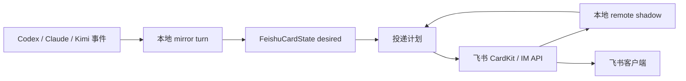

# 流式卡片

飞书的流式卡片功能非常强大，其丰富的前端效果组合是 CodeLark 能够实现精美交互的关键。使用中，有时会遇到流失卡片更新加载不及时，或者弱网环境下卡片更新较慢的情况。为此引入了大量面向用户体验和性能的优化、埋点分析。本文说明 CodeLark 把 runtime 输出投递到飞书流式卡片的完整链路及响应机制的模块归属。

> 飞书文档：
>
> - [富文本](https://open.feishu.cn/document/feishu-cards/card-json-v2-components/content-components/rich-text)
> - [标题](https://open.feishu.cn/document/feishu-cards/card-json-v2-components/content-components/title)
> - [表单容器](https://open.feishu.cn/document/feishu-cards/card-json-v2-components/containers/form-container)
> - [折叠面板](https://open.feishu.cn/document/feishu-cards/card-json-v2-components/containers/collapsible-panel)

## 总览



核心原则：

- runtime、mirror、工具进度、任务进度和状态文本只改本地 desired state。
- `scheduleCardFlush()` 负责把细碎变化合并到下一轮 flush。
- `flushCardUpdate()` 在 flush 时读取一份 desired snapshot，和本地 shadow 比较后生成投递计划。
- 只有投递计划执行器能调用飞书 CardKit API。
- 本地 shadow 表示“飞书服务端接受过什么”，不表示“用户客户端已经完成重绘”。

## 生命周期

### 首屏创建

入口是 `FeishuAdapter.createStreamingCard()`，实际创建在 `_doCreateStreamingCard()`。

1. 用当前正文、任务、状态、工具、actions 和 metadata 渲染初始 CardKit JSON，日志为 `Streaming card create payload`。
2. 调用 `cardkit.v1.card.create` 创建 CardKit 卡片，payload 是 `{ type: "card_json", data: <card json> }`。
3. 把返回的 `card_id` 包成 interactive 消息内容。
4. 如果是回复已有消息，调用 `im.message.reply`；否则调用 `im.message.create`，消息类型都是 `interactive`。
5. 把 `cardId`、`messageId`、sequence、desired 字段、rendered 字段和 perf 统计写入 `activeCards`。

需要观察：

- `card.create` 耗时、超时次数、payload bytes、component count。
- `im.message.*:interactive` 耗时和超时次数。
- 从 `onMessageStart` 到 card message id 可见的首屏耗时。

### 流式更新

运行中的入口包括：

- `updateCardContent()`：正文。
- `updateCardStatus()`：状态和 context usage。
- `updateToolProgress()`：工具面板。
- `updateTaskProgress()`：任务列表。
- `updateStreamingHistory()`：history-driven transcript。
- `updateCardMetadata()`：runtime、model、effort 和 bridge 标签；runtime 以无前缀的 `codex`/`claude`/`kimi` 橙色 tag 展示在 model/effort 前。
- `updateCardActions()`：按钮和表单 actions。

这些函数只更新 desired 字段，递增 `desiredRevision`，然后调用 `scheduleCardFlush()`。真正远端请求在 `flushCardUpdate()` 中执行。

调度规则：

- 同一张卡同时只允许一个 `flushInFlight` 或 `backgroundFlushInFlight`。
- 请求进行中又有新状态到来，只设置 `flushQueued=true`。
- 成功后下一次最早 flush 间隔默认 2s。
- 第一次失败后最早间隔默认 5s。
- 多次失败后封顶默认 10s。
- 单个飞书请求默认 timeout 为 15s。

需要观察：

- 每个 stream 的 flush attempt 数、成功数、失败数、timeout 数。
- 每次 flush 的 plan：`noop`、`batchUpdate`、`fullRefresh`。
- `flushQueued` 发生次数，表示请求期间又有新状态进来。
- 每次 flush 从 schedule 到发起、从发起到结束的耗时。

### 增量更新

flush 阶段分四步：

```text
snapshotStreamingDesiredState(state)
  -> buildDesiredRenderSnapshot(state, snapshot)
  -> planStreamingSync(state, desiredRender)
  -> executeStreamingSyncPlan(...) 或 flushFullCardRefresh(...)
```

`planStreamingSync()` 只产出三类计划：

| 计划            | 触发条件                                                                          | 投递方式                                                                                |
| ------------- | ----------------------------------------------------------------------------- | ----------------------------------------------------------------------------------- |
| `noop`        | desired 和 shadow 已一致                                                          | 不调用飞书 API                                                                           |
| `batchUpdate` | 只有可证明安全的局部差异                                                                  | `cardElement.content`、`cardElement.create`、`cardElement.patch` 或 `card.batchUpdate` |
| `fullRefresh` | shadow 不可信、metadata/action/layout 变化、history/tool 结构风险、周期性校正、小卡片直接刷新或用户文本边界更新 | `card.update` 写整张卡                                                                  |

`executeStreamingSyncPlan()` 可能调用：

- `card.batchUpdate`：批量 create/patch 元素。
- `cardElement.create`：追加元素。
- `cardElement.patch`：局部 patch 元素。
- `cardElement.content`：更新单个元素内容，常见目标是 `streaming_content`、`streaming_tasks`、`streaming_status`。

需要观察：

- 按 target 分组的耗时：`streaming_content`、`streaming_tasks`、`streaming_status`、tool/history element。
- `cardElement.content:streaming_status` 的频率和耗时，判断状态刷新是否占用预算。
- `batchUpdate` 的 action count、payload bytes、耗时。
- `patch` 是否导致 `shadowTrust=weak`，以及随后是否触发 full refresh。

### Full Refresh

入口是 `flushFullCardRefresh()`，底层调用 `card.update:streaming_refresh` 更新整张卡 JSON。Full refresh 通常比单 element update 更重，但在 shadow 不可信或结构变化时更可靠。

常见触发条件：

- `shadowTrust !== "trusted"`，例如 timeout、失败、慢 batch 或 patch 后进入 `shadow_unknown` / `shadow_weak`。
- actions、metadata、正文 layout signature 或 history signature 变化。
- history/tool append 需要 full refresh。
- 用户文本边界更新走 `direct_refresh_user_text`。
- 小卡片里如果本来要形成 batch，优先 `direct_refresh_small_card`。
- 非 historyDriven 卡片周期性 refresh。

需要观察：

- fullRefresh 次数和原因：`shadow_unknown`、`shadow_weak`、`direct_refresh_user_text`、`direct_refresh_small_card`、`periodic_refresh` 等。
- full refresh payload bytes、component count、耗时、超时次数。
- full refresh 后是否立即又有 `flushQueued`，表示刷新期间新状态继续堆积。

### Finalize

入口是 `finalizeCard()`。

1. 等待已有 flush 完成，等待时间是请求超时加一个额外缓冲。
2. 调用 `card.settings`，写入 `{ streaming_mode: false }`，sequence 递增。
3. 渲染最终卡片 JSON，包括最终正文、任务、工具、footer、actions 和 metadata。
4. 如果组件数超过上限，裁剪较早 history/tool 内容。
5. 调用 `card.update` 写最终卡。
6. 成功后按 completed/error 添加终态 reaction。

需要观察：

- finalize 前等待 flush 的耗时和是否超时。
- `card.settings` 耗时。
- final `card.update` payload bytes、component count、耗时。
- background finalize 触发次数：`Streaming card finalize exceeded blocking budget`。

## 卡片结构

流式卡片按“稳定分区 + 局部元素 ID”组织，目标是让 adapter 能用 diff 决定低成本局部更新，必要时回退到 full refresh。

| 分区                 | 主要元素 ID                        | 数据来源                                    | 正常更新方式                                   | 失效时回退                              |
| ------------------ | ------------------------------ | --------------------------------------- | ---------------------------------------- | ---------------------------------- |
| Header             | header title、`streaming_tag_*` | stream metadata、bridge 标签 | metadata 变化触发 `card.update` full refresh | 关闭流式后 final `card.update`          |
| Metadata body tags | `runtime_meta_tags`            | runtime、model、effort tags；runtime 为无前缀 `codex`/`claude`/`kimi` 橙色 tag | full refresh                             | final `card.update`                |
| History / 正文容器     | `stream_history`               | `historyItems` 或正文 + tools              | 追加 markdown/tool panel 子元素               | full refresh 或续接新卡片                |
| 正文 markdown        | `streaming_content`            | `pendingText`                           | `cardElement.content`                    | full refresh                       |
| 工具面板               | `stream_tool_N` / 子事件元素        | `toolCalls` 或 history tool panel        | create/append；工具结构变化倾向 full refresh      | full refresh 或续接新卡片                |
| 任务区                | `streaming_tasks`              | task progress                           | `cardElement.content`                    | full refresh                       |
| 状态区                | `streaming_status`             | elapsed/status/context usage            | `cardElement.content`                    | final status append 或 full refresh |
| Actions            | action rows                    | stream actions                          | full refresh                             | 关闭流式后 final `card.update`          |

这个分区不是 CardKit 原生概念，是 CodeLark adapter 的同步边界。`renderedHistoryElementJson`、`renderedToolSnapshots`、`renderedComponentCount` 等状态只表示“本地认为已经提交到飞书服务端的结构”，不能证明用户客户端已经完成重绘。

## 本地镜像

创建后的 `FeishuCardState` 同时保存两类状态：

| 类型            | 代表字段                                                                                                                                                                                                                  | 含义                  |
| ------------- | --------------------------------------------------------------------------------------------------------------------------------------------------------------------------------------------------------------------- | ------------------- |
| Desired state | `pendingText`、`pendingTasksText`、`pendingStatusText`、`toolCalls`、`historyItems`、`metadata`、`actionRows`、`desiredRevision`                                                                                             | 本地现在希望卡片长什么样        |
| Remote shadow | `renderedText`、`renderedTasksText`、`renderedStatusText`、`renderedHistoryElementIds`、`renderedHistoryElementJson`、`renderedToolSnapshots`、`rendered*Signature`、`renderedComponentCount`、`shadowRevision`、`shadowTrust` | 本地认为已经被飞书服务端接受的卡片状态 |

Remote shadow 不是从飞书客户端反查出来的真实 DOM，而是 CodeLark 在每次 API 成功后提交的本地账本：

- `cardElement.content` 成功后，只更新对应 element 的 rendered 内容。
- `cardElement.create` / `patch` / `card.batchUpdate` 成功后，更新对应 history/tool element 的快照。
- `card.update` full refresh 成功后，用完整 desired render 覆盖 shadow。
- 慢 batch 或 patch 成功后，`shadowTrust` 会降级为 `weak`，下一轮优先整卡校正。
- 失败或 timeout 会把 shadow 视为不可信，后续投递倾向 full refresh。

这层 shadow 的价值是抑制重复投递：如果 desired snapshot 和 shadow 已一致，planner 直接返回 `noop`。

## 抑制碎片投递

CodeLark 不会让每个 mirror record 都触发一次远端请求。抑制碎片投递靠三层机制完成。

第一层是 desired 覆盖写。正文、任务、状态、工具和 history 事件到来时只覆盖本地最新状态；flush 还没发生时，中间态自然被合并。

第二层是 per-card flush gate。同一张卡同时只允许一个 `flushInFlight` 或 `backgroundFlushInFlight`。请求进行中又来了新状态，只设置 `flushQueued=true`，当前请求结束后再排下一轮。

第三层是拥塞窗口。成功后下一轮最早 flush 间隔使用基础间隔；失败后进入第一次失败间隔，再进入最大失败间隔。飞书请求默认也有超时保护，timeout 会进入失败路径。

这个设计牺牲了逐事件可见性，换来三个稳定性收益：

- 远端 API 频率受控。
- 飞书客户端弱网或慢刷新时，不会堆积大量过期更新。
- 每轮投递都基于最新 desired snapshot，而不是 replay 一串已经过时的事件。

## 打字机模式

CardKit 的 `streaming_mode` 只影响文本流式上屏的表现，不应成为卡片内容可靠同步的前提。CodeLark 当前的主要用户可见内容集中在正文区和工具区，各区域都允许用 full refresh 或最终普通卡片更新：

- 正文区：不强制流式。可以用 `cardElement.content` 更新固定 `streaming_content` 元素，也可以用 `card.update` / full refresh 直接写入全文。
- 状态区：不需要严格流式。`streaming_status` 可以用 `cardElement.content` 低频更新；如果结构变化或客户端不同步，可以接受 full refresh。
- 任务区：不需要严格流式。`streaming_tasks` 可以低频更新；多任务结构变化可以接受 full refresh。
- 工具区：不需要严格流式。工具调用面板、长输出折叠面板和 history/tool panel 追加不应依赖高频 `batchUpdate` 保证每个中间态都上屏。
- header、tag、actions、按钮、表单：不需要流式。运行中可以低频 full refresh；最终交互组件应在关闭流式后再更新。

飞书文档中的 `streaming_config.print_frequency_ms`、`print_step`、`print_strategy` 控制的是流式更新文本的打字机上屏，不控制 `batchUpdate` 组件树同步。因此不要把 `batchUpdate` 当成正文流式刷新机制。

## 长连接刷新

飞书侧的长连接负责把用户消息、云文档评论、群生命周期和卡片交互回调推到本地 bridge。CodeLark 订阅的关键事件和回调包括：

- `im.message.receive_v1`：IM 消息入口。
- `drive.notice.comment_add_v1`：云文档评论入口。
- `im.chat.member.bot.deleted_v1`：bot 被移出群。
- `im.chat.disbanded_v1`：群被解散。
- `card.action.trigger`：卡片按钮、表单和交互动作。

长连接刷新和流式卡片刷新是两条不同链路：

- 长连接刷新解决“飞书事件如何到达本地 bridge”。
- CardKit 刷新解决“本地 bridge 如何把 stream UI 状态写回飞书卡片”。

如果长连接断开，bridge 收不到新的用户输入或按钮回调；如果 CardKit 刷新失败，bridge 仍可能继续执行 runtime，但用户看到的卡片会停留在旧状态。排障时需要分别看 WebSocket/事件日志和 `perf.card.sync_plan`、`cardElement.*`、`card.update:*` 日志。

## 续接与飞书限制

飞书流式卡片有 200 个组件的限制，当前 adapter 使用 `STREAMING_CARD_COMPONENT_LIMIT=160` 作为组件软上限。组件数不是唯一风险，实际 CardKit 写入还会受 payload 大小、字符数和 markdown element 数影响；因此运行中还会用 `payload_bytes`、`payload_chars`、`markdown_count` 做提前续接判断。

接近或超过任一安全线时，优先执行续接：

1. 尝试用 `cardElement.content` 把旧卡状态区改成“已续接到下一条”。
2. 对旧卡调用 `card.settings` 关闭 `streaming_mode`，让 finalize 成为旧卡续接前的最后一次 CardKit 写入。
3. 用相同 stream key 创建 continuation card。
4. continuation card 从 `historyItemOffset` 或 `toolCallOffset` 后继续渲染。
5. 如果续接失败，再尝试 `card.update` full refresh。

续接依赖 shadow 中记录的已渲染 history/tool offset。offset 按“上一个已渲染文本/工具 group”后退：旧卡保留已显示的 group，新卡从当前正在更新的 history item 或 tool group 开始，避免把还没写成功的内容留在过大的旧卡里。由于 shadow 不是客户端 ACK，慢 batch 或弱确认场景下要保守降级，避免 offset 跳过用户没看到的内容。

如果飞书返回 `code=200850`，adapter 会直接触发强制 continuation rollover，不再等待下一轮 full refresh。这个错误通常说明 payload 维度已触及飞书实际限制，即使 `componentCount` 仍低于组件软上限，也应该把当前 group 切到新卡。

## 底层飞书 API

| 阶段           | SDK 调用                           | 关键参数                                                                                                  | 用途                                           |
| ------------ | -------------------------------- | ----------------------------------------------------------------------------------------------------- | -------------------------------------------- |
| 创建 CardKit 卡 | `cardkit.v1.card.create`         | `data.type="card_json"`、`data.data=<card json>`                                                       | 在 CardKit 创建可复用卡片，获得 `card_id`               |
| 发送卡片消息       | `im.message.reply`               | `msg_type="interactive"`、`content={"type":"card","data":{"card_id":...}}`                             | 回复已有 IM 消息                                   |
| 发送卡片消息       | `im.message.create`              | `receive_id_type="chat_id"`、`msg_type="interactive"`、`content={"type":"card","data":{"card_id":...}}` | 主动向 chat 发送卡片                                |
| 更新固定文本区      | `cardkit.v1.cardElement.content` | `card_id`、`element_id`、`content`、`sequence`                                                           | 更新正文、任务、状态等固定 element                        |
| 追加元素         | `cardkit.v1.cardElement.create`  | `card_id`、`type="append"`、`target_element_id`、`elements`、`sequence`                                   | 追加 history/tool 子元素                          |
| 局部 patch     | `cardkit.v1.cardElement.patch`   | `card_id`、`element_id`、`partial_element`、`sequence`                                                   | 更新工具面板等结构的一部分                                |
| 批量更新         | `cardkit.v1.card.batchUpdate`    | `actions`、`sequence`                                                                                  | 合并 `add_elements` 和 `partial_update_element` |
| 整卡刷新         | `cardkit.v1.card.update`         | `card={type:"card_json",data:<card json>}`、`sequence`                                                 | full refresh 或最终定稿                           |
| 关闭流式         | `cardkit.v1.card.settings`       | `settings={"streaming_mode":false}`、`sequence`                                                        | 定稿；续接状态写入后关闭 streaming mode             |
| 终态 reaction  | `im.messageReaction.create`      | `message_id`、emoji type                                                                               | completed/error 结果提示                         |

所有 CardKit 更新都依赖递增的 `sequence`。关闭 streaming mode 本身也占用一个 sequence；普通 finalize 会先关闭 streaming mode 再写最终普通卡，rollover 会先写“已续接到下一条”状态，再用 `card.settings` 作为旧卡的最后一次写入。

## 日志与性能观测

已经有的日志：

- `Request start/success/timeout/error`：所有 `withFeishuRequestTimeout()` 包裹的飞书 API 请求。
- `Streaming card create payload`：首屏卡片 payload 摘要。
- `Streaming sync plan`：每次 flush 的计划类型和原因。
- `Streaming card full refresh payload`：full refresh payload 摘要。
- `Streaming card threshold reached; opening continuation card`：组件或 payload 安全线触发续接，包含 `reason`、`component_count`、`payload_bytes`、`payload_chars`、`markdown_count`。
- `Final card update payload`：最终卡 payload 摘要。
- `cardElement.* failed`、`card.update streaming refresh failed`：更新失败。
- `Streaming batch shadow downgraded`：慢 batch 或 patch 导致 shadow trust 降级。
- `Streaming card perf summary` / `perf.card.lifecycle`：单张流式卡片生命周期汇总。

`Streaming card perf summary` 建议重点看：

- 基础：`streamKey`、`chatId`、`cardId`、`messageId`、`elapsedMs`。
- 首屏：`createCardMs`、`sendMessageMs`、`initialPayloadBytes`、`initialComponentCount`。
- flush：`flushAttempts`、`flushSuccesses`、`flushFailures`、`flushTimeouts`、`flushQueuedCount`。
- plan：`noopCount`、`batchUpdateCount`、`fullRefreshCount`、`fullRefreshReasons`。
- API 汇总：按 target 记录 `count`、`timeoutCount`、`totalMs`、`maxMs`。
- payload：`maxPayloadBytes`、`maxComponentCount`、`finalPayloadBytes`、`finalComponentCount`。
- finalize：`finalizeWaitMs`、`settingsMs`、`finalUpdateMs`、`backgroundFinalize`。
