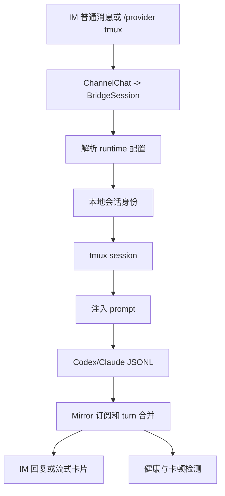

# tmux Runtime 生命周期

本文描述 CodeLark 当前 tmux runtime 的完整链路。Codex 和 Claude Code 共用 `src/bridge/tmux/core.ts` 的 tmux API，差异只保留在各自 CLI 启动参数、会话文件发现和 JSONL 解析上。

## 总览

## 公共 tmux API

公共层在 `src/bridge/tmux/core.ts`，只负责稳定地驱动 tmux：

| API | 职责 |
| --- | --- |
| `hasSession` | 检查 tmux session 是否存在。 |
| `ensureDetachedSession` | 创建或按需重建 detached session。 |
| `capturePane` | 抓取屏幕，用于 `/tmux-screen`、ready 检测和调试。 |
| `sendActions` | 发送 literal 或特殊键；长文本自动走 buffer paste。 |
| `injectPromptIntoPane` | 多行 prompt 使用 paste-buffer + `M-Enter`，最后 `Enter` 提交。 |
| `sendInterrupt` | `/stop` 或 abort 时发送 `C-c`。 |

`src/bridge/tmux/runtime.ts` 是 runtime 级公共层：Codex 侧提供 `startCodexResumeTmuxSession`，Claude 侧提供 `startClaudeTmuxSession`，二者都复用同一个 tmux core、ready 轮询和 session name 规范。

## Codex tmux 生命周期

### 1. thread 获取和注入

当用户把当前 Codex runtime 切到 `/provider tmux` 时，`src/bridge/command/provider-settings.ts` 先从 `BridgeSession.runtime.codex.threadId` 或 binding 推导已有 Codex thread。若没有 thread，会通过 `bootstrapCodexThreadLocally` 本地预创建 Codex thread，并把结果写回 `BridgeSession`。

完成 thread 解析后，`codexTmuxSessionName(threadId)` 生成 `codex_<threadId>`，`startCodexResumeTmuxSession` 用 `codex resume <threadId>` 启动 TUI。启动参数来自 `resolveSessionRuntimeConfig`，包括 model、sandbox、network、reasoning effort、mode 和 skipGitRepoCheck。

### 2. TUI 启动和 ready 检测

`buildCodexResumeTmuxCommand` 构造 Codex TUI shell command。`waitForCodexResumeTmuxReady` 周期性 `capturePane`，直到看到 Codex TUI ready prompt，或者达到 `CODELARK_CODEX_RESUME_TMUX_READY_TIMEOUT_MS`。超时不会阻断 provider 切换，但会在日志里记录，便于排查 TUI 启动慢或卡在交互提示。

### 3. 普通消息转发

普通 IM 消息进入 interactive turn 后，`CodexRoutingProvider` 根据 `codexProvider=tmux` 分发到 `CodexTmuxProvider`。provider 校验 tmux session，等待信任、更新或权限选择提示稳定后，通过 tmux core 注入 prompt。Codex TUI 的输出不直接依赖屏幕文本作为最终答案，而是由 Codex session JSONL mirror 同步。

### 4. JSONL mirror 和回复

Codex TUI 写入本地 JSONL 后，`src/runtime/codex/session-index/*` 负责发现 session 文件、按 offset 解析增量，并转换成 `BridgeMirrorRecord`。`src/bridge/mirror/runtime.ts` 订阅活动绑定，`src/bridge/mirror/turns.ts` 合并 message、reasoning、tool、plan 和 terminal 事件，再交给反馈控制器投递到 IM。

### 5. 卡顿和健康检测

卡顿检测不依赖单一信号。`src/bridge/health/runtime.ts` 汇总 `BridgeSession` 的 `runtime_status`、`last_progress_at`、活跃工具、stream UI 刷新、mirror 事件时间和进程状态，`src/bridge/health/reducer.ts` 归约为 `running_active`、`slow_observed`、`suspected_stall`、`suspected_stream_ui_stall`、`suspected_detached` 等状态。`/health` 展示单会话诊断，`/status` 和运行时卡片展示概览。

## Claude tmux 生命周期

Claude Code 现在提供与 Codex tmux 对齐的 provider：

| 阶段 | Claude tmux 实现 |
| --- | --- |
| provider 选择 | `/provider tmux` 写入 `BridgeSession.runtime.claude.provider=tmux`，并记录 `general.tmuxSessionName`。 |
| 启动命令 | `buildClaudeTmuxCommand` 复用 Claude pty 的 CLI 参数构造，支持 `claude` / `ccr code`、model、permission mode 和 `--effort`。 |
| tmux session | `claudeTmuxSessionName(session.id)` 生成稳定 session 名，`startClaudeTmuxSession` 创建或重建 detached session。 |
| prompt 注入 | `ClaudeTmuxProvider` 使用 `tmuxCore.injectPromptIntoPane` 注入普通消息。 |
| 会话身份 | provider 通过 Claude JSONL discovery 获取 `session_id`、cwd 和 transcript path，并在 SSE `result` 中回传。 |
| 输出同步 | Claude pty/tmux 都依赖 `src/runtime/claude/session-jsonl.ts` 读取 Claude Code JSONL；SDK provider 继续走原生事件。 |

Claude tmux 与 Codex tmux 的差异是：Claude Code 本身决定 JSONL session id；CodeLark 不需要像 Codex 那样预创建 thread，也不会执行 `resume <threadId>`。因此 Claude tmux 的身份注入发生在 Claude Code 写出 JSONL 后，再把发现到的 `session_id` 保存回 `BridgeSession.runtime.claude.sessionId`。

## 命令和配置入口

| 入口 | 作用 |
| --- | --- |
| `/runtime codex|claude` | 切换当前聊天的 runtime。 |
| `/provider tmux` | 对当前 runtime 启用 tmux provider。Codex 会启动 `codex_<threadId>`；Claude 会启动 `claude_<sessionId>`。 |
| `/tmux-screen` | 查看当前绑定的 tmux 屏幕。 |
| `/stop` | 对运行中的 tmux/pty provider 发送中断。 |
| `/current` | 当前会话配置卡片，支持 provider、model、mode、reasoning 等会话级覆盖。 |
| `/set codexReasoningEffort ...` | 设置 Codex 全局 reasoning 默认值。 |
| `/set claudeReasoningEffort ...` | 设置 Claude Code 全局 effort 默认值。 |
| `/set claudeProvider pty|tmux|sdk` | 设置 Claude Code 新会话默认 provider。 |

## 维护边界

- tmux 命令拼装、长文本 paste、屏幕抓取和特殊键发送必须继续留在 `src/bridge/tmux/core.ts`，不要在 provider 内重复 shell 拼接。
- Codex 和 Claude 各自的 CLI 参数构造可以不同，但 tmux session 生命周期应通过 `src/bridge/tmux/runtime.ts` 暴露的 runtime API。
- JSONL mirror 是 pty/tmux provider 的权威输出来源；屏幕抓取主要用于 ready 检测、人工诊断和短期兜底。
- 卡顿检测应继续消费统一的 `BridgeSession` 运行状态和 mirror 进度，而不是让 provider 自己决定最终健康状态。
