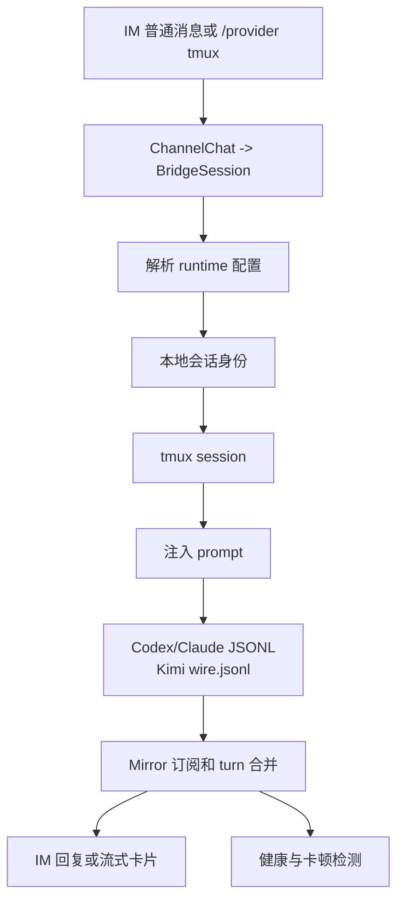

# tmux Runtime 生命周期

本文描述 CodeLark 当前 tmux runtime 的完整链路。Codex、Claude Code、Kimi Code 和 Cursor Agent 共用 `src/bridge/tmux/core.ts` 的 tmux API 和 `src/bridge/tmux/input-state-machine.ts` 的输入生命周期状态机，差异保留在各自 CLI 启动参数、会话身份和 JSONL/wire/transcript 解析上。`src/bridge/tmux/runtime.ts` 承载 Codex/Claude 的 shared provider-owned 启动和 readiness；Kimi 与 Cursor 分别在自己的 provider 中发现 CLI identity 和持久输出文件，再把相同的 session/tmux/send 状态写入共享 machine。

## 总览

## 公共 tmux API

公共层在 `src/bridge/tmux/core.ts`，只负责稳定地驱动 tmux：

| API | 职责 |
| --- | --- |
| `hasSession` | 检查 tmux session 是否存在。 |
| `ensureDetachedSession` | 创建或按需重建 detached session。 |
| `capturePane` | 抓取屏幕，用于 `/tmux-screen`、ready 检测和调试。 |
| `sendActions` | 发送 literal 或特殊键；长文本自动走 buffer paste。 |
| `injectPromptIntoPane` | 多行 prompt 使用 paste-buffer + `M-Enter`，最后 `Enter` 提交。 |
| `sendInterrupt` | `/stop` 或 abort 时发送 `C-c`。 |

`src/bridge/tmux/runtime.ts` 是 runtime 级公共层，Codex 和 Claude 共用这些生命周期入口；Kimi 当前共用底层 tmux core、输入状态机和跨平台 shell snapshot，并在 Kimi provider 中处理 CLI 自己生成的 session identity 与 wire 时序：

| API | 职责 |
| --- | --- |
| `runtimeTmuxSessionName` / `codexTmuxSessionName` / `claudeTmuxSessionName` | 统一 provider-owned tmux session 命名。 |
| `startRuntimeTmuxSession` | 以 `runtime=codex|claude` 创建或重建 tmux provider session；Codex 执行 `codex resume <threadId>`，Claude 执行 Claude Code TUI。Kimi 由 `KimiTmuxProvider` 直接启动 `kimi [-r session] -y`。 |
| `waitForRuntimeTmuxReady` | 统一屏幕 ready 检测和 startup selection 处理；Codex 支持 update/goal/permission/generic selection 透传，Claude 支持 onboarding/trust 确认。 |
| `inspectRuntimeTmuxSession` | 统一检查 session 存在性、抓屏，并返回当前屏幕上的 selection prompt。 |
| `cleanupRuntimeTmuxSession` | 统一 best-effort 清理 provider-owned tmux session，供 `/clear` 和 `/t archive` 等生命周期操作调用。 |

`src/bridge/tmux/input-state-machine.ts` 位于 tmux core 和各 runtime 语义之间，统一回答“这条输入现在能否发送”：

| API | 职责 |
| --- | --- |
| `inspectRuntimeTmuxInput` | 每次输入只检查 tmux 是否仍存在；已知 `running` 且进程仍存在时跳过 pane capture/prompt readiness。冷状态、失败状态或进程丢失才要求重新 readiness/启动。 |
| `transitionRuntimeTmuxInputState` | 让 Codex/Claude readiness、Kimi session discovery、GUI/TUI selection、发送和清理进入同一个状态集合。 |
| `coordinateRuntimeTmuxSelection` | 以 runtime/session/prompt fingerprint 注册唯一 selection lifecycle；startup readiness、运行期 provider polling 和 mirror probe 只能加入同一条等待与执行链，不能各自创建 waiter 或发送按键。 |
| `sendRuntimeTmuxInput` | 只允许从 `running` 进入 `sending`；成功回到 `running`，失败进入 `failed`。 |

Codex 保留 `startCodexResumeTmuxSession` 和 `waitForCodexResumeTmuxReady` 作为兼容包装；Claude 的 `startClaudeTmuxSession` 也由 `src/bridge/tmux/runtime.ts` 提供，`src/runtime/claude/tmux-provider.ts` 只负责 prompt 注入、JSONL discovery 和 SSE/mirror 转换。

## Codex tmux 生命周期

### 1. thread 获取和注入

当用户把当前 Codex runtime 切到 `/provider tmux` 时，`src/bridge/command/provider-settings.ts` 先从 `BridgeSession.runtime.codex.threadId` 或 binding 推导已有 Codex thread。若没有 thread，会通过 `bootstrapCodexThreadLocally` 本地预创建 Codex thread，并把结果写回 `BridgeSession`。

完成 thread 解析后，`codexTmuxSessionName(threadId)` 生成 `codex_<threadId>`，`startCodexResumeTmuxSession` 用 `codex resume <threadId>` 启动 TUI。启动参数来自 `resolveSessionRuntimeConfig`，包括 model、sandbox、network、reasoning effort、mode 和 skipGitRepoCheck。

Codex tmux 还有一条隐式初始化路径：如果当前聊天的有效 Codex provider 已经是 `tmux`，但新会话还没有 `codex_thread_id` 或 tmux session，第一条普通 IM 消息会被 `src/bridge/host/manager.ts` 转成 `/tmux <message>`，并把 `autoRecoverProviderSession=true` 传给 `src/bridge/command/tmux.ts`。共享的 `ensureRuntimeTmuxSessionForProvider` 会在这个路径中自动执行本地 thread bootstrap、写回 `runtime.codex.threadId`、生成 `codex_<threadId>`、启动缺失的 Codex TUI，并在 ready 检测完成后再注入用户消息；Claude/Kimi 的 auto-forward 也从同一入口检查 input lifecycle。

### 2. TUI 启动和 ready 检测

`buildCodexResumeTmuxCommand` 构造 Codex TUI shell command。Codex tmux 只允许使用全局 Codex CLI：resolver 不会回退到 `node_modules/.bin/codex` 或包内 `node_modules/.bin/codex`，显式 `CODELARK_CODEX_CLI_PATH` 也不能指向 `node_modules/.bin`，避免旧本地依赖反复弹更新提示。

启动命令在 shared tmux core 中保留两种等价表示：人类可读 command preview，以及实际传给 tmux 的 `string | argv[]`。POSIX tmux 的 `new-session --` 接收单一 shell command；Windows psmux 必须接收分开的 executable/args argv，不能把 `pwsh.exe ...` 或 `node.exe ...` 拼成一个字符串，否则 CreateProcessW 会把整串误当成 executable path。Codex 和 Kimi 都通过 shell snapshot 把当前 bridge 环境交给 Windows 子进程，因此 npm 的 `.cmd` wrapper 由系统 shell 执行，不能直接当成 `.exe` 交给 CreateProcess。

`waitForCodexResumeTmuxReady` 现在委托给 `waitForRuntimeTmuxReady(runtime='codex')` 周期性 `capturePane`，直到看到 Codex TUI ready prompt，或者达到 `CODELARK_CODEX_RESUME_TMUX_READY_TIMEOUT_MS`。如果启动时停在 update、goal、permission 或 generic selection，shared readiness 会把完整 selection prompt 发给 IM handler；没有 handler 时只返回未 ready，不自动按默认项。IM 下拉默认项来自 TUI 当前选择游标，若无法识别游标则使用 TUI 选项第一项；不会再把 update 固定成 `skip`，也不会把 goal 固定成 `cancel`。用户回调的 choice 会转换成 tmux 上的上下移动和 Enter，发送后继续 ready 检测，直到真正可输入才注入消息。

Codex/Claude 公共的终端控制字符清理和 Enter footer 检测集中在 `src/runtime/tui-screen.ts`；Codex TUI 的 Enter footer 检测统一支持 `Press enter to confirm ... esc ...` 和 `Press enter to continue`，但 selection parser 仍要求屏幕中存在选择游标和可解析选项，避免把普通 TUI 输出误判成 selection。没有 handler 时返回启动失败，避免误把 selection prompt 当作 idle prompt。Kimi 的 prompt 注入在 provider 内完成，普通文本提交后会额外发送 `Ctrl-S` 触发 steer。

如果启动期 Codex update selection 选择了 `update_now`，真实 Codex CLI 通常会执行全局更新并退出当前 TUI。`startCodexResumeTmuxSession` 把“用户选择 `update_now` 后 provider-owned tmux session 消失”视为可恢复的更新完成信号：向用户发送一次强制可见 notice，然后最多重新启动同名 tmux session 一次，并重新进入 ready 检测。只有重启后的 TUI 进入 `ready`，调用方才会继续 provider 切换或 auto-forward 原始输入；如果重启仍失败，则按普通 launch failure 报告，避免重复循环。

ready 检测内部仍按一个短生命周期 readiness gate 运转；它只用于冷启动、进程恢复和 Bridge 重启后首次接管。外层输入状态机持久记录 readiness 的结果，避免每条消息重新跑 gate。readiness 状态进入时的动作和触发条件如下：

| 状态 | 进入动作 | 触发条件 | 下一跳 |
| --- | --- | --- | --- |
| `starting` | 初始化 ready deadline 和命令追踪。 | 调用 `waitForRuntimeTmuxReady`。 | `polling`；如果 timeout 配成 0，直接 `ready`。 |
| `polling` | 抓取 tmux pane，并按当前屏幕分类。 | 启动检测开始，或 selection action 已发送后重新等待。 | 看到 idle prompt 转 `ready`；看到 selection 转 `waiting_selection` 或 `suspended`；抓屏失败且 session 消失转 `missing`；超时转 `timeout`。 |
| `suspended` | 停止 ready 检测，把当前 selection 交给外部路径处理。 | 禁止自动处理 selection、没有 IM handler、或 handler 没返回选择。 | 本次调用返回 not-ready；外部 callback 可以再次按当前屏幕恢复。 |
| `waiting_selection` | 等待 selection handler；等待用户选择的耗时不计入 ready timeout。 | `polling` 识别出可处理的 Codex/Claude selection。 | handler 给出 choice 后转 `selection_resolved`；无 choice 转 `suspended`。 |
| `selection_resolved` | 把选择转换成 tmux actions 发送，并重置一个完整 ready 窗口。 | 用户选择或默认确认已解析。 | `polling`。 |
| `ready` | 把控制权还给调用方；调用方可以继续转发 queued input。 | 屏幕出现当前 runtime 的 idle/input prompt，或 timeout 被显式禁用。 | 调用方进入 auto-forward 的发送阶段。 |
| `missing` | 返回 not-ready，并记录 provider-owned tmux session 已消失。 | 抓屏失败后 `has-session` 也失败。 | 调用方决定是否重建、报错或发退出通知。 |
| `timeout` | 做最后一次 session 检查并返回 not-ready timeout 结果。 | deadline 用完且未看到 ready prompt。 | 调用方按启动失败或未就绪处理。 |

readiness gate 的 `ready` 会把共享输入状态推进到 `running`，随后普通消息才进入 `sending` 并写入 literal/Enter。运行期不再为了寻找空闲光标而重复 readiness capture；Codex 在执行过程中真正出现 permission/goal 等交互选择时，mirror selection monitor 仍可把共享状态从 `running` 推到 `waiting_selection`，用户选择完成后回到 `running`。这是业务交互检测，不是每条输入前的光标门控。

### 3. 输入生命周期状态机

共享状态按 `runtime + provider-owned tmux session name` 键控：

| 状态 | 含义与下一步 |
| --- | --- |
| `idle` | 当前 Bridge 进程尚未观察过该 tmux。 |
| `checking_tmux` | 发送前执行轻量 `has-session`；这是 `running` 后仍保留的唯一固定门控。 |
| `checking_session` | tmux 存在但本进程尚未确认 runtime session/readiness；冷接管只进入一次。 |
| `starting_session` | 创建或发现 Codex thread、Claude JSONL session、Kimi session id/wire identity。 |
| `starting_tmux` | 启动或重建 provider-owned tmux/TUI。 |
| `waiting_selection` | 启动选择或运行期真实 GUI/TUI 选择等待 IM 用户处理。 |
| `running` | tmux 和 runtime session 已建立；下一条输入只验证 tmux 仍存在，不抓屏找 prompt。 |
| `sending` | 输入正在写入 pane；发送成功回 `running`。 |
| `failed` | readiness、session discovery 或发送失败；下一条输入必须恢复，不复用该状态。 |
| `stopped` | `has-session` 发现进程丢失，或 `/clear`、归档、turn cleanup 已结束 tmux。 |

因此普通消息的统一决策是：先确认/创建 runtime session，再确认/启动 tmux并处理启动选择，进入 `running` 后发送；后续消息仅检查 tmux 是否还活着。Bridge 重启会丢失内存状态，所以首次接管已有 tmux 仍执行一次 readiness，这是必要的冷接管边界。

### 不可破坏的输入生命周期契约

以下约束适用于 Codex、Claude Code、Kimi Code、Cursor Agent 和以后新增的 runtime：

1. host 消息路由不得按 runtime 名称开“只对某家生效”的旁路。普通消息统一进入 provider-owned input lifecycle。
2. 首条输入可以依次创建或发现 runtime identity、启动 tmux、处理真实启动选择并进入 `running`；后续输入必须复用同一 identity 和 tmux process。
3. `running` 状态发送前只允许做轻量 `has-session` 存活检查。不得再次创建 session、运行 resume discovery、抓取 pane 查光标，或等待 idle prompt。输入后为捕获新出现的 goal/permission/update 选择而做的短时事件 probe 仍然允许；它不是每轮发送前的 readiness gate。
4. 只有 tmux 进程确实丢失、前一生命周期进入 `failed`、Bridge 冷接管，或用户明确切换/清理 session/provider 时，才允许重新进入 session/tmux/readiness 阶段。
5. runtime-specific 代码只负责 CLI 参数、identity/wire 格式和必要的交互动作（例如 Kimi `Ctrl-S`）；它不能改变共享状态机的触发时机和 process 所有权。
6. provider-owned tmux 的生命周期长于单个 turn。成功 turn 不得在 `finally` 中 kill；只有已经证明进程退出、认证失败或启动不可恢复的半初始化进程才能清理。像 Cursor workspace indexing 这样“pane 暂时空白但进程仍存活”的合法冷启动，在 readiness 窗口用尽后也必须保留 tmux，并让下一轮从 `failed -> checking_session -> running` 重新接管。显式 `/clear`、归档和 provider 切换负责最终释放。
7. 选择动作必须经过验证。Codex 的用户选择仍由 session coordinator 单一执行，不能因两个观察者同时命中而重复发方向键；Claude 这类无需用户决策的确认提示如果在动作发送后仍以同一 prompt 持续可见，则由同一个 readiness owner 重试确认键，直到 prompt 消失或原 deadline 到期。`actions_sent` 只证明 tmux 接收了按键，不等于 TUI 已消费。
8. 任何以 JSONL、wire 或 transcript 作为答案来源的 provider 都必须明确单一 terminal owner：可以由 provider 读取当前增量并完成 direct turn，也可以由独立 mirror 完成，但另一条路径必须 suppression/claim 清晰，不能让同一持久事件结束两张卡或丢失真实回答。
9. `/p tmux` 的启动结果写回前必须重新校验聊天仍绑定原 session；`/stop`、`/clear`、`/t` attach/archive 和进程丢失恢复必须进入共享 lifecycle owner，不能在 runtime 命令里保留私有旧路径。

任何新 runtime 在接入前都必须通过“首轮初始化一次 → 同一聊天连续两条消息复用 → 进程丢失后恢复”的同一组用户故事测试。只证明单个 turn 能返回答案，不足以接入 tmux provider。

### 4. 普通消息转发

普通 IM 消息有两种进入 Codex tmux 的路径：

- 已经在 interactive turn 中运行的 Codex 请求由 `CodexRoutingProvider` 根据 `codexProvider=tmux` 分发到 `CodexTmuxProvider`。provider 校验 tmux session，等待信任、更新或权限选择提示稳定后，通过 tmux core 注入 prompt。
- 已经绑定到 tmux provider 的聊天会在 host manager 的普通消息分支中被直接 auto-forward 到 `/tmux <message>`。这条路径用于“把普通聊天文本当作 TUI 输入”，会自动追加 Enter，并在 tmux session 缺失时走上一节的 auto-recover。

auto-forward 的输入必须在启动门控之后才写入 tmux：缺失 session 恢复、新建 provider session、冷接管已有 session 的路径都会先执行 shared ready/selection 检测。状态一旦成为 `running`，后续输入只执行 `has-session`，不再依赖屏幕光标或 prompt 文本决定发送时机。等待过程是异步 Promise，不会阻塞 Node 主事件循环；调度层会把 tmux provider 普通消息标记为 conversation barrier，阻塞同一 chat/session 的后续普通消息和 session 变更命令，直到当前 auto-forward 完成。`/stop`、selection callback 等控制路径仍可绕过 barrier，用于中断或完成启动选择。`/tmux-screen`、`/pty-screen` 保持 feature 前的 monitor job 行为：它们走 job lane 但不等待 conversation barrier，因此可在普通对话卡住时及时抓屏；`/shell` 等普通 job 仍等待 barrier。只查看或手动控制 pane 的命令不自动恢复 provider session，也不等待 startup ready。

显式 `/p tmux` 与普通 auto-forward 不同：它可能跨越进程启动、readiness 轮询和人工 selection，必须走每个 chat 串行的 provider-start job，但不持有 `SessionExecutor` 锁，也不把自己登记为 conversation barrier。它只建立 ordinary-message routing barrier：下一句普通消息等待启动收口后重新解析 binding，而 `/clear` 可以立即执行。一旦聊天改绑，仍在等待的旧 provider-start 即使随后成功，也必须按原 session id 识别为 stale，清理刚创建的 tmux 并拒绝回写；随后放行的普通消息会进入新 session。重复 `/p tmux` 仍由 provider-start job 自身串行，不能同时重建同名 tmux。

host manager 不在消息入站时添加 `Typing` reaction。只有 tmux actions 已成功提交后，才 fire-and-forget 给原 IM 消息添加常亮的 `Get`（“了解”）reaction；它明确表示 prompt 已投递进 tmux，而不是模型已经响应。投递失败不添加，飞书 reaction ACK 也不得占用 session lane、阻塞下一条消息或延迟 tmux 输入。若 ready 过程中需要用户选择，`requestCodexTuiSelection` 会发送完整 IM selection card。startup readiness、运行期 provider polling 和 mirror probe 都可能观察到同一屏幕，但它们只把观察提交给 session 级 selection coordinator；coordinator 唯一拥有“等待用户 → 记录 choice → 发送 tmux actions”的完整生命周期，其他观察者加入同一个 Promise，不创建第二个 waiter。permission broker 的 channel/chat/session/prompt 卡片去重只作为交互边界保险，并能接住 rich card 发送完成但 permission link 尚未落库时的早到回调，不能代替生命周期所有权。provider auto-forward 的 selection card 会在 permission link 元数据中保存原始 tmux actions；如果真实回调到达时 live waiter 已经丢失，host manager 的 orphan 恢复路径也必须加入同一个 session coordinator，再发送 selection choice、等待 `ready`，然后继续发送原始 actions，不能另写一套独立副作用或发送缓存。用户选择的等待时间不计入 shared ready timeout；普通选择动作发送后重置普通 ready 窗口，只有 Codex update 的 `update_now` 进入 5 分钟安装窗口，并立即显示“正在安装，完成后自动重启并继续发送原消息”。这一区分防止 15 秒普通启动超时误杀仍在执行的全局 npm 安装。用户选择“这不是 TUI 选择”则立即收口为未就绪，不发送按键，也不能继续对同一 fingerprint 空转到超时。输入成功写入后，host manager 会为每次成功投递各自保留一个短延迟的 post-forward exit probe，后续输入不能取消前一次 probe。probe 二次确认 provider-owned tmux session 已消失后，先清除 `runtime.general.tmuxSessionName`，再把 session health 标记为 failed，并向 IM 发送一句“tmux Provider 会话已退出，请 `/p tmux` 重启”的可见通知；诊断命令和 mirror selection probe 只要通过 `has-session` 确认 session 已不存在，也必须进入同一 `stopped + clear binding + failed health` 终态，撤销 follow-up 并停止后续 capture，不能只打印 `can't find session`。启动期更新完成并关闭 tmux session 后，启动函数会先强制通知用户并自动重启一次同名 Codex tmux；只有重启失败或输入已成功写入后又异常退出，才落到 post-forward/update exit notice。

Kimi TUI 依赖 tmux extended key protocol 区分“提交 Enter”和输入框换行。Kimi 新建 lifecycle 或 Bridge 冷接管已有 Kimi tmux 时，在 readiness 阶段一次性执行 `tmux set-option -g extended-keys on`；进入 `running` 后每句话不再重复设置，也不通过抓屏/光标猜发送时机。

Kimi 的停止按键合同也与 Codex/Claude 不同。共享 stop lifecycle 对 Codex/Claude 发送一次 `Ctrl-C`，对 Kimi 连续发送两次 `Ctrl-C`（中间短暂异步等待）：真实 Kimi 0.29.1 中第一次产生 `turn.cancel` 并回到输入框，第二次显示 `Press Ctrl+C again to exit`，但仍保留可复用的 tmux TUI；第三次才可能退出。`/stop` 与 `/t` 运行中确认必须共用该实现。

Codex TUI 的输出不直接依赖屏幕文本作为最终答案，而是由 Codex session JSONL mirror 同步。

### 5. JSONL mirror 和回复

Codex TUI 写入本地 JSONL 后，`src/runtime/codex/session-index/*` 负责发现 session 文件、按 offset 解析增量，并转换成 `BridgeMirrorRecord`。`src/bridge/mirror/runtime.ts` 订阅活动绑定，`src/bridge/mirror/turns.ts` 合并 message、reasoning、tool、plan 和 terminal 事件，再交给反馈控制器投递到 IM。

运行期屏幕只补充 JSONL 没有稳定表达的 TUI 状态，不作为最终答案来源。Codex transport retry 在底部显示 `Reconnecting... n/m` 时，host manager 复用已有 selection capture，把当前卡 status note 临时改成“正在重连 n/m”；该行消失后，仅当 status note 仍是监控自己写入的值时恢复旧状态，不能覆盖后来到达的模型状态。parser 不匹配完整行、颜色、动态耗时、快捷键 footer 或随机 composer placeholder。

Codex 恢复旧 session 时还可能发送模型不一致 `WarningEvent`。Codex TUI 会把这类事件渲染成行首 `⚠ ` history cell，正文包含 session 记录模型和本次恢复模型；该信号当前不会稳定进入 mirror JSONL。CodeLark 复用同一 screen probe，只识别 warning cell 行首和两个反引号模型名，不依赖后半段完整英文或终端换行。命中后向对应聊天发送一张橙色提醒卡，建议用 `/clear` 新建 session；不自动清空、不改变 turn 终态。去重所有权属于 ChannelChat binding：同一 session 被多个聊天绑定时，每个聊天各收到一次；相同 binding + session + 模型组合在 delivery 期间内存去重，发送成功后持久化到 binding，bridge 重启和历史 scrollback 重扫也不会重复提醒；发送失败则允许后续 probe 重试。

selection/reconnect probe 必须由活动状态驱动：只覆盖当前 hot chat、有 pending turn，或刚完成 tmux 输入后的短 follow-up window。cold 且没有 pending/follow-up 的历史 subscription 不做周期性 `display-message` / `capture-pane`；completed 后的异常方块由 finalized-status 路径单独抓屏，idle baseline 也只在建立 checkpoint 时抓一次。建立 baseline 前必须先用一次共享的 `tmux list-sessions` 获取真实存活集合，不能为每个历史 subscription 单独试探 `capture-pane`；只有集合内的 session 才抓屏。idle checkpoint 在共享列表里发现缺失时，hot/cold 分别退避 5 秒/60 秒；selection probe 的 `capture-pane` 失败再经 `has-session` 确认不存在时，则直接把统一 input lifecycle 标为 `stopped`、清除持久化 tmux binding，并把当前 pending mirror turn 一次性收口为 `error`。错误卡说明 tmux 会话已退出并提示 `/p tmux`，随后清空 pending turn，footer heartbeat 不得继续把旧卡刷新成“处理中”；若飞书终态投递暂时失败，终态保留在 delivery queue 重试，但不恢复运行态。后续抓屏保持停止，直到新输入或显式 `/p tmux` 建立新 lifecycle。这样 cold 但仍在终端运行的 session 仍有错误基线，已经退出的历史 session 不会在每轮 reconcile 反复创建进程或刷 `can't find session`。probe 只用于观测选择、重连和异常，不能另写一套发送 readiness。

不可重试错误在 Codex TUI history 中表现为行首 `■`。新版协议如果在 `task_complete.error` 提供结构化错误，mirror 直接采用；但真实 Codex CLI 0.144.3 的 HTTP 400/429 回合只落 `task_complete(last_agent_message=null)`，原因只出现在 provider response 和 TUI 方块中。为覆盖这个版本，每个空闲 Codex mirror subscription 预先保存 pane checkpoint；`task_started` 只有在 checkpoint 已严格早于本 turn 完成采集时才 claim。普通 turn 结束时保存的截图会作为下一轮 idle checkpoint；如果 goal 在上一轮 `task_complete` 后立即写入下一轮 `task_started`，没有留下空闲抓屏窗口，就把上一轮结束时保存的截图记为下一轮的 error baseline。下一轮结束后再次截图，只把两次截图之间新增的方块归到下一轮。这样可以覆盖自动接续的 59 ms 竞态，同时排除历史错误。completed 后还必须满足本批只有一个 turn、rollout 文件在截图期间未增长，才允许把新增方块归到当前 turn；歧义样本宁可不升级状态，也不能错归。运行中已有的 selection/reconnect pane probe 会按 turn 保存“相对基线新增的错误方块”，但不提前结束 turn；即使后续工具输出将该方块推出最终 pane，`task_complete` 仍会用已观测证据把 completed 收口为 error。这条路径复用现有 probe，不增加独立 tmux 扫描。checkpoint 和运行中 probe 都只比较基线后新增方块，完整 scrollback 中的历史错误不会影响新回合。把上一轮截图保存为下一轮基线时记录 `codex.tui.error_baseline.handoff`；运行中首次捕获和终态应用分别记录 `codex.tui.error_observed` 与 `codex.tui.error_applied`；completed 因缺少基线而跳过补查时记录 `codex.tui.error_probe.skipped`。

Codex TUI 会按 pane 宽度主动排版 history cell，这不是 tmux soft wrap，`capture-pane -J` 不能合并。error parser 从 `■` 行开始读取同一 cell 的 continuation，遇到空行或下一 cell 停止；以 `{`/`[` 开头的结构化内容无分隔拼接，普通文本用空格拼接。测试必须强制窄到足以在 JSON 字符串内部换行，不能只在宽终端验证单行样本。

### 6. 卡顿和健康检测

卡顿检测不依赖单一信号。`src/bridge/health/runtime.ts` 汇总 `BridgeSession` 的 `runtime_status`、`last_progress_at`、活跃工具、stream UI 刷新、mirror 事件时间和进程状态，`src/bridge/health/reducer.ts` 归约为 `running_active`、`slow_observed`、`suspected_stall`、`suspected_stream_ui_stall`、`suspected_detached` 等状态。`/health` 展示单会话诊断，`/status` 和运行时卡片展示概览。

## Claude tmux 生命周期

Claude Code 现在提供与 Codex tmux 对齐的 provider：

| 阶段 | Claude tmux 实现 |
| --- | --- |
| provider 选择 | `/provider tmux` 写入 `BridgeSession.runtime.claude.provider=tmux`，并记录 `general.tmuxSessionName`。 |
| 启动命令 | shared `startClaudeTmuxSession` 复用 Claude pty 的 CLI 参数构造，支持 `claude` / `ccr code`、model、permission mode 和 `--effort`。 |
| tmux session | `claudeTmuxSessionName(session.id)` 生成稳定 session 名，`startRuntimeTmuxSession(runtime='claude')` 创建或重建 detached session。 |
| prompt 注入 | `ClaudeTmuxProvider` 使用 `tmuxCore.injectPromptIntoPane` 注入普通消息。 |
| 会话身份 | provider 通过 Claude JSONL discovery 获取 `session_id`、cwd 和 transcript path，并在 SSE `result` 中回传。 |
| 输出同步 | Claude pty/tmux 都依赖 `src/runtime/claude/session-jsonl.ts` 读取 Claude Code JSONL；SDK provider 继续走原生事件。 |

Claude tmux 与 Codex tmux 的差异是：Claude Code 本身决定 JSONL session id；CodeLark 不需要像 Codex 那样预创建 thread，也不会执行 `resume <threadId>`。因此 Claude tmux 的身份注入发生在 Claude Code 写出 JSONL 后，再把发现到的 `session_id` 保存回 `BridgeSession.runtime.claude.sessionId`。

Claude tmux 也必须支持和 Codex 相同的普通消息隐式初始化/恢复语义：如果当前聊天的有效 Claude provider 是 `tmux`，但还没有 `runtime.general.tmuxSessionName`，第一条普通消息会生成 `claude_<BridgeSessionId>` 并启动 Claude Code TUI；如果已记录 tmux session 但进程不存在，普通消息会重建同名 tmux session。两种情况都会写回 `runtime.claude.provider=tmux`、`runtime.general.tmuxSessionName` 和 tmux auto-enter 配置，然后再把消息注入 TUI。之后 `reconcileClaudeTmuxMirrorAfterAutoForward` 等待 Claude JSONL 出现，发现 `session_id` 后写回 `runtime.claude.sessionId/cwd`，prime 首个 turn 的 mirror delivery，并触发 Claude mirror reconcile。

Claude tmux 使用同一个 `waitForRuntimeTmuxReady` 启动门控。新建、恢复或 Bridge 进程冷接管已有 Claude provider-owned tmux 时等待一次 Claude 输入提示，并处理 onboarding/trust prompt；进入共享 `running` 后，普通消息不再重复抓屏找输入提示。为兼容旧会话和测试 fake pane，Claude readiness 还接受“看起来是 TUI 且已出现输入提示、且没有任何 selection prompt”的通用 ready 兜底；这个兜底只用于冷启动/接管，不影响普通 `/tmux-screen` 查看。

## 链路对齐盘点

| 链路点 | Codex tmux | Claude tmux | 当前对齐状态 |
| --- | --- | --- | --- |
| provider 选择 | `/provider tmux` 写 session TOML `runtime.codex.provider=tmux`。 | `/provider tmux` 写 session TOML `runtime.claude.provider=tmux`，并更新 runtime state。 | Kimi 只允许 `runtime.kimi.provider=tmux`；三者都只修改当前 active runtime 的 provider 配置，显式选择 tmux 后还会立即执行下一行的启动流程。 |
| 本地身份 | 先有 Codex `thread_id`；没有时本地 bootstrap。 | Claude Code 写 JSONL 后才有 `session_id`；启动前用 BridgeSessionId 命名。 | Kimi fresh session 不预造 id；启动 `kimi -y` 后从 TUI 的 `Session:` 读取 CLI 生成的 id。已绑定 session 才使用持久化 id。状态落点都是 `BridgeSession.runtime.*`。 |
| tmux session 命名 | `codex_<thread_id>`。 | `claude_<session_id>`；没有 Claude `session_id` 时用 `claude_<BridgeSessionId>`。 | Kimi 使用 `clk-kimi-<BridgeSessionId>` 作为 provider-owned tmux session，并把 Kimi 本地 session id 存到 `runtime.kimi.sessionId`。 |
| `/provider tmux` 启动 | 启动或重建 detached tmux，执行 `codex resume <thread_id>`。 | 启动或重建 detached tmux，执行 Claude Code TUI。 | 每次显式执行都会重建同名 tmux；Kimi fresh 启动 `kimi -y`，已有 identity 执行 `kimi -r <session> -y`，输入框 ready 后才返回。 |
| 普通消息隐式初始化 | auto-forward 触发 `/tmux <message>`；缺 thread/session 时自动 bootstrap + 启动 + ready/selection 后注入。 | auto-forward 触发 `/tmux <message>`；缺 tmux session 时自动启动 Claude TUI，session 缺失时用 BridgeSessionId 命名。 | auto-forward 进入同一 input lifecycle；首次读取 CLI 生成的随机 session id，后续复用同一 tmux/session。 |
| 缺失 tmux 恢复 | `/provider tmux` 会强制重启；普通消息 auto-forward 和显式 `/tmux <...>` 可重建 provider session；`/tmux-screen` 只查看并提示 `/p tmux`。 | `/provider tmux` 会强制重启；普通消息 auto-forward 和显式 `/tmux <...>` 可重建 provider session；`/tmux-screen` 只查看并提示 `/p tmux`。 | 退出 probe 清除失效 binding；普通消息可按持久化 Kimi session id 自动恢复，显式 `/p tmux` 总是强制重启；只读屏幕不触发恢复。 |
| prompt 注入 | provider 内部或 `/tmux` 命令都走 tmux core；普通消息自动追加 Enter。 | provider 内部或 `/tmux` 命令都走 tmux core；普通消息自动追加 Enter。 | Kimi provider 使用 tmux core paste/Enter 后额外发送 `Ctrl-S` 触发 steer。 |
| 首轮 mirror | Codex thread 已知，mirror 可按 thread 找 JSONL。 | 首轮普通消息后等待 Claude JSONL，写回 `session_id/cwd`，再 prime 首个 turn。 | Kimi 的 session id/input-ready 与 wire-ready 是两个阶段：wire 已存在时从当前尾部续读；尚未存在时先提交首条 prompt，再等待文件并从 offset 0 读取。通用 Kimi mirror runtime 负责后续订阅。 |
| mirror suppression | SDK turn 复用已有 Codex JSONL thread 时建立 suppression，避免 SDK final 和 mirror final 重复。 | Claude SDK provider 不订阅 tmux/pty mirror；pty/tmux 由 Claude JSONL mirror 负责最终投递。 | Kimi 只有 tmux provider，不走 SDK suppression；think/status、tool、terminal 都来自 Kimi wire mirror。 |
| 健康状态 | auto-forward 后记录 interactive start，等待 mirror terminal 更新。 | auto-forward 后记录 interactive start，等待 Claude mirror terminal 更新。 | Kimi interactive turn 记录 `kimi_jsonl`/`kimi_task_complete`，等待 Kimi wire terminal 更新。 |
| TUI 特殊提示 | shared readiness 检测 Codex update/goal/permission/generic selection；IM 下拉默认项跟随 TUI 当前项或第一项；所有 startup selection 都通过 IM handler 等待用户选择后继续启动门控。 | shared readiness 检测 Claude onboarding/trust/input prompt，并在 provider-owned pane 上做通用 TUI ready 兜底。 | 已共享检测入口；按 CLI 实际提示语义分别处理默认动作。 |
| auto-forward 调度门控 | tmux provider 普通消息进入 session lane，并作为 conversation barrier 挡住同 chat 后续 regular/session job；control job 和 selection callback 仍可执行。 | 同一 adapter-runtime 机制适用于 Claude tmux provider 普通消息。 | 已对齐；等待 ready/selection 不阻塞 Node 主事件循环，但阻塞同一会话的后续输入。 |
| `/stop` / abort | tmux/pty provider 发送中断，interactive runtime 释放状态。 | tmux/pty provider 发送中断，interactive runtime 释放状态。 | 共用终端控制和 runtime health 语义。 |
| `/clear` after runtime switch | 只替换当前 Codex BridgeSession，保留同一聊天记住的 Claude BridgeSession 映射；清理旧 Codex provider-owned tmux session。 | 只替换当前 Claude BridgeSession，保留同一聊天记住的 Codex BridgeSession 映射；清理旧 Claude provider-owned tmux session。 | 新 session 继承当前 active runtime、Kimi provider 和 session 级 model，避免清空后卡片或下次启动静默回到 default。 |
| `/t archive` cleanup | 归档/删除 BridgeSession 前清理记录在 runtime state 中的 Codex tmux session。 | 归档/删除 BridgeSession 前清理记录在 runtime state 中的 Claude tmux session。 | 已对齐；只清理 provider-owned session，不清理手动 `/tmux-attach` 目标。 |
| `/t rename` after runtime switch | 重命名当前聊天当前 Codex BridgeSession。 | 重命名当前聊天当前 Claude BridgeSession。 | 已对齐；切回另一个 runtime 时不会污染另一个 BridgeSession 的标题。 |

## 回归覆盖

### 用户故事优先级矩阵

| 优先级 | 用户故事 | 跨 runtime 断言 | 主要证据 |
| --- | --- | --- | --- |
| P0 | 首条普通消息进入 tmux provider | 只初始化一次 runtime identity/tmux，ready 后才注入输入 | Codex/Claude/Kimi auto-init mock-app E2E |
| P0 | 同一聊天连续第二条普通消息 | runtime session id 与 tmux 名称不变；CLI launch 次数不增加；只做 `has-session` 后发送 | Kimi first-message E2E 的 follow-up launch count；Codex cold-probe reuse；Claude existing-session route |
| P0 | 问题卡提交后继续普通对话 | callback 回到同一绑定；卡片答案和下一句话都进入同一 runtime process；不重新 launch | `delivers Kimi mirror clk-ask ... after /t binding` |
| P0 | `/set` / `/current` 改配置后发下一句话 | home 默认值只影响新 session；session override 立即由当前 runtime accessor 读取；不串写其他 runtime | command-dispatch global/current config matrix |
| P0 | `/runtime` / `/provider` 切换 | barrier 后下一条消息只进入新 runtime/provider；另一个 runtime 的映射保留 | runtime switch and provider routing E2E |
| P0 | 已经选择 tmux 后再次执行 `/p tmux` | 结束并重建当前 runtime 的 provider-owned tmux；Kimi 复用已有 session id；即使长历史把 session header 滚出屏幕，也要以持久 wire identity + 编辑框 ready 完成恢复，失败必须进入 `failed` 而不是悬在 `checking_session` | Kimi 真实 executable + 真 tmux resume E2E；mock-app 的退出→显式重启→继续输入故事；header 缺失和失败状态 workflow 回归 |
| P0 | tmux 进程丢失或启动失败 | 只在确认缺失/failed 后恢复；失败不持久化假 running；用户得到可执行错误 | missing-session recovery、dead-pane、Kimi auth/session-log tests |
| P0 | Kimi 每轮 `step.end` 后写入 usage，或 wire 含内部 injection reminder | 每个真实 turn 只创建一张 mirror 卡且必有 terminal；usage 归属刚结束的 turn；内部 reminder 不进入用户卡片 | Kimi terminal-usage unit/split-delta tests、Kimi Feishu card E2E pendingTurn/injection assertions |
| P0 | Kimi 首次启动或 Bridge 重启后冷接管仍存活的 tmux，再发送普通消息 | readiness 只启用一次 tmux extended keys；fresh 不传 `-r`；Enter 形成真实 `turn.prompt`；wire 无论在提交前还是提交后创建都不丢首轮事件；Bridge 内存状态清空但 tmux/session identity 保留时，以持久 identity + 编辑框 ready 完成 `checking_session → running`，session header 已滚出也不能误报失败，且不得重启 tmux；后续 running turn 不重复初始化 | Kimi fresh/cold/lazy-wire workflow tests、真实 Kimi executable + 真 tmux + fake proxy 的 bridge 重启同构 E2E |
| P0 | Get reaction 的飞书 ACK 很慢 | tmux 输入先完整提交；之后才异步 add Get；主 lane 不等待 reaction ACK | slow Get mock-app E2E |
| P0 | 飞书 reply/权限卡/CardKit/群名/callback ACK、入站 notice/reaction 或 mirror reconcile 很慢 | session/chat/adapter 入站主路径已释放；同类投递仍保序；权限/交互卡不被慢普通回复堵住；文本和按钮 `/new` 建群都在独立 job lane | command pending ACK、permission pending/failure、rename pending、callback pending、inbound adapter pending ACK、reconcile pending、interactive finalize pending、delivery queue priority tests |
| P1 | 启动中出现 goal/permission/update 选择 | 真实选择 prompt 仍可抓取和回调；不得把它当成重复 idle/readiness probe 删除 | Codex selection workflow + mock-app E2E |
| P1 | 从旧版 Codex 选择 Update now | 安装超过普通 startup timeout 时仍保持进行态；不得提前清理 tmux 或宣称原消息已投递；更新退出后只重启一次，ready 后才发送原消息 | 超普通 timeout 的 command workflow；隔离 npm prefix 的真实旧版 Codex update gate |
| P2 | 运行中停止、定时屏幕刷新 | control lane 可中断；不作为基础生命周期接入的替代证据 | stop/screen monitor tests |

新增 runtime 必须至少通过全部 P0；只覆盖“运行中停止”或单轮返回不算生命周期完成。

| 覆盖点 | 测试 |
| --- | --- |
| Codex tmux 默认 provider 首条普通消息自动 bootstrap thread、启动 tmux、等待 ready、注入、mirror 投递。 | `initializes a default tmux provider conversation on first text after /set defaultProvider tmux and /new` |
| `/new` 继承 tmux provider 后首条普通消息自动初始化 Codex thread/session。 | `keeps tmux provider auto-enter enabled when /new follows /p tmux` |
| Claude tmux 已有 tmux session 时普通消息直接注入，不走 SDK。 | `routes plain messages into Claude tmux when the active Claude provider is tmux` |
| Claude tmux 首条普通消息自动启动 `claude_<BridgeSessionId>`、写回绑定、注入、发现 JSONL、启动 mirror。 | `auto-initializes a Claude tmux provider binding on the first plain message` |
| Claude tmux 普通消息后 JSONL 出现时回填 `session_id/cwd` 并投递首个 mirror turn。 | `starts Claude tmux mirror after a plain auto-forwarded message discovers the JSONL session` |
| 切到 Claude runtime 后不会被 Codex tmux provider 抢走普通消息。 | `does not let the Codex tmux provider intercept plain messages after switching to Claude runtime` |
| tmux provider 普通消息等待 ready/selection 时，同 chat 后续 job 被 conversation barrier 阻塞，但 `/stop` 控制消息仍可执行。 | `lets regular messages opt into a conversation barrier without blocking controls` |
| host manager 将 tmux provider 普通消息分类为阻塞同 chat 的 tmux auto-forward session job。 | `adapterSessionLane` tmux regular barrier assertions |
| provider tmux auto-forward 启动时遇到无默认 Codex permission selection，fake Codex TUI 负责生成 permission prompt，fake tmux 只承载 capture/send-keys；CodeLark 会先发 IM 选择卡，用户回调后才注入 literal。 | `waits for a no-default Codex permission selection before provider tmux auto-forward input` |
| startup readiness 与 mirror probe 同时看到同一 Codex TUI selection 时，只创建一个 session selection coordinator。它只发一张 IM 卡、只向 tmux 发送一次按键；两个观察者等待同一个结果。 | `suppresses duplicate Codex TUI selection cards while resolving all waiters`；session coordinator 并发观察回归 |
| Feishu `select_static` 回调即使把选项包成对象，也能提取用户实际选择并透传给 waiter。 | `extracts selected callback data from select_static object options` |
| tmux provider 普通消息成功写入后会异步添加 Get；即使 session 随后立刻消失，仍标记 health failed 并向 IM 发送退出通知。 | `notifies the chat when a tmux provider session exits right after auto-forwarded input` |
| Codex 启动没有 update prompt 但尚未 ready 时，fake Codex TUI 先输出 starting screen；CodeLark 持续 readiness capture，直到 ready 后才把触发拉起的原始输入和 Enter 透传进 tmux。 | `does not forward the triggering input until a normal fake Codex tmux startup becomes ready` |
| Codex 启动 update prompt 选择 `update_now` 后，fake Codex TUI 模拟更新输出和进程退出，fake tmux 只负责承载 session/capture/send-keys；CodeLark 强制提示用户、重启同名 tmux、等待 ready 后再发送原始 auto-forward 输入。 | `relaunches Codex tmux and forwards input when startup update selection exits after update_now` |
| Codex CLI resolver 拒绝 `node_modules/.bin/codex`，要求全局 Codex CLI。 | `rejects node_modules even when it is the only Codex CLI on PATH` |
| `/every` 定时输入通过当前 SDK session 触发，复用已有 BridgeSession。 | `runs /every interval prompts through the SDK provider on the current session` |
| `/clear` 在 Claude runtime 下运行时保持 Claude runtime/provider，并保留同聊天 Codex runtime 映射。 | `keeps the active runtime and remembered alternate runtime when /clear follows a runtime switch` |
| `/p tmux` 等待外部选择时不持有 session lock；`/clear` 可以立即改绑，旧启动完成后只清理自己的 tmux、不回写。 | `lets clear preempt a provider tmux startup waiting for external input`；`does not let a delayed provider tmux startup write back after clear rebinds the chat` |
| mirror selection probe 确认 tmux 不存在后落 `stopped`、清 binding/health，把当前流式卡一次性收口为 error；后续 reconcile 不再 capture，也不再刷新 thinking footer。 | `marks a missing mirror tmux stopped and finalizes its streaming card once as an error` |
| generic selection 选择“这不是 TUI 选择”后立即停止 readiness，不发送按键、不重复检测至超时。 | `stops readiness immediately when the user dismisses a generic selection false positive` |
| 真实 Codex 以新模型恢复旧模型 rollout 时，只发送一张 `/clear` 提醒卡，保留原 thread；用户引用相同文本不触发。 | `keeps a real Codex thread and warns once when resuming it with a different model`；`warns once when a real Codex resume screen reports a model mismatch` |
| `/t rename` 在 runtime 切换后只修改当前 runtime 的 BridgeSession 标题。 | `renames only the active runtime BridgeSession after runtime switches` |
| `/tmux-attach` 和 `/tmux-screen` 查看当前屏幕时通过 shared inspect 报告 selection prompt。 | `reports tmux selection prompts through shared attach and screen inspection` |
| 冷接管已有 Codex tmux 时 readiness 抓屏一次，进入 `running` 后第二条输入只做 `has-session`、不再 capture prompt。 | `probes a cold existing Codex tmux once, then forwards subsequent input without another prompt capture` |
| 通用输入 machine 在 tmux 丢失时回到 `stopped`，发送严格执行 `running -> sending -> running/failed`。 | `runtime tmux input state machine` |

## 命令和配置入口

| 入口 | 作用 |
| --- | --- |
| `/runtime codex|claude|kimi` | 切换当前聊天的 runtime。 |
| `/provider tmux` | 对当前 runtime 启用 tmux provider，并立即重建当前 runtime 的 provider-owned tmux。Kimi fresh session 执行 `kimi -y`，已有 identity 执行 `kimi -r <session> -y`；确认输入框 ready 后才返回并写回 binding。 |
| 普通消息 + tmux provider | 对当前 runtime 的 tmux provider 自动注入 TUI；Codex 可自动 bootstrap thread 并启动 `codex_<threadId>`，Claude 可自动启动或恢复 `claude_<BridgeSessionId 或 session_id>`，Kimi 会恢复 `runtime.kimi.sessionId`，没有 identity 时由 fresh Kimi CLI 生成。 |
| `/tmux-screen` | 查看当前绑定的 tmux 屏幕。 |
| `/stop` | 对运行中的 tmux/pty provider 发送中断。 |
| `/clear` | 清空当前聊天当前 runtime 的 BridgeSession；如果同一聊天记住了另一个 runtime 的 BridgeSession，映射会保留，之后 `/runtime <other>` 可以切回；旧 runtime tmux provider session 会 best-effort 清理。 |
| `/t archive ...` | 归档本地 Codex/Claude/Kimi 会话或删除 Bridge-only 会话；如果目标 BridgeSession 记录了 runtime tmux provider session，会 best-effort 清理。 |
| `/t rename <name>` | 重命名当前聊天当前 runtime 绑定的 BridgeSession；不会改写同一聊天里另一个 runtime 的 BridgeSession 标题。 |
| `/current` | 当前会话配置卡片；通用分栏管理 name、cwd 和 session tmux 设置，Codex、Claude、Kimi、Cursor 四个 runtime 分栏分别管理各自支持的会话级覆盖。 |
| `/set codexReasoningEffort ...` | 设置 Codex 全局 reasoning 默认值。 |
| `/set claudeReasoningEffort ...` | 设置 Claude Code 全局 effort 默认值。 |
| `/set claudeProvider pty|tmux|sdk` | 设置 Claude Code 新会话默认 provider。 |

Kimi 入口补充：

| 入口 | 作用 |
| --- | --- |
| `/runtime kimi` | 切换当前聊天到 Kimi Code runtime。 |
| `/provider tmux` | Kimi 当前唯一 provider。每次显式执行都会重建 `clk-kimi-<BridgeSessionId>`：已有 session 用持久化 id 执行 `kimi -r <session> -y`，以已索引的 wire identity 和真实编辑框 ready 共同确认恢复；恢复大量历史时不要求 TUI 再次露出已滚出屏幕的 session header。fresh 执行 `kimi -y`，仍必须从 TUI 读取 CLI 新生成的真实 session id。确认 ready 后写回 binding，成功后同一进程跨普通 turn 保留。禁止通过 Ctrl-C 杀掉空 TUI 再抓 resume hint；Kimi 对空 session 不保证 hint，且会删除它。 |
| 普通消息 + Kimi tmux provider | 写入 Kimi TUI，自动追加 Enter 和 `Ctrl-S`；输出从 Kimi `wire.jsonl` mirror 投递，`think` 内容截断显示在状态区「当前思考」。 |
| `/t kimi ...` | 列出、接管和归档本地 Kimi Code 会话。 |

## 维护边界

- tmux 命令拼装、长文本 paste、屏幕抓取和特殊键发送必须继续留在 `src/bridge/tmux/core.ts`，不要在 provider 内重复 shell 拼接。
- Codex 和 Claude 各自的 CLI 参数构造可以不同，但 provider-owned tmux session 的创建、ready/selection 检测、查看和清理应通过 `src/bridge/tmux/runtime.ts` 暴露的 runtime API；Kimi 若继续迁入 shared lifecycle，需要保留 fresh identity 由 CLI 生成、已绑定 session 恢复、lazy wire 与 `Ctrl-S` steer 语义。
- Codex、Claude、Kimi、Cursor 四个 runtime 的 tmux/session/selection/send 决策必须写入 `src/bridge/tmux/input-state-machine.ts`；不要再用 `BridgeSession.runtime_status` 推断 TUI 是否需要 readiness，也不要在 `running` 输入前新增光标/prompt 判定。Codex mirror 的空闲 error checkpoint 只用于 completed 后的差分归属，不能参与发送时机或 lifecycle 状态判断。
- 普通消息 auto-forward 和显式 `/tmux <...>` 的自动初始化逻辑集中在 `src/bridge/command/tmux.ts`：Codex、Claude 和 Kimi 都应只在 `autoRecoverProviderSession=true` 或当前 runtime provider 明确为 tmux 时启动或重建 provider-owned tmux session；`/tmux-screen`、`/tmux-session` 和 `/tmux-attach` 不负责 provider 恢复，也不等待 startup ready。
- tmux provider 普通消息的调度门控在 adapter runtime/host manager 层表达为 session lane + conversation barrier；不要把同 chat 阻塞语义藏进 tmux command handler 内部，否则 `/tmux-screen`、`/runtime` 等后续 job 可能绕过启动等待。
- tmux provider 普通消息的可见进度、selection 去重和 post-forward/update exit notice 属于 host manager/permission broker 职责，因为它们依赖 IM adapter reaction、mirror stream start、selection callback 和 session health 多方状态；provider 只应暴露底层 tmux readiness/selection 能力，否则 Claude tmux 无法共享同一行为。
- JSONL mirror 是 pty/tmux provider 的权威输出来源；屏幕抓取主要用于 ready 检测、人工诊断和短期兜底。
- 卡顿检测应继续消费统一的 `BridgeSession` 运行状态和 mirror 进度，而不是让 provider 自己决定最终健康状态。
