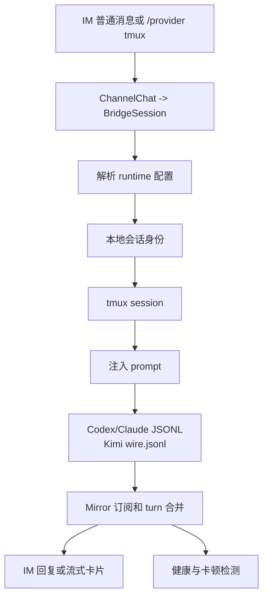

# tmux Runtime 生命周期

本文描述 CodeLark 当前 tmux runtime 的完整链路。Codex、Claude Code 和 Kimi Code 共用 `src/bridge/tmux/core.ts` 的 tmux API和 `src/bridge/tmux/input-state-machine.ts` 的输入生命周期状态机，差异保留在各自 CLI 启动参数、会话身份发现和 JSONL/wire 解析上。`src/bridge/tmux/runtime.ts` 承载 Codex/Claude 的 shared provider-owned 启动和 readiness；Kimi 由 `src/runtime/kimi/tmux-provider.ts` 处理 resume hint/session id，再把相同的 session/tmux/send 状态写入共享 machine。

## 总览

## 公共 tmux API

公共层在 `src/bridge/tmux/core.ts`，只负责稳定地驱动 tmux：

| API | 职责 |
| --- | --- |
| `hasSession` | 检查 tmux session 是否存在。 |
| `ensureDetachedSession` | 创建或按需重建 detached session。 |
| `capturePane` | 抓取屏幕，用于 `/tmux-screen`、ready 检测和调试。 |
| `sendActions` | 发送 literal 或特殊键；长文本自动走 buffer paste。 |
| `injectPromptIntoPane` | 多行 prompt 使用 paste-buffer + `M-Enter`，最后 `Enter` 提交。 |
| `sendInterrupt` | `/stop` 或 abort 时发送 `C-c`。 |

`src/bridge/tmux/runtime.ts` 是 runtime 级公共层，Codex 和 Claude 共用这些生命周期入口；Kimi 当前只共用底层 tmux core，并在 Kimi provider 中处理自己的启动和 resume hint：

| API | 职责 |
| --- | --- |
| `runtimeTmuxSessionName` / `codexTmuxSessionName` / `claudeTmuxSessionName` | 统一 provider-owned tmux session 命名。 |
| `startRuntimeTmuxSession` | 以 `runtime=codex|claude` 创建或重建 tmux provider session；Codex 执行 `codex resume <threadId>`，Claude 执行 Claude Code TUI。Kimi 由 `KimiTmuxProvider` 直接启动 `kimi [-r session] -y`。 |
| `waitForRuntimeTmuxReady` | 统一屏幕 ready 检测和 startup selection 处理；Codex 支持 update/goal/permission/generic selection 透传，Claude 支持 onboarding/trust 确认。 |
| `inspectRuntimeTmuxSession` | 统一检查 session 存在性、抓屏，并返回当前屏幕上的 selection prompt。 |
| `cleanupRuntimeTmuxSession` | 统一 best-effort 清理 provider-owned tmux session，供 `/clear` 和 `/t archive` 等生命周期操作调用。 |

`src/bridge/tmux/input-state-machine.ts` 位于 tmux core 和各 runtime 语义之间，统一回答“这条输入现在能否发送”：

| API | 职责 |
| --- | --- |
| `inspectRuntimeTmuxInput` | 每次输入只检查 tmux 是否仍存在；已知 `running` 且进程仍存在时跳过 pane capture/prompt readiness。冷状态、失败状态或进程丢失才要求重新 readiness/启动。 |
| `transitionRuntimeTmuxInputState` | 让 Codex/Claude readiness、Kimi session discovery、GUI/TUI selection、发送和清理进入同一个状态集合。 |
| `sendRuntimeTmuxInput` | 只允许从 `running` 进入 `sending`；成功回到 `running`，失败进入 `failed`。 |

Codex 保留 `startCodexResumeTmuxSession` 和 `waitForCodexResumeTmuxReady` 作为兼容包装；Claude 的 `startClaudeTmuxSession` 也由 `src/bridge/tmux/runtime.ts` 提供，`src/runtime/claude/tmux-provider.ts` 只负责 prompt 注入、JSONL discovery 和 SSE/mirror 转换。

## Codex tmux 生命周期

### 1. thread 获取和注入

当用户把当前 Codex runtime 切到 `/provider tmux` 时，`src/bridge/command/provider-settings.ts` 先从 `BridgeSession.runtime.codex.threadId` 或 binding 推导已有 Codex thread。若没有 thread，会通过 `bootstrapCodexThreadLocally` 本地预创建 Codex thread，并把结果写回 `BridgeSession`。

完成 thread 解析后，`codexTmuxSessionName(threadId)` 生成 `codex_<threadId>`，`startCodexResumeTmuxSession` 用 `codex resume <threadId>` 启动 TUI。启动参数来自 `resolveSessionRuntimeConfig`，包括 model、sandbox、network、reasoning effort、mode 和 skipGitRepoCheck。

Codex tmux 还有一条隐式初始化路径：如果当前聊天的有效 Codex provider 已经是 `tmux`，但新会话还没有 `codex_thread_id` 或 tmux session，第一条普通 IM 消息会被 `src/bridge/host/manager.ts` 转成 `/tmux <message>`，并把 `autoRecoverProviderSession=true` 传给 `src/bridge/command/tmux.ts`。共享的 `ensureRuntimeTmuxSessionForProvider` 会在这个路径中自动执行本地 thread bootstrap、写回 `runtime.codex.threadId`、生成 `codex_<threadId>`、启动缺失的 Codex TUI，并在 ready 检测完成后再注入用户消息；Claude/Kimi 的 auto-forward 也从同一入口检查 input lifecycle。

### 2. TUI 启动和 ready 检测

`buildCodexResumeTmuxCommand` 构造 Codex TUI shell command。Codex tmux 只允许使用全局 Codex CLI：resolver 不会回退到 `node_modules/.bin/codex` 或包内 `node_modules/.bin/codex`，显式 `CODELARK_CODEX_CLI_PATH` 也不能指向 `node_modules/.bin`，避免旧本地依赖反复弹更新提示。

`waitForCodexResumeTmuxReady` 现在委托给 `waitForRuntimeTmuxReady(runtime='codex')` 周期性 `capturePane`，直到看到 Codex TUI ready prompt，或者达到 `CODELARK_CODEX_RESUME_TMUX_READY_TIMEOUT_MS`。如果启动时停在 update、goal、permission 或 generic selection，shared readiness 会把完整 selection prompt 发给 IM handler；没有 handler 时只返回未 ready，不自动按默认项。IM 下拉默认项来自 TUI 当前选择游标，若无法识别游标则使用 TUI 选项第一项；不会再把 update 固定成 `skip`，也不会把 goal 固定成 `cancel`。用户回调的 choice 会转换成 tmux 上的上下移动和 Enter，发送后继续 ready 检测，直到真正可输入才注入消息。

Codex/Claude 公共的终端控制字符清理和 Enter footer 检测集中在 `src/runtime/tui-screen.ts`；Codex TUI 的 Enter footer 检测统一支持 `Press enter to confirm ... esc ...` 和 `Press enter to continue`，但 selection parser 仍要求屏幕中存在选择游标和可解析选项，避免把普通 TUI 输出误判成 selection。没有 handler 时返回启动失败，避免误把 selection prompt 当作 idle prompt。Kimi 的 prompt 注入在 provider 内完成，普通文本提交后会额外发送 `Ctrl-S` 触发 steer。

如果启动期 Codex update selection 选择了 `update_now`，真实 Codex CLI 通常会执行全局更新并退出当前 TUI。`startCodexResumeTmuxSession` 把“用户选择 `update_now` 后 provider-owned tmux session 消失”视为可恢复的更新完成信号：向用户发送一次强制可见 notice，然后最多重新启动同名 tmux session 一次，并重新进入 ready 检测。只有重启后的 TUI 进入 `ready`，调用方才会继续 provider 切换或 auto-forward 原始输入；如果重启仍失败，则按普通 launch failure 报告，避免重复循环。

ready 检测内部仍按一个短生命周期 readiness gate 运转；它只用于冷启动、进程恢复和 Bridge 重启后首次接管。外层输入状态机持久记录 readiness 的结果，避免每条消息重新跑 gate。readiness 状态进入时的动作和触发条件如下：

| 状态 | 进入动作 | 触发条件 | 下一跳 |
| --- | --- | --- | --- |
| `starting` | 初始化 ready deadline 和命令追踪。 | 调用 `waitForRuntimeTmuxReady`。 | `polling`；如果 timeout 配成 0，直接 `ready`。 |
| `polling` | 抓取 tmux pane，并按当前屏幕分类。 | 启动检测开始，或 selection action 已发送后重新等待。 | 看到 idle prompt 转 `ready`；看到 selection 转 `waiting_selection` 或 `suspended`；抓屏失败且 session 消失转 `missing`；超时转 `timeout`。 |
| `suspended` | 停止 ready 检测，把当前 selection 交给外部路径处理。 | 禁止自动处理 selection、没有 IM handler、或 handler 没返回选择。 | 本次调用返回 not-ready；外部 callback 可以再次按当前屏幕恢复。 |
| `waiting_selection` | 等待 selection handler；等待用户选择的耗时不计入 ready timeout。 | `polling` 识别出可处理的 Codex/Claude selection。 | handler 给出 choice 后转 `selection_resolved`；无 choice 转 `suspended`。 |
| `selection_resolved` | 把选择转换成 tmux actions 发送，并重置一个完整 ready 窗口。 | 用户选择或默认确认已解析。 | `polling`。 |
| `ready` | 把控制权还给调用方；调用方可以继续转发 queued input。 | 屏幕出现当前 runtime 的 idle/input prompt，或 timeout 被显式禁用。 | 调用方进入 auto-forward 的发送阶段。 |
| `missing` | 返回 not-ready，并记录 provider-owned tmux session 已消失。 | 抓屏失败后 `has-session` 也失败。 | 调用方决定是否重建、报错或发退出通知。 |
| `timeout` | 做最后一次 session 检查并返回 not-ready timeout 结果。 | deadline 用完且未看到 ready prompt。 | 调用方按启动失败或未就绪处理。 |

readiness gate 的 `ready` 会把共享输入状态推进到 `running`，随后普通消息才进入 `sending` 并写入 literal/Enter。运行期不再为了寻找空闲光标而重复 readiness capture；Codex 在执行过程中真正出现 permission/goal 等交互选择时，mirror selection monitor 仍可把共享状态从 `running` 推到 `waiting_selection`，用户选择完成后回到 `running`。这是业务交互检测，不是每条输入前的光标门控。

### 3. 输入生命周期状态机

共享状态按 `runtime + provider-owned tmux session name` 键控：

| 状态 | 含义与下一步 |
| --- | --- |
| `idle` | 当前 Bridge 进程尚未观察过该 tmux。 |
| `checking_tmux` | 发送前执行轻量 `has-session`；这是 `running` 后仍保留的唯一固定门控。 |
| `checking_session` | tmux 存在但本进程尚未确认 runtime session/readiness；冷接管只进入一次。 |
| `starting_session` | 创建或发现 Codex thread、Claude JSONL session、Kimi session id/wire identity。 |
| `starting_tmux` | 启动或重建 provider-owned tmux/TUI。 |
| `waiting_selection` | 启动选择或运行期真实 GUI/TUI 选择等待 IM 用户处理。 |
| `running` | tmux 和 runtime session 已建立；下一条输入只验证 tmux 仍存在，不抓屏找 prompt。 |
| `sending` | 输入正在写入 pane；发送成功回 `running`。 |
| `failed` | readiness、session discovery 或发送失败；下一条输入必须恢复，不复用该状态。 |
| `stopped` | `has-session` 发现进程丢失，或 `/clear`、归档、turn cleanup 已结束 tmux。 |

因此普通消息的统一决策是：先确认/创建 runtime session，再确认/启动 tmux并处理启动选择，进入 `running` 后发送；后续消息仅检查 tmux 是否还活着。Bridge 重启会丢失内存状态，所以首次接管已有 tmux 仍执行一次 readiness，这是必要的冷接管边界。

### 不可破坏的输入生命周期契约

以下约束适用于 Codex、Claude Code、Kimi Code 和以后新增的 runtime：

1. host 消息路由不得按 runtime 名称开“只对某家生效”的旁路。普通消息统一进入 provider-owned input lifecycle。
2. 首条输入可以依次创建或发现 runtime identity、启动 tmux、处理真实启动选择并进入 `running`；后续输入必须复用同一 identity 和 tmux process。
3. `running` 状态发送前只允许做轻量 `has-session` 存活检查。不得再次创建 session、运行 resume discovery、抓取 pane 查光标，或等待 idle prompt。输入后为捕获新出现的 goal/permission/update 选择而做的短时事件 probe 仍然允许；它不是每轮发送前的 readiness gate。
4. 只有 tmux 进程确实丢失、前一生命周期进入 `failed`、Bridge 冷接管，或用户明确切换/清理 session/provider 时，才允许重新进入 session/tmux/readiness 阶段。
5. runtime-specific 代码只负责 CLI 参数、identity/wire 格式和必要的交互动作（例如 Kimi `Ctrl-S`）；它不能改变共享状态机的触发时机和 process 所有权。
6. provider-owned tmux 的生命周期长于单个 turn。成功 turn 不得在 `finally` 中 kill；失败的半初始化进程可以清理，显式 `/clear`、归档和 provider 切换负责最终释放。

任何新 runtime 在接入前都必须通过“首轮初始化一次 → 同一聊天连续两条消息复用 → 进程丢失后恢复”的同一组用户故事测试。只证明单个 turn 能返回答案，不足以接入 tmux provider。

### 4. 普通消息转发

普通 IM 消息有两种进入 Codex tmux 的路径：

- 已经在 interactive turn 中运行的 Codex 请求由 `CodexRoutingProvider` 根据 `codexProvider=tmux` 分发到 `CodexTmuxProvider`。provider 校验 tmux session，等待信任、更新或权限选择提示稳定后，通过 tmux core 注入 prompt。
- 已经绑定到 tmux provider 的聊天会在 host manager 的普通消息分支中被直接 auto-forward 到 `/tmux <message>`。这条路径用于“把普通聊天文本当作 TUI 输入”，会自动追加 Enter，并在 tmux session 缺失时走上一节的 auto-recover。

auto-forward 的输入必须在启动门控之后才写入 tmux：缺失 session 恢复、新建 provider session、冷接管已有 session 的路径都会先执行 shared ready/selection 检测。状态一旦成为 `running`，后续输入只执行 `has-session`，不再依赖屏幕光标或 prompt 文本决定发送时机。等待过程是异步 Promise，不会阻塞 Node 主事件循环；调度层会把 tmux provider 普通消息标记为 conversation barrier，阻塞同一 chat/session 的后续普通消息和 session 变更命令，直到当前 auto-forward 完成。`/stop`、selection callback 等控制路径仍可绕过 barrier，用于中断或完成启动选择。`/tmux-screen`、`/pty-screen` 保持 feature 前的 monitor job 行为：它们走 job lane 但不等待 conversation barrier，因此可在普通对话卡住时及时抓屏；`/shell` 等普通 job 仍等待 barrier。只查看或手动控制 pane 的命令不自动恢复 provider session，也不等待 startup ready。

host manager 会在 tmux provider 普通消息进入 auto-forward 时立即给原 IM 消息加 `Typing` reaction，覆盖本地 thread bootstrap、tmux session recovery、ready 检测和 selection 等待阶段。若 ready 过程中需要用户选择，`requestCodexTuiSelection` 会发送完整 IM selection card；permission broker 按 channel/chat/session/prompt 去重，startup readiness 和 mirror probe 同时看到同一个 Codex TUI selection 时只发一张卡，重复 waiter 共享同一个用户选择，并能接住 rich card 发送完成但 permission link 尚未落库时的早到回调。provider auto-forward 的 selection card 会在 permission link 元数据中保存原始 tmux actions；如果真实回调到达时 live waiter 已经丢失，host manager 的 orphan 恢复路径复用同一个 readiness gate 发送 selection choice、等待 `ready`，然后再继续发送原始 actions，避免另写一套抓屏/解析/发送选择逻辑。用户选择的等待时间不计入 shared ready timeout，选择动作发送到 tmux 后会重置一个完整 ready 窗口，因此 Codex trust/update/goal selection 和 Claude onboarding/trust prompt 都不会因为用户思考时间而触发启动失败清理。若无需选择，reaction 仍让用户知道后台正在处理。输入成功写入后，host manager 会启动一个短延迟的 post-forward exit probe：如果 JSONL mirror 开始 streaming，probe 会随 pending reaction 一起取消；如果 probe 发现 provider-owned tmux session 已消失，会移除 reaction、把 session health 标记为 failed，并向 IM 发送一句“tmux Provider 会话已退出，请 `/p tmux` 重启”的可见通知；诊断命令和 mirror 细节保留在日志里。启动期用户选择 Codex update `update_now` 后，如果更新流程关闭 tmux session，启动函数会先强制通知用户并自动重启一次同名 Codex tmux；只有重启失败或输入已成功写入后又异常退出，才落到 post-forward/update exit notice。

Codex TUI 的输出不直接依赖屏幕文本作为最终答案，而是由 Codex session JSONL mirror 同步。

### 5. JSONL mirror 和回复

Codex TUI 写入本地 JSONL 后，`src/runtime/codex/session-index/*` 负责发现 session 文件、按 offset 解析增量，并转换成 `BridgeMirrorRecord`。`src/bridge/mirror/runtime.ts` 订阅活动绑定，`src/bridge/mirror/turns.ts` 合并 message、reasoning、tool、plan 和 terminal 事件，再交给反馈控制器投递到 IM。

### 6. 卡顿和健康检测

卡顿检测不依赖单一信号。`src/bridge/health/runtime.ts` 汇总 `BridgeSession` 的 `runtime_status`、`last_progress_at`、活跃工具、stream UI 刷新、mirror 事件时间和进程状态，`src/bridge/health/reducer.ts` 归约为 `running_active`、`slow_observed`、`suspected_stall`、`suspected_stream_ui_stall`、`suspected_detached` 等状态。`/health` 展示单会话诊断，`/status` 和运行时卡片展示概览。

## Claude tmux 生命周期

Claude Code 现在提供与 Codex tmux 对齐的 provider：

| 阶段 | Claude tmux 实现 |
| --- | --- |
| provider 选择 | `/provider tmux` 写入 `BridgeSession.runtime.claude.provider=tmux`，并记录 `general.tmuxSessionName`。 |
| 启动命令 | shared `startClaudeTmuxSession` 复用 Claude pty 的 CLI 参数构造，支持 `claude` / `ccr code`、model、permission mode 和 `--effort`。 |
| tmux session | `claudeTmuxSessionName(session.id)` 生成稳定 session 名，`startRuntimeTmuxSession(runtime='claude')` 创建或重建 detached session。 |
| prompt 注入 | `ClaudeTmuxProvider` 使用 `tmuxCore.injectPromptIntoPane` 注入普通消息。 |
| 会话身份 | provider 通过 Claude JSONL discovery 获取 `session_id`、cwd 和 transcript path，并在 SSE `result` 中回传。 |
| 输出同步 | Claude pty/tmux 都依赖 `src/runtime/claude/session-jsonl.ts` 读取 Claude Code JSONL；SDK provider 继续走原生事件。 |

Claude tmux 与 Codex tmux 的差异是：Claude Code 本身决定 JSONL session id；CodeLark 不需要像 Codex 那样预创建 thread，也不会执行 `resume <threadId>`。因此 Claude tmux 的身份注入发生在 Claude Code 写出 JSONL 后，再把发现到的 `session_id` 保存回 `BridgeSession.runtime.claude.sessionId`。

Claude tmux 也必须支持和 Codex 相同的普通消息隐式初始化/恢复语义：如果当前聊天的有效 Claude provider 是 `tmux`，但还没有 `runtime.general.tmuxSessionName`，第一条普通消息会生成 `claude_<BridgeSessionId>` 并启动 Claude Code TUI；如果已记录 tmux session 但进程不存在，普通消息会重建同名 tmux session。两种情况都会写回 `runtime.claude.provider=tmux`、`runtime.general.tmuxSessionName` 和 tmux auto-enter 配置，然后再把消息注入 TUI。之后 `reconcileClaudeTmuxMirrorAfterAutoForward` 等待 Claude JSONL 出现，发现 `session_id` 后写回 `runtime.claude.sessionId/cwd`，prime 首个 turn 的 mirror delivery，并触发 Claude mirror reconcile。

Claude tmux 使用同一个 `waitForRuntimeTmuxReady` 启动门控。新建、恢复或 Bridge 进程冷接管已有 Claude provider-owned tmux 时等待一次 Claude 输入提示，并处理 onboarding/trust prompt；进入共享 `running` 后，普通消息不再重复抓屏找输入提示。为兼容旧会话和测试 fake pane，Claude readiness 还接受“看起来是 TUI 且已出现输入提示、且没有任何 selection prompt”的通用 ready 兜底；这个兜底只用于冷启动/接管，不影响普通 `/tmux-screen` 查看。

## 链路对齐盘点

| 链路点 | Codex tmux | Claude tmux | 当前对齐状态 |
| --- | --- | --- | --- |
| provider 选择 | `/provider tmux` 写 session TOML `runtime.codex.provider=tmux`。 | `/provider tmux` 写 session TOML `runtime.claude.provider=tmux`，并更新 runtime state。 | Kimi 只允许 `runtime.kimi.provider=tmux`；三者都只修改当前 active runtime 的 provider。 |
| 本地身份 | 先有 Codex `thread_id`；没有时本地 bootstrap。 | Claude Code 写 JSONL 后才有 `session_id`；启动前用 BridgeSessionId 命名。 | Kimi fresh session 通过两次 `Ctrl-C` 的 resume hint 得到 `session_id`，再用 `kimi -r` 重启；状态落点都是 `BridgeSession.runtime.*`。 |
| tmux session 命名 | `codex_<thread_id>`。 | `claude_<session_id>`；没有 Claude `session_id` 时用 `claude_<BridgeSessionId>`。 | Kimi 使用 `clk-kimi-<BridgeSessionId>` 作为 provider-owned tmux session，并把 Kimi 本地 session id 存到 `runtime.kimi.sessionId`。 |
| `/provider tmux` 启动 | 启动或重建 detached tmux，执行 `codex resume <thread_id>`。 | 启动或重建 detached tmux，执行 Claude Code TUI。 | Kimi 由 `KimiTmuxProvider` 启动 `kimi -y` 或 `kimi -r <session> -y`，再注入 prompt 并补 `Ctrl-S`。 |
| 普通消息隐式初始化 | auto-forward 触发 `/tmux <message>`；缺 thread/session 时自动 bootstrap + 启动 + ready/selection 后注入。 | auto-forward 触发 `/tmux <message>`；缺 tmux session 时自动启动 Claude TUI，session 缺失时用 BridgeSessionId 命名。 | auto-forward 进入同一 input lifecycle；缺 Kimi session id 时只在首轮捕获 resume hint、恢复并解析 wire identity，后续直接复用。 |
| 缺失 tmux 恢复 | `/provider tmux` 会强制重启；普通消息 auto-forward 和显式 `/tmux <...>` 可重建 provider session；`/tmux-screen` 只查看并提示 `/p tmux`。 | `/provider tmux` 会强制重启；普通消息 auto-forward 和显式 `/tmux <...>` 可重建 provider session；`/tmux-screen` 只查看并提示 `/p tmux`。 | 普通消息 auto-forward 按持久化 Kimi session id 重建；显式只读屏幕不触发恢复。 |
| prompt 注入 | provider 内部或 `/tmux` 命令都走 tmux core；普通消息自动追加 Enter。 | provider 内部或 `/tmux` 命令都走 tmux core；普通消息自动追加 Enter。 | Kimi provider 使用 tmux core paste/Enter 后额外发送 `Ctrl-S` 触发 steer。 |
| 首轮 mirror | Codex thread 已知，mirror 可按 thread 找 JSONL。 | 首轮普通消息后等待 Claude JSONL，写回 `session_id/cwd`，再 prime 首个 turn。 | Kimi 首轮先定位 `wire.jsonl`，provider 内部轮询即时转 SSE，通用 Kimi mirror runtime 负责后续订阅。 |
| mirror suppression | SDK turn 复用已有 Codex JSONL thread 时建立 suppression，避免 SDK final 和 mirror final 重复。 | Claude SDK provider 不订阅 tmux/pty mirror；pty/tmux 由 Claude JSONL mirror 负责最终投递。 | Kimi 只有 tmux provider，不走 SDK suppression；think/status、tool、terminal 都来自 Kimi wire mirror。 |
| 健康状态 | auto-forward 后记录 interactive start，等待 mirror terminal 更新。 | auto-forward 后记录 interactive start，等待 Claude mirror terminal 更新。 | Kimi interactive turn 记录 `kimi_jsonl`/`kimi_task_complete`，等待 Kimi wire terminal 更新。 |
| TUI 特殊提示 | shared readiness 检测 Codex update/goal/permission/generic selection；IM 下拉默认项跟随 TUI 当前项或第一项；所有 startup selection 都通过 IM handler 等待用户选择后继续启动门控。 | shared readiness 检测 Claude onboarding/trust/input prompt，并在 provider-owned pane 上做通用 TUI ready 兜底。 | 已共享检测入口；按 CLI 实际提示语义分别处理默认动作。 |
| auto-forward 调度门控 | tmux provider 普通消息进入 session lane，并作为 conversation barrier 挡住同 chat 后续 regular/session job；control job 和 selection callback 仍可执行。 | 同一 adapter-runtime 机制适用于 Claude tmux provider 普通消息。 | 已对齐；等待 ready/selection 不阻塞 Node 主事件循环，但阻塞同一会话的后续输入。 |
| `/stop` / abort | tmux/pty provider 发送中断，interactive runtime 释放状态。 | tmux/pty provider 发送中断，interactive runtime 释放状态。 | 共用终端控制和 runtime health 语义。 |
| `/clear` after runtime switch | 只替换当前 Codex BridgeSession，保留同一聊天记住的 Claude BridgeSession 映射；清理旧 Codex provider-owned tmux session。 | 只替换当前 Claude BridgeSession，保留同一聊天记住的 Codex BridgeSession 映射；清理旧 Claude provider-owned tmux session。 | 已对齐；新 session 继承当前 active runtime 和当前 runtime 的 provider override，避免清空后静默切回另一个 runtime。 |
| `/t archive` cleanup | 归档/删除 BridgeSession 前清理记录在 runtime state 中的 Codex tmux session。 | 归档/删除 BridgeSession 前清理记录在 runtime state 中的 Claude tmux session。 | 已对齐；只清理 provider-owned session，不清理手动 `/tmux-attach` 目标。 |
| `/t rename` after runtime switch | 重命名当前聊天当前 Codex BridgeSession。 | 重命名当前聊天当前 Claude BridgeSession。 | 已对齐；切回另一个 runtime 时不会污染另一个 BridgeSession 的标题。 |

## 回归覆盖

### 用户故事优先级矩阵

| 优先级 | 用户故事 | 跨 runtime 断言 | 主要证据 |
| --- | --- | --- | --- |
| P0 | 首条普通消息进入 tmux provider | 只初始化一次 runtime identity/tmux，ready 后才注入输入 | Codex/Claude/Kimi auto-init mock-app E2E |
| P0 | 同一聊天连续第二条普通消息 | runtime session id 与 tmux 名称不变；CLI launch 次数不增加；只做 `has-session` 后发送 | Kimi first-message E2E 的 follow-up launch count；Codex cold-probe reuse；Claude existing-session route |
| P0 | 问题卡提交后继续普通对话 | callback 回到同一绑定；卡片答案和下一句话都进入同一 runtime process；不重新 launch | `delivers Kimi mirror clk-ask ... after /t binding` |
| P0 | `/set` / `/current` 改配置后发下一句话 | home 默认值只影响新 session；session override 立即由当前 runtime accessor 读取；不串写其他 runtime | command-dispatch global/current config matrix |
| P0 | `/runtime` / `/provider` 切换 | barrier 后下一条消息只进入新 runtime/provider；另一个 runtime 的映射保留 | runtime switch and provider routing E2E |
| P0 | tmux 进程丢失或启动失败 | 只在确认缺失/failed 后恢复；失败不持久化假 running；用户得到可执行错误 | missing-session recovery、dead-pane、Kimi auth/session-log tests |
| P0 | 飞书 reply/CardKit ACK 很慢 | session lane 已释放；同类投递仍保序；交互卡不被慢普通回复堵住 | command pending ACK、interactive finalize pending、delivery queue priority tests |
| P1 | 启动中出现 goal/permission/update 选择 | 真实选择 prompt 仍可抓取和回调；不得把它当成重复 idle/readiness probe 删除 | Codex selection workflow + mock-app E2E |
| P2 | 运行中停止、定时屏幕刷新 | control lane 可中断；不作为基础生命周期接入的替代证据 | stop/screen monitor tests |

新增 runtime 必须至少通过全部 P0；只覆盖“运行中停止”或单轮返回不算生命周期完成。

| 覆盖点 | 测试 |
| --- | --- |
| Codex tmux 默认 provider 首条普通消息自动 bootstrap thread、启动 tmux、等待 ready、注入、mirror 投递。 | `initializes a default tmux provider conversation on first text after /set defaultProvider tmux and /new` |
| `/new` 继承 tmux provider 后首条普通消息自动初始化 Codex thread/session。 | `keeps tmux provider auto-enter enabled when /new follows /p tmux` |
| Claude tmux 已有 tmux session 时普通消息直接注入，不走 SDK。 | `routes plain messages into Claude tmux when the active Claude provider is tmux` |
| Claude tmux 首条普通消息自动启动 `claude_<BridgeSessionId>`、写回绑定、注入、发现 JSONL、启动 mirror。 | `auto-initializes a Claude tmux provider binding on the first plain message` |
| Claude tmux 普通消息后 JSONL 出现时回填 `session_id/cwd` 并投递首个 mirror turn。 | `starts Claude tmux mirror after a plain auto-forwarded message discovers the JSONL session` |
| 切到 Claude runtime 后不会被 Codex tmux provider 抢走普通消息。 | `does not let the Codex tmux provider intercept plain messages after switching to Claude runtime` |
| tmux provider 普通消息等待 ready/selection 时，同 chat 后续 job 被 conversation barrier 阻塞，但 `/stop` 控制消息仍可执行。 | `lets regular messages opt into a conversation barrier without blocking controls` |
| host manager 将 tmux provider 普通消息分类为阻塞同 chat 的 tmux auto-forward session job。 | `adapterSessionLane` tmux regular barrier assertions |
| provider tmux auto-forward 启动时遇到无默认 Codex permission selection，fake Codex TUI 负责生成 permission prompt，fake tmux 只承载 capture/send-keys；CodeLark 会先发 IM 选择卡，用户回调后才注入 literal。 | `waits for a no-default Codex permission selection before provider tmux auto-forward input` |
| startup readiness 与 mirror probe 同时看到同一 Codex TUI selection 时只发一张 IM 卡，用户选择会同时唤醒所有 waiter。 | `suppresses duplicate Codex TUI selection cards while resolving all waiters` |
| Feishu `select_static` 回调即使把选项包成对象，也能提取用户实际选择并透传给 waiter。 | `extracts selected callback data from select_static object options` |
| tmux provider 普通消息写入后 session 立刻消失时，host manager 会清理 Typing reaction、标记 health failed，并向 IM 发送退出通知。 | `notifies the chat when a tmux provider session exits right after auto-forwarded input` |
| Codex 启动没有 update prompt 但尚未 ready 时，fake Codex TUI 先输出 starting screen；CodeLark 持续 readiness capture，直到 ready 后才把触发拉起的原始输入和 Enter 透传进 tmux。 | `does not forward the triggering input until a normal fake Codex tmux startup becomes ready` |
| Codex 启动 update prompt 选择 `update_now` 后，fake Codex TUI 模拟更新输出和进程退出，fake tmux 只负责承载 session/capture/send-keys；CodeLark 强制提示用户、重启同名 tmux、等待 ready 后再发送原始 auto-forward 输入。 | `relaunches Codex tmux and forwards input when startup update selection exits after update_now` |
| Codex CLI resolver 拒绝 `node_modules/.bin/codex`，要求全局 Codex CLI。 | `rejects node_modules even when it is the only Codex CLI on PATH` |
| `/every` 定时输入通过当前 SDK session 触发，复用已有 BridgeSession。 | `runs /every interval prompts through the SDK provider on the current session` |
| `/clear` 在 Claude runtime 下运行时保持 Claude runtime/provider，并保留同聊天 Codex runtime 映射。 | `keeps the active runtime and remembered alternate runtime when /clear follows a runtime switch` |
| `/t rename` 在 runtime 切换后只修改当前 runtime 的 BridgeSession 标题。 | `renames only the active runtime BridgeSession after runtime switches` |
| `/tmux-attach` 和 `/tmux-screen` 查看当前屏幕时通过 shared inspect 报告 selection prompt。 | `reports tmux selection prompts through shared attach and screen inspection` |
| 冷接管已有 Codex tmux 时 readiness 抓屏一次，进入 `running` 后第二条输入只做 `has-session`、不再 capture prompt。 | `probes a cold existing Codex tmux once, then forwards subsequent input without another prompt capture` |
| 通用输入 machine 在 tmux 丢失时回到 `stopped`，发送严格执行 `running -> sending -> running/failed`。 | `runtime tmux input state machine` |

## 命令和配置入口

| 入口 | 作用 |
| --- | --- |
| `/runtime codex|claude|kimi` | 切换当前聊天的 runtime。 |
| `/provider tmux` | 对当前 runtime 启用 tmux provider。Codex/Claude 会立即建立 provider-owned tmux；Kimi 记录唯一受支持的 provider，下一条普通消息经统一 input lifecycle 按需建立 `clk-kimi-<BridgeSessionId>` 和 Kimi identity。 |
| 普通消息 + tmux provider | 对当前 runtime 的 tmux provider 自动注入 TUI；Codex 可自动 bootstrap thread 并启动 `codex_<threadId>`，Claude 可自动启动或恢复 `claude_<BridgeSessionId 或 session_id>`，Kimi 会恢复 `runtime.kimi.sessionId` 或先捕获 fresh session resume hint。 |
| `/tmux-screen` | 查看当前绑定的 tmux 屏幕。 |
| `/stop` | 对运行中的 tmux/pty provider 发送中断。 |
| `/clear` | 清空当前聊天当前 runtime 的 BridgeSession；如果同一聊天记住了另一个 runtime 的 BridgeSession，映射会保留，之后 `/runtime <other>` 可以切回；旧 runtime tmux provider session 会 best-effort 清理。 |
| `/t archive ...` | 归档本地 Codex/Claude/Kimi 会话或删除 Bridge-only 会话；如果目标 BridgeSession 记录了 runtime tmux provider session，会 best-effort 清理。 |
| `/t rename <name>` | 重命名当前聊天当前 runtime 绑定的 BridgeSession；不会改写同一聊天里另一个 runtime 的 BridgeSession 标题。 |
| `/current` | 当前会话配置卡片，支持 provider、model、mode、reasoning 等会话级覆盖。 |
| `/set codexReasoningEffort ...` | 设置 Codex 全局 reasoning 默认值。 |
| `/set claudeReasoningEffort ...` | 设置 Claude Code 全局 effort 默认值。 |
| `/set claudeProvider pty|tmux|sdk` | 设置 Claude Code 新会话默认 provider。 |

Kimi 入口补充：

| 入口 | 作用 |
| --- | --- |
| `/runtime kimi` | 切换当前聊天到 Kimi Code runtime。 |
| `/provider tmux` | Kimi 当前唯一 provider；命令本身只保存 provider 选择。首条普通消息才按需启动：已有 session 用 `kimi -r <session> -y`，fresh session 先启动 `kimi -y`，若屏幕没有直接给出 `Session:`，就两次 `Ctrl-C` 捕获 `To resume this session: kimi -r ...`，再用该 id 重启。成功后该 resumed process 跨 turn 保留。 |
| 普通消息 + Kimi tmux provider | 写入 Kimi TUI，自动追加 Enter 和 `Ctrl-S`；输出从 Kimi `wire.jsonl` mirror 投递，`think` 内容截断显示在状态区「当前思考」。 |
| `/t kimi ...` | 列出、接管和归档本地 Kimi Code 会话。 |

## 维护边界

- tmux 命令拼装、长文本 paste、屏幕抓取和特殊键发送必须继续留在 `src/bridge/tmux/core.ts`，不要在 provider 内重复 shell 拼接。
- Codex 和 Claude 各自的 CLI 参数构造可以不同，但 provider-owned tmux session 的创建、ready/selection 检测、查看和清理应通过 `src/bridge/tmux/runtime.ts` 暴露的 runtime API；Kimi 若迁入 shared lifecycle，需要保留 resume hint/session id 解析和 `Ctrl-S` steer 语义。
- 三个 runtime 的 tmux/session/selection/send 决策必须写入 `src/bridge/tmux/input-state-machine.ts`；不要再用 `BridgeSession.runtime_status` 推断 TUI 是否需要 readiness，也不要在 `running` 输入前新增光标/prompt capture。
- 普通消息 auto-forward 和显式 `/tmux <...>` 的自动初始化逻辑集中在 `src/bridge/command/tmux.ts`：Codex、Claude 和 Kimi 都应只在 `autoRecoverProviderSession=true` 或当前 runtime provider 明确为 tmux 时启动或重建 provider-owned tmux session；`/tmux-screen`、`/tmux-session` 和 `/tmux-attach` 不负责 provider 恢复，也不等待 startup ready。
- tmux provider 普通消息的调度门控在 adapter runtime/host manager 层表达为 session lane + conversation barrier；不要把同 chat 阻塞语义藏进 tmux command handler 内部，否则 `/tmux-screen`、`/runtime` 等后续 job 可能绕过启动等待。
- tmux provider 普通消息的可见进度、selection 去重和 post-forward/update exit notice 属于 host manager/permission broker 职责，因为它们依赖 IM adapter reaction、mirror stream start、selection callback 和 session health 多方状态；provider 只应暴露底层 tmux readiness/selection 能力，否则 Claude tmux 无法共享同一行为。
- JSONL mirror 是 pty/tmux provider 的权威输出来源；屏幕抓取主要用于 ready 检测、人工诊断和短期兜底。
- 卡顿检测应继续消费统一的 `BridgeSession` 运行状态和 mirror 进度，而不是让 provider 自己决定最终健康状态。
