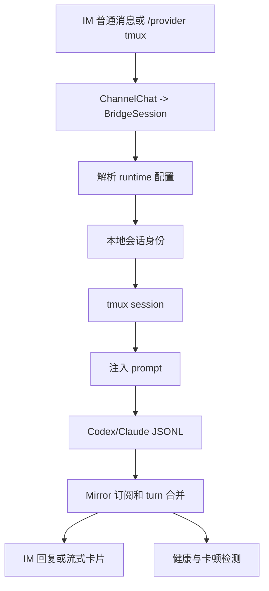

# tmux Runtime 生命周期

本文描述 CodeLark 当前 tmux runtime 的完整链路。Codex 和 Claude Code 共用 `src/bridge/tmux/core.ts` 的 tmux API，差异只保留在各自 CLI 启动参数、会话文件发现和 JSONL 解析上。

## 总览

## 公共 tmux API

公共层在 `src/bridge/tmux/core.ts`，只负责稳定地驱动 tmux：

| API | 职责 |
| --- | --- |
| `hasSession` | 检查 tmux session 是否存在。 |
| `ensureDetachedSession` | 创建或按需重建 detached session。 |
| `capturePane` | 抓取屏幕，用于 `/tmux-screen`、ready 检测和调试。 |
| `sendActions` | 发送 literal 或特殊键；长文本自动走 buffer paste。 |
| `injectPromptIntoPane` | 多行 prompt 使用 paste-buffer + `M-Enter`，最后 `Enter` 提交。 |
| `sendInterrupt` | `/stop` 或 abort 时发送 `C-c`。 |

`src/bridge/tmux/runtime.ts` 是 runtime 级公共层：Codex 侧提供 `startCodexResumeTmuxSession`，并提供 `runtimeTmuxSessionName` / `codexTmuxSessionName` / `claudeTmuxSessionName` 这些跨 runtime 的 session name 规范。Claude 侧的 `startClaudeTmuxSession` 位于 `src/runtime/claude/tmux-provider.ts`，同样复用 `tmuxCore.ensureDetachedSession` 和 `claudeTmuxSessionName`，但 ready/setup 检测保留在 Claude provider 内。

## Codex tmux 生命周期

### 1. thread 获取和注入

当用户把当前 Codex runtime 切到 `/provider tmux` 时，`src/bridge/command/provider-settings.ts` 先从 `BridgeSession.runtime.codex.threadId` 或 binding 推导已有 Codex thread。若没有 thread，会通过 `bootstrapCodexThreadLocally` 本地预创建 Codex thread，并把结果写回 `BridgeSession`。

完成 thread 解析后，`codexTmuxSessionName(threadId)` 生成 `codex_<threadId>`，`startCodexResumeTmuxSession` 用 `codex resume <threadId>` 启动 TUI。启动参数来自 `resolveSessionRuntimeConfig`，包括 model、sandbox、network、reasoning effort、mode 和 skipGitRepoCheck。

Codex tmux 还有一条隐式初始化路径：如果当前聊天的有效 Codex provider 已经是 `tmux`，但新会话还没有 `codex_thread_id` 或 tmux session，第一条普通 IM 消息会被 `src/bridge/host/manager.ts` 转成 `/tmux <message>`，并把 `autoRecoverProviderSession=true` 传给 `src/bridge/command/tmux.ts`。`ensureCodexTmuxSessionForProvider` 会在这个路径中自动执行本地 thread bootstrap、写回 `runtime.codex.threadId`、生成 `codex_<threadId>`、启动缺失的 Codex TUI，并在 ready 检测完成后再注入用户消息。

### 2. TUI 启动和 ready 检测

`buildCodexResumeTmuxCommand` 构造 Codex TUI shell command。`waitForCodexResumeTmuxReady` 周期性 `capturePane`，直到看到 Codex TUI ready prompt，或者达到 `CODELARK_CODEX_RESUME_TMUX_READY_TIMEOUT_MS`。超时不会阻断 provider 切换，但会在日志里记录，便于排查 TUI 启动慢或卡在交互提示。

### 3. 普通消息转发

普通 IM 消息有两种进入 Codex tmux 的路径：

- 已经在 interactive turn 中运行的 Codex 请求由 `CodexRoutingProvider` 根据 `codexProvider=tmux` 分发到 `CodexTmuxProvider`。provider 校验 tmux session，等待信任、更新或权限选择提示稳定后，通过 tmux core 注入 prompt。
- 已经绑定到 tmux provider 的聊天会在 host manager 的普通消息分支中被直接 auto-forward 到 `/tmux <message>`。这条路径用于“把普通聊天文本当作 TUI 输入”，会自动追加 Enter，并在 tmux session 缺失时走上一节的 auto-recover。

Codex TUI 的输出不直接依赖屏幕文本作为最终答案，而是由 Codex session JSONL mirror 同步。

### 4. JSONL mirror 和回复

Codex TUI 写入本地 JSONL 后，`src/runtime/codex/session-index/*` 负责发现 session 文件、按 offset 解析增量，并转换成 `BridgeMirrorRecord`。`src/bridge/mirror/runtime.ts` 订阅活动绑定，`src/bridge/mirror/turns.ts` 合并 message、reasoning、tool、plan 和 terminal 事件，再交给反馈控制器投递到 IM。

### 5. 卡顿和健康检测

卡顿检测不依赖单一信号。`src/bridge/health/runtime.ts` 汇总 `BridgeSession` 的 `runtime_status`、`last_progress_at`、活跃工具、stream UI 刷新、mirror 事件时间和进程状态，`src/bridge/health/reducer.ts` 归约为 `running_active`、`slow_observed`、`suspected_stall`、`suspected_stream_ui_stall`、`suspected_detached` 等状态。`/health` 展示单会话诊断，`/status` 和运行时卡片展示概览。

## Claude tmux 生命周期

Claude Code 现在提供与 Codex tmux 对齐的 provider：

| 阶段 | Claude tmux 实现 |
| --- | --- |
| provider 选择 | `/provider tmux` 写入 `BridgeSession.runtime.claude.provider=tmux`，并记录 `general.tmuxSessionName`。 |
| 启动命令 | `buildClaudeTmuxCommand` 复用 Claude pty 的 CLI 参数构造，支持 `claude` / `ccr code`、model、permission mode 和 `--effort`。 |
| tmux session | `claudeTmuxSessionName(session.id)` 生成稳定 session 名，`startClaudeTmuxSession` 创建或重建 detached session。 |
| prompt 注入 | `ClaudeTmuxProvider` 使用 `tmuxCore.injectPromptIntoPane` 注入普通消息。 |
| 会话身份 | provider 通过 Claude JSONL discovery 获取 `session_id`、cwd 和 transcript path，并在 SSE `result` 中回传。 |
| 输出同步 | Claude pty/tmux 都依赖 `src/runtime/claude/session-jsonl.ts` 读取 Claude Code JSONL；SDK provider 继续走原生事件。 |

Claude tmux 与 Codex tmux 的差异是：Claude Code 本身决定 JSONL session id；CodeLark 不需要像 Codex 那样预创建 thread，也不会执行 `resume <threadId>`。因此 Claude tmux 的身份注入发生在 Claude Code 写出 JSONL 后，再把发现到的 `session_id` 保存回 `BridgeSession.runtime.claude.sessionId`。

Claude tmux 也必须支持和 Codex 相同的普通消息隐式初始化/恢复语义：如果当前聊天的有效 Claude provider 是 `tmux`，但还没有 `runtime.general.tmuxSessionName`，第一条普通消息会生成 `claude_<BridgeSessionId>` 并启动 Claude Code TUI；如果已记录 tmux session 但进程不存在，普通消息会重建同名 tmux session。两种情况都会写回 `runtime.claude.provider=tmux`、`runtime.general.tmuxSessionName` 和 tmux auto-enter 配置，然后再把消息注入 TUI。之后 `reconcileClaudeTmuxMirrorAfterAutoForward` 等待 Claude JSONL 出现，发现 `session_id` 后写回 `runtime.claude.sessionId/cwd`，prime 首个 turn 的 mirror delivery，并触发 Claude mirror reconcile。

## 链路对齐盘点

| 链路点 | Codex tmux | Claude tmux | 当前对齐状态 |
| --- | --- | --- | --- |
| provider 选择 | `/provider tmux` 写 session TOML `runtime.codex.provider=tmux`。 | `/provider tmux` 写 session TOML `runtime.claude.provider=tmux`，并更新 runtime state。 | 已对齐；Claude 额外把 `activeRuntime` 固定为 `claude`。 |
| 本地身份 | 先有 Codex `thread_id`；没有时本地 bootstrap。 | Claude Code 写 JSONL 后才有 `session_id`；启动前用 BridgeSessionId 命名。 | 语义不同但状态落点对齐：都写回 `BridgeSession.runtime.*`。 |
| tmux session 命名 | `codex_<thread_id>`。 | `claude_<session_id>`；没有 Claude `session_id` 时用 `claude_<BridgeSessionId>`。 | 已对齐到统一 `runtimeTmuxSessionName` 规则。 |
| `/provider tmux` 启动 | 启动或重建 detached tmux，执行 `codex resume <thread_id>`。 | 启动或重建 detached tmux，执行 Claude Code TUI。 | 已对齐；启动参数各自走 runtime config。 |
| 普通消息隐式初始化 | auto-forward 触发 `/tmux <message>`；缺 thread/session 时自动 bootstrap + 启动 + ready 后注入。 | auto-forward 触发 `/tmux <message>`；缺 tmux session 时自动启动 Claude TUI，session 缺失时用 BridgeSessionId 命名。 | 已对齐；Claude 不做 thread bootstrap，只等待 JSONL 发现身份。 |
| 缺失 tmux 恢复 | 普通消息 auto-forward 可重建；显式 `/tmux` / `/tmux-screen` 只报错。 | 普通消息 auto-forward 可重建；显式 `/tmux` / `/tmux-screen` 只报错。 | 已对齐，避免人工诊断命令产生隐式副作用。 |
| prompt 注入 | provider 内部或 `/tmux` 命令都走 tmux core；普通消息自动追加 Enter。 | provider 内部或 `/tmux` 命令都走 tmux core；普通消息自动追加 Enter。 | 已对齐。 |
| 首轮 mirror | Codex thread 已知，mirror 可按 thread 找 JSONL。 | 首轮普通消息后等待 Claude JSONL，写回 `session_id/cwd`，再 prime 首个 turn。 | 已对齐到“首轮也必须可投递”，实现手段不同。 |
| mirror suppression | SDK turn 复用已有 Codex JSONL thread 时建立 suppression，避免 SDK final 和 mirror final 重复。 | Claude SDK provider 不订阅 tmux/pty mirror；pty/tmux 由 Claude JSONL mirror 负责最终投递。 | Codex SDK/mirror 混合路径已覆盖；Claude 按 provider 分流。 |
| 健康状态 | auto-forward 后记录 interactive start，等待 mirror terminal 更新。 | auto-forward 后记录 interactive start，等待 Claude mirror terminal 更新。 | 已对齐。 |
| TUI 特殊提示 | Codex 处理 trust、update、goal/permission 选择。 | Claude 处理 onboarding/trust/input prompt。 | 不做 1:1 复制，按 CLI 实际提示语义分别处理。 |
| `/stop` / abort | tmux/pty provider 发送中断，interactive runtime 释放状态。 | tmux/pty provider 发送中断，interactive runtime 释放状态。 | 共用终端控制和 runtime health 语义。 |
| `/clear` after runtime switch | 只替换当前 Codex BridgeSession，保留同一聊天记住的 Claude BridgeSession 映射。 | 只替换当前 Claude BridgeSession，保留同一聊天记住的 Codex BridgeSession 映射。 | 已对齐；新 session 继承当前 active runtime 和当前 runtime 的 provider override，避免清空后静默切回另一个 runtime。 |
| `/t rename` after runtime switch | 重命名当前聊天当前 Codex BridgeSession。 | 重命名当前聊天当前 Claude BridgeSession。 | 已对齐；切回另一个 runtime 时不会污染另一个 BridgeSession 的标题。 |

## 回归覆盖

| 覆盖点 | 测试 |
| --- | --- |
| Codex tmux 默认 provider 首条普通消息自动 bootstrap thread、启动 tmux、等待 ready、注入、mirror 投递。 | `initializes a default tmux provider conversation on first text after /set defaultProvider tmux and /new` |
| `/new` 继承 tmux provider 后首条普通消息自动初始化 Codex thread/session。 | `keeps tmux provider auto-enter enabled when /new follows /p tmux` |
| Claude tmux 已有 tmux session 时普通消息直接注入，不走 SDK。 | `routes plain messages into Claude tmux when the active Claude provider is tmux` |
| Claude tmux 首条普通消息自动启动 `claude_<BridgeSessionId>`、写回绑定、注入、发现 JSONL、启动 mirror。 | `auto-initializes a Claude tmux provider binding on the first plain message` |
| Claude tmux 普通消息后 JSONL 出现时回填 `session_id/cwd` 并投递首个 mirror turn。 | `starts Claude tmux mirror after a plain auto-forwarded message discovers the JSONL session` |
| 切到 Claude runtime 后不会被 Codex tmux provider 抢走普通消息。 | `does not let the Codex tmux provider intercept plain messages after switching to Claude runtime` |
| SDK final 与已有 Codex mirror 订阅共存时建立 suppression，避免重复 final。 | `delivers /auto SDK final output for a still-bound session without duplicate mirror output` |
| `/clear` 在 Claude runtime 下运行时保持 Claude runtime/provider，并保留同聊天 Codex runtime 映射。 | `keeps the active runtime and remembered alternate runtime when /clear follows a runtime switch` |
| `/t rename` 在 runtime 切换后只修改当前 runtime 的 BridgeSession 标题。 | `renames only the active runtime BridgeSession after runtime switches` |

## 命令和配置入口

| 入口 | 作用 |
| --- | --- |
| `/runtime codex|claude` | 切换当前聊天的 runtime。 |
| `/provider tmux` | 对当前 runtime 启用 tmux provider。Codex 会启动 `codex_<threadId>`；Claude 会启动 `claude_<session_id 或 BridgeSessionId>`。 |
| 普通消息 + tmux provider | 对当前 runtime 的 tmux provider 自动注入 TUI；Codex 可自动 bootstrap thread 并启动 `codex_<threadId>`，Claude 可自动启动或恢复 `claude_<BridgeSessionId 或 session_id>`。 |
| `/tmux-screen` | 查看当前绑定的 tmux 屏幕。 |
| `/stop` | 对运行中的 tmux/pty provider 发送中断。 |
| `/clear` | 清空当前聊天当前 runtime 的 BridgeSession；如果同一聊天记住了另一个 runtime 的 BridgeSession，映射会保留，之后 `/runtime <other>` 可以切回。 |
| `/t rename <name>` | 重命名当前聊天当前 runtime 绑定的 BridgeSession；不会改写同一聊天里另一个 runtime 的 BridgeSession 标题。 |
| `/current` | 当前会话配置卡片，支持 provider、model、mode、reasoning 等会话级覆盖。 |
| `/set codexReasoningEffort ...` | 设置 Codex 全局 reasoning 默认值。 |
| `/set claudeReasoningEffort ...` | 设置 Claude Code 全局 effort 默认值。 |
| `/set claudeProvider pty|tmux|sdk` | 设置 Claude Code 新会话默认 provider。 |

## 维护边界

- tmux 命令拼装、长文本 paste、屏幕抓取和特殊键发送必须继续留在 `src/bridge/tmux/core.ts`，不要在 provider 内重复 shell 拼接。
- Codex 和 Claude 各自的 CLI 参数构造可以不同，但 tmux session 生命周期应通过 `src/bridge/tmux/runtime.ts` 暴露的 runtime API。
- 普通消息 auto-forward 的自动初始化逻辑集中在 `src/bridge/command/tmux.ts`：Codex 和 Claude 都应只在 `autoRecoverProviderSession=true` 时启动或重建 provider-owned tmux session；显式 `/tmux` / `/tmux-screen` 命令不能悄悄创建缺失 session。
- JSONL mirror 是 pty/tmux provider 的权威输出来源；屏幕抓取主要用于 ready 检测、人工诊断和短期兜底。
- 卡顿检测应继续消费统一的 `BridgeSession` 运行状态和 mirror 进度，而不是让 provider 自己决定最终健康状态。
