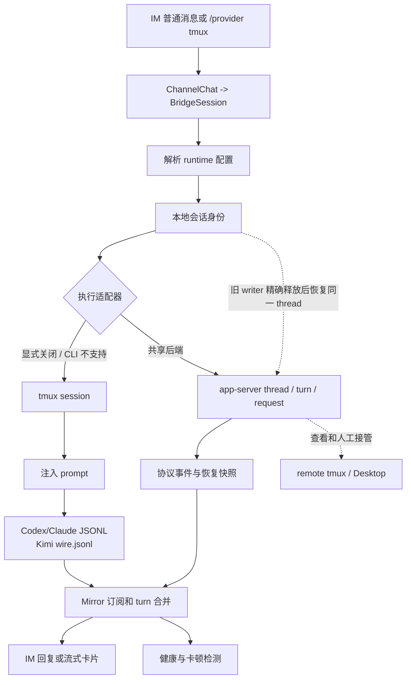

# tmux Runtime 生命周期

本文描述 CodeLark 的终端适配器与 Codex app-server 执行适配器。启用 app-server 的 Codex 由协议管理线程、输入、停止和状态；tmux 是可选查看入口，不是并列 writer。升级前已绑定的 Codex thread 会在下一条输入前迁移到 app-server；只有显式关闭 app-server 或 CLI 明确不支持时才继续旧流程。legacy Codex、Claude Code、Kimi Code、Cursor Agent 和 ZCode 共用 `src/bridge/tmux/core.ts` 的 tmux API 和 `src/bridge/tmux/input-state-machine.ts` 的输入生命周期状态机，差异保留在各自 CLI 启动参数、会话身份和 JSONL/wire/transcript/SQLite 解析上。`src/bridge/tmux/runtime.ts` 承载 Codex/Claude 的 shared provider-owned 启动和 readiness；Kimi、Cursor 与 ZCode 分别在自己的 provider 中发现稳定 CLI identity 和持久输出，再把相同的 session/tmux/send 状态写入共享 machine。

## 总览

```mermaid
flowchart TD
  msg[IM 普通消息或 /provider tmux]
  binding[ChannelChat -> BridgeSession]
  config[解析 runtime 配置]
  thread[本地会话身份]
  tmux[tmux session]
  inject[注入 prompt]
  jsonl[Codex/Claude JSONL<br/>Kimi wire.jsonl]
  mirror[Mirror 订阅和 turn 合并]
  health[健康与卡顿检测]
  reply[IM 回复或流式卡片]

  msg --> binding
  binding --> config
  config --> thread
  thread --> protocol{执行适配器}
  protocol -->|显式关闭 / CLI 不支持| tmux
  protocol -->|共享后端| app[app-server thread / turn / request]
  thread -.旧 writer 精确释放后恢复同一 thread.-> app
  app --> events[协议事件与恢复快照]
  events --> mirror
  app -.查看和人工接管.-> view[remote tmux / Desktop]
  tmux --> inject
  inject --> jsonl
  jsonl --> mirror
  mirror --> reply
  mirror --> health
```

## 公共 tmux API

公共层在 `src/bridge/tmux/core.ts`，只负责稳定地驱动 tmux：

| API | 职责 |
| --- | --- |
| `hasSession` | 检查 tmux session 是否存在。 |
| `ensureDetachedSession` | 创建或按需重建 detached session。 |
| `capturePane` | 抓取屏幕，用于 `/tmux-screen`、ready 检测和调试。 |
| `sendActions` | 发送 literal 或特殊键；长文本自动走 buffer paste。 |
| `injectPromptIntoPane` | 多行 prompt 使用 paste-buffer + `M-Enter`，最后 `Enter` 提交。 |
| `sendInterrupt` | `/stop` 或 abort 时发送 `C-c`。 |

`src/bridge/tmux/runtime.ts` 是 runtime 级公共层，Codex 和 Claude 共用这些生命周期入口；Kimi 当前共用底层 tmux core、输入状态机和跨平台 shell snapshot，并在 Kimi provider 中处理 CLI 自己生成的 session identity 与 wire 时序：

| API | 职责 |
| --- | --- |
| `runtimeTmuxSessionName` / `codexTmuxSessionName` / `claudeTmuxSessionName` | 统一 provider-owned tmux session 命名。 |
| `startRuntimeTmuxSession` | 以 `runtime=codex|claude` 创建或重建 tmux provider session；Codex 执行 `codex resume <threadId>`，已有 identity 的 Claude 执行 `claude --resume <sessionId>`，fresh Claude 才直接启动 TUI。Kimi 由 `KimiTmuxProvider` 直接启动 `kimi [-r session] -y`。 |
| `waitForRuntimeTmuxReady` | 统一屏幕 ready 检测和 startup selection 处理；Codex 支持 update/goal/permission/generic selection 透传，Claude 支持 welcome/theme/terminal-setup onboarding，并在 trust prompt 中显式选择可信选项后确认。 |
| `inspectRuntimeTmuxSession` | 统一检查 session 存在性、抓屏，并返回当前屏幕上的 selection prompt。 |
| `cleanupRuntimeTmuxSession` | 统一 best-effort 清理 provider-owned tmux session，供 `/clear` 和 `/t archive` 等生命周期操作调用。 |

`src/bridge/tmux/input-state-machine.ts` 位于 tmux core 和各 runtime 语义之间，统一回答“这条输入现在能否发送”：

| API | 职责 |
| --- | --- |
| `inspectRuntimeTmuxInput` | 每次输入只检查 tmux 是否仍存在；已知 `running` 且进程仍存在时跳过 pane capture/prompt readiness。冷状态、失败状态或进程丢失才要求重新 readiness/启动。 |
| `transitionRuntimeTmuxInputState` | 让 Codex/Claude readiness、Kimi session discovery、GUI/TUI selection、发送和清理进入同一个状态集合。 |
| `coordinateRuntimeTmuxSelection` | 以 runtime/session/prompt fingerprint 注册唯一 selection lifecycle；startup readiness、运行期 provider polling 和 mirror probe 只能加入同一条等待与执行链，不能各自创建 waiter 或发送按键。 |
| `sendRuntimeTmuxInput` | 只允许从 `running` 进入 `sending`；成功回到 `running`，失败进入 `failed`。 |

Codex 保留 `startCodexResumeTmuxSession` 和 `waitForCodexResumeTmuxReady` 作为兼容包装；Claude 的 `startClaudeTmuxSession` 也由 `src/bridge/tmux/runtime.ts` 提供，`src/runtime/claude/tmux-provider.ts` 只负责 prompt 注入、JSONL discovery 和 SSE/mirror 转换。

## Codex 执行路径与兼容

下面的 bootstrap、键盘输入、JSONL 轮询和屏幕就绪检查仅用于旧执行适配器；启用协议的线程使用本章的 app-server 生命周期。已有旧 thread 不会因升级 CodeLark 或安装 Desktop 自动迁移。只有新会话自动选择共享后端，或用户明确配置 `CODELARK_CODEX_APP_SERVER_URL` / 已保存的 thread endpoint 后才走协议。

### 1. thread 获取和注入

当用户把当前 Codex runtime 切到 `/provider tmux` 时，`src/bridge/command/provider-settings.ts` 先从 `BridgeSession.runtime.codex.threadId` 或 binding 推导已有 Codex thread。若没有 thread，会通过 `bootstrapCodexThreadLocally` 本地预创建 Codex thread，并把结果写回 `BridgeSession`。

完成 thread 解析后，`codexTmuxSessionName(threadId)` 生成 `codex_<threadId>`，`startCodexResumeTmuxSession` 用 `codex resume <threadId>` 启动 TUI。启动参数来自 `resolveSessionRuntimeConfig`，包括 model、sandbox、network、reasoning effort、mode 和 skipGitRepoCheck。

Codex tmux 还有一条隐式初始化路径：如果当前聊天的有效 Codex provider 已经是 `tmux`，但新会话还没有 `codex_thread_id` 或 tmux session，第一条普通 IM 消息会被 `src/bridge/host/manager.ts` 转成 `/tmux <message>`，并把 `autoRecoverProviderSession=true` 传给 `src/bridge/command/tmux.ts`。共享的 `ensureRuntimeTmuxSessionForProvider` 会在这个路径中自动执行本地 thread bootstrap、写回 `runtime.codex.threadId`、生成 `codex_<threadId>`、启动缺失的 Codex TUI，并在 ready 检测完成后再注入用户消息；Claude/Kimi 的 auto-forward 也从同一入口检查 input lifecycle。

### 2. TUI 启动和 ready 检测

`buildCodexResumeTmuxCommand` 构造 Codex TUI shell command。Codex tmux 只允许使用全局 Codex CLI：resolver 不会回退到 `node_modules/.bin/codex` 或包内 `node_modules/.bin/codex`，显式 `CODELARK_CODEX_CLI_PATH` 也不能指向 `node_modules/.bin`，避免旧本地依赖反复弹更新提示。

TUI 启动和本地 thread bootstrap 共用 `buildCodexTuiEnv`，显式设置 `GIT_TERMINAL_PROMPT=0`。Codex 启动时可能后台同步官方插件目录；无凭据时 Git 必须返回失败，不能读取 `/dev/tty` 与 TUI 抢占输入。已有 credential helper 仍可正常提供凭据。就绪检测还会排除当前 `model: loading`、`Resuming session…` 和 Git 用户名/密码提示；已滚入历史的加载画面不会挡住后续正常输入框。

热更新必须继承目标实例自己的 shell snapshot 环境。`scripts/hot-update-bridge.sh` 不覆盖实例凭据或 `NODE_OPTIONS`；更新 Bridge 仅影响之后启动的子进程，已卡住的旧 Git/Codex 进程需要另行核实并恢复。`/tmux-screen` 只抓屏，不会执行恢复。

### Codex Desktop 与共享 app-server

macOS 上准备新 Codex 会话时，CodeLark 会通过 `com.openai.codex` bundle id 检测 Desktop，并检查 CLI 是否支持 `--remote`。Linux、Windows、未安装 Desktop 或显式设置 `CODELARK_CODEX_DESKTOP_REMOTE=0` 时，新线程使用下文的 Bridge 私有 app-server；既有 legacy 线程不自动迁移。Desktop 的 `CODEX_APP_SERVER_FORCE_CLI=1` 设置优先，不自动改写。

已配置且可连接的本机 `CODEX_APP_SERVER_WS_URL` 优先复用。Desktop 默认本地路径使用 stdio，不提供通用的可接入 socket；缺少明确地址时，CodeLark 为当前 macOS 用户安装 `dev.codelark.codex-app-server` LaunchAgent，通过私有 Unix socket 运行独立 app-server。新 TUI 使用 `--remote unix://… resume <thread>`，Desktop 使用同一 socket 对应的 `ws+unix://localhost/绝对路径:/` 地址。官方应用的连接选择器通过 hostname 判断是否为本机，空 hostname 会误选代理；旧版保存的空 hostname 地址仍能被 CodeLark 识别，受管理的启动脚本会更新地址写法，不替换原环境快照。服务端仍持有 thread writer lock；两个客户端共享一个持锁后端，没有删除或关闭锁。

LaunchAgent 保存在 `~/Library/LaunchAgents/dev.codelark.codex-app-server.plist`，服务脚本、日志和环境快照在 `~/.codelark/codex-desktop/`。登录时启动服务并重新设置用户级 Desktop 环境；不需要每次 export，也不要求先启动 Bridge。Bridge 停止、热更新或某个 TUI 退出都不会停止共享服务。服务异常退出后由 launchd 重启；客户端仍需重新连接，重启不保证中断中的轮次自动继续。登录时 Desktop 与 LaunchAgent 同时自动启动的先后顺序尚需 macOS 实机验证。

CodeLark 先完成 `initialize` 和 `thread/loaded/list` 协议检查，再由协议建立线程。选择 tmux 的聊天会异步建立 remote 查看入口，创建成功后提示检测结果；输入不等待终端菜单或编辑框。首次设置地址时，如果 Desktop 已在运行，需要用户退出后重开一次才能继承新环境；不会强制退出用户的 Desktop。地址已配置但后端不可达时明确报错，不另起一个独立 writer。原有 stdio Desktop 或独立 CLI 已占用的 thread，仍需先正常释放后才能迁入共享服务。

一个 macOS 用户共用一个后端。首次安装保存该实例的 `CODEX_HOME` 和环境快照，目录权限为 `0700`，快照为 `0600`；移除 Bridge/chat/turn/tmux 身份环境，不在 plist 中写凭据。后续启动复用这份环境，不用另一个实例的凭据覆盖它；不同 `CODEX_HOME` 会拒绝自动接入。修改当前终端环境不会改变已运行服务的环境。Unix socket 路径超过 macOS 长度限制或包含当前 Desktop 传输不能处理的 URL 特殊字符时，自动配置会报错。

关闭可执行 `codelark codex-desktop disable`：该命令会中断共享服务的活动轮次、移除自己的 LaunchAgent、只清除指向自己服务的 Desktop 环境变量，并写入 `~/.codelark/codex-desktop/disabled` 防止下一次 tmux 自动安装。之后重开 Desktop 恢复默认方式。若要重新启用，移除该 `disabled` 文件后创建新 tmux；已有环境快照继续复用。仅设置 `CODELARK_CODEX_DESKTOP_REMOTE=0` 只影响该 Bridge 后续启动，不停止已经安装的共享服务。卸载 CodeLark 前若要恢复 Desktop 默认方式，应先运行上述 disable 命令；普通 Bridge stop 不负责停止 Desktop 使用的后端。

`CODEX_APP_SERVER_WS_URL` 的行为取证自 Desktop `26.930.31730` 发行包；它是实现细节，不能当作长期稳定的公开接口。Linux 已实测发行包原版通信模块与真实 Codex `0.153.4`、`0.160.0` 共享会话，另以 `0.160.0` 验证 Unix socket、CodeLark 新连接层和真实 remote TUI。GitHub macOS 26 runner 已验证真实 LaunchAgent、Bridge 准备进程退出后服务继续运行，以及通过 LaunchServices 启动的应用继承连接环境；完整官方 Desktop GUI 的同线程收发、审批、问答和退出重开，以及真实飞书的新终端提示已有独立验收；服务恢复、晚启动和停用后的完整 GUI 结果见下方验收文档，不能用通信模块的成功代替。

专用工作流 `.github/workflows/codex-desktop.yml` 在独立分支 `ci/codex-desktop-remote` 上运行；`scripts/verify-codex-desktop-macos.ts` 现通过 LaunchServices 启动官方 Desktop 原版 App，再用 CDP 鼠标/键盘操作真实窗口，验证共享线程收发、审批和问答；模型响应由隔离的本地 mock 提供。测试用 `turn/completed` 确认回合完成，保存截图、界面文本、线程协议及 App 身份；任何 GUI 失败都不能退回通信模块验收后报成功。受控启动顺序与实际 OS 注销/登录分别记录，后者仍未验证。执行方式、证据口径和专用 Mac 登录验收步骤见 [Desktop GUI 验收](../testing/codex-desktop.md)。

Codex 0.160 的启动菜单有两种紧凑 footer：目录信任为 `enter continue · esc back`，模型介绍为 `enter/esc confirm · ctrl+c quit`。公共 footer 识别按完整行匹配，Codex 还必须同时存在选择游标和有效选项才会交给交互处理，不能将说明文字当作可操作菜单；生产不会自动信任目录或选择新模型。

### app-server 的执行生命周期

用户要求以 app-server 重新划分完整生命周期，而非把协议探活接到旧的抓屏流程上。新线程默认启用 app-server；明确指定的地址、已保存的后端绑定和 `CODELARK_CODEX_APP_SERVER_URL` 优先。macOS 原有独立 Desktop 服务继续使用原管理方式，无 Desktop 或非 macOS 时由 Bridge 懒启动私有后端。既有 legacy 线程不自动迁移；其他 runtime 不受影响。生产实现分别位于 `app-server-client.ts`（连接和错误）、`app-server-lifecycle.ts`（线程、轮次和请求）、`app-server-events.ts`（事件转换）、`app-server-registry.ts`（后端选择与持久记录）。Bridge 的普通输入、direct provider、停止和镜像复用这套服务；验收记录单独注明已验证范围。

#### 默认私有后端的归属与兼容

`app-server-local.ts` 使用当前安装的普通 `codex app-server --listen`，不调用要求 managed standalone 安装的 `app-server daemon start`，不替用户安装或复制二进制。各平台的 npm 入口解析到同一安装自带的原生 Codex（包括 Windows 的 `codex.exe`），避免只持有命令或 Node 包装层的句柄。私有启动保留 `CODELARK_CODEX_BASE_URL` 与 `CODELARK_CODEX_API_KEY > CODEX_API_KEY > OPENAI_API_KEY` 的既有优先级。原生 app-server 不自动读取环境中的登录 key；有显式 key 时，私有子进程使用官方 `cli_auth_credentials_store="ephemeral"`，核对有效配置后通过 `account/login/start` 注入内存认证。密钥不放进命令参数，不写入或替换用户的 `auth.json`；已有服务复用不修改其认证。没有显式 key 时沿用原有 Codex 登录配置。

地址由规范化的 `CODELARK_HOME` 哈希确定；目录尚不存在时先解析最近存在父路径的 realpath，再拼接未创建的后缀，确保 macOS `/tmp` 与 symlink 父目录不会使创建前后的地址改变。Unix 使用 `/tmp/codelark-codex-<hash>/rpc.sock`，目录属于当前用户且权限为 `0700`；Windows 使用确定的 `127.0.0.1` 高位端口。准备时先以 `initialize` 核对 `CODEX_HOME`，再查询 `thread/loaded/list`；同地址已有兼容后端就连接它。地址已被其他程序或不同 `CODEX_HOME` 使用、握手/鉴权/协议失败均直接报错。已有但不可连接、且没有本进程创建证据的 Unix socket 不会被删除或替换；确定的端口冲突也不会改选另一个地址。

同一 Bridge 内的并发准备复用一个 Promise，多个聊天共用一个后端。没有新增 PID 文件、进程出生时间检查、磁盘锁或独立守护。只有真正启动进程的一方持有其 `ChildProcess`；`closeCodexAppServerSessions()` 会同步发出关闭请求，并返回可等待进程退出的 Promise。其他进程复用的后端、显式外部服务和 Desktop LaunchAgent 不归该关闭操作管理。manager.stop 等待该关闭 Promise，再结束 Bridge。私有后端跟随 Bridge；Bridge 意外退出可能遗留可用服务，下次只按同地址协议核对并复用，不扫描 PID 或猜测归属。若本进程持有的后端异常退出，仅允许清理本次成功启动后记录、dev/ino 未变、且已无监听者的自有 socket。若路径被替换，或是跨 Bridge 重启留下且无法确认归属的残留，保持原样并报错。

`/clear`、`/new` 继承本实例的确定性 endpoint 时，新 session 即使尚无 registry 记录，也保留 private 归属。已保存的私有后端绑定保留相同 endpoint 与 threadId；服务正常关闭后可在原地址启动并 resume，不更换 writer 或重复提交旧输入。`CODELARK_CODEX_APP_SERVER=0` 关闭未绑定新线程的自动启用，供显式选择旧路径和 legacy 测试使用；已有 pinned 线程或显式 endpoint 不能借此退回旧适配器。只有 CLI 明确报告无 `app-server` 子命令，或有效 app-server 帮助明确不含 `--listen` 时，新线程才允许兼容回退；启动错误不能当作“不支持”。

原生 0.153.4 对仅 `thread/start`、尚无输入的空线程，服务重启后会返回 `no rollout found`；已完成首轮的线程可以恢复。实现不会自动创建替代 thread 或偷偷发送输入。本阶段移除 `/clear`、`/new` 继承裸 endpoint 后由后台订阅自动创建空线程的行为：主线的 `reconcileMirrorSubscriptions()` 以 `createIfMissing=false` 仅恢复已有线程，首次真实输入才创建线程。`/p tmux` 仍允许显式预热；若预热后未发送首轮就重启服务，原生无 rollout 的恢复边界仍保留。本次不新增线程持久元数据或错误后重建逻辑。

私有地址不写入 Desktop 环境，不修改 App。需要 Bridge 退出后仍独立使用的 Desktop 应连接已有独立 LaunchAgent；没有启用共享的 Desktop 保持原生启动行为。实际 OS 注销/登录的顺序边界仍见 Desktop 验收文档。

独立 workflow 测试显式开启 `CODELARK_CODEX_APP_SERVER=1`，覆盖 registry 默认选择、并发聊天、跨进程复用、关闭归属、同地址恢复、明确回退和冲突拒绝。稳定套件入口 `scripts/run-tests.js` 显式关闭自动启用，保留旧 SDK/TUI 故事。`scripts/verify-codex-default-app-server.ts` 以独占 HOME/CODEX_HOME 和本地 mock 模型验证真实 CLI 首轮、其他进程退出、继承 endpoint 的新会话在关闭后恢复，以及实际子进程异常退出后同线程新回合；普通 CI 的 Linux/macOS/Windows 分别运行并保存证据，未运行的平台不能凭 mock 宣称通过。

#### 对象与职责

| 对象 | 唯一职责 | 生命周期结束的依据 |
| --- | --- | --- |
| 独立共享后端 | 持有 Codex 线程、配置、工具执行和 writer lock | 外部服务管理器或用户明确关闭；Bridge/TUI 退出不停止它 |
| Bridge 私有后端 | 为同一 Bridge 的聊天提供 app-server | 实际持有子进程句柄的 Bridge 关闭；复用连接没有终止服务的权限 |
| Bridge 连接 | 初始化协议、请求关联、订阅与重连 | socket 关闭只标记断连，不能结束轮次 |
| 线程 | 固定 backend + threadId、当前轮次与待处理请求 | 用户解绑/归档使在途 prepare/read/resume 失效并解除本端订阅；不强杀其他客户端的工作 |
| 轮次 | 接收输入、执行工具、提交最终结果 | 匹配 threadId/turnId 的 turn/completed 或恢复读取中的终态 |
| 审批/问答请求 | 按服务端 request id 接收一次有效答复 | serverRequest/resolved、轮次结束或连接失效；旧回调失效 |
| tmux 界面 | 查看和人工接管同一后端上的线程 | 界面关闭仅失去该查看入口；不影响消息提交和状态 |

后台订阅只恢复已有的原生线程，包括 registry 已持久保存、但 BridgeSession 尚未写回 threadId 的绑定。`/clear` 和 `/new` 继承 endpoint 只表示选择了后端，不能因此创建空线程；第一条真实输入或显式 `/p tmux` 才负责创建。尚未创建线程的空会话不需要请求后端停止。原生 Codex 可能不持久保存零输入的预热线程，因此不能用后台创建空线程来代替订阅恢复。

消息发给协议执行适配器，由 thread/start 或 thread/resume 确认线程，再用 turn/start 提交；活动轮次上的明确追加用 turn/steer 并携带 expectedTurnId。/stop 使用 turn/interrupt，目标必须为当前服务器确认的 turnId。普通消息与 direct provider 共用 turn 配置转换，后续修改模型、sandbox、approvalPolicy、工作目录会传给下一次 turn/start；remote resume 不能再传本地权限覆盖参数。

通知转换为既有 BridgeMirrorRecord，复用现有卡片、投递重试和 TurnCoordinator。协议线程只允许这一份事件源决定进度和终态，不能再由 JSONL 与抓屏平行生成结束事件。其他 runtime 与旧 Codex 继续使用原记录来源。进程关闭、静默超时、编辑框出现、JSONL 暂无增量都不是协议轮次完成的证据。

#### 配置的生效范围与尚未完成的迁移

2026-10-08 对本机 Codex 0.153.4 实际生成的公开及实验 JSON schema 做了核对，并运行独立 app-server + 隔离模型实验：`thread/settings/update` 可以不发送用户消息地修改下一轮设置，`thread/settings/updated` 返回完整有效设置。同一进程和线程内更改 model、cwd、effort、approvalPolicy、sandboxPolicy 后，新请求采用新设置；活动轮次期间再次更改只影响后续新轮次，配置文件不变。该接口是实验能力，接入时必须按服务器是否支持判断，不能仅比较版本号。

| 参数 | 适用范围 |
| --- | --- |
| model、cwd、effort、approvalPolicy、sandboxPolicy、serviceTier、personality、summary | 可用线程设置接口修改下一轮；旧接口也可在 `turn/start` 携带覆盖。YOLO 是审批与沙箱策略的组合，不是必须重启的开关。 |
| modelProvider、baseInstructions、developerInstructions、创建线程时注册的 dynamicTools | 不在通用线程设置更新参数中；需按该参数的线程加载合同处理，不能以 warm resume 接受字段就宣称运行中已更新。 |
| MCP 服务配置 | 使用专门的 `config/mcpServer/reload`；不等同于重启整个后端。 |
| Codex 可执行文件、CODEX_HOME、监听地址、进程自身环境 | 进程启动配置；需要重启或选择另一后端，不允许悄悄迁移已有线程。 |
| 已提交的模型请求、已启动的工具命令 | 不能追溯改变。实验 `turn/settings/update` 有消费者与模型指令限制，不作为普通配置命令的默认实现。 |

`config/batchWrite` 保存磁盘配置，与当前线程设置不同。即使使用 `reloadUserConfig`，官方说明也排除了已有线程的 model、reasoning effort、service tier 等默认值重载，不能将“文件已保存”呈现成“当前线程已生效”。

当前迁移尚未闭环：slash 命令、配置表单和 Web 设置共用存储但不共用校验与应用用例；表单存在逐字段写入，命令仍可能等待旧会话执行队列；每轮传完整 CodeLark 配置会覆盖其他客户端更改。下一阶段必须让这些入口共用一次完整校验与配置变更，以服务器有效设置、等待应用的变更、服务端拒绝结果为统一输出。`/model` 的局部限制修复不代表这套迁移已经完成。

默认 app-server 与自动接入 Desktop 是两个决策。现有 macOS 共享服务由 launchd 管理；普通 CodeLark 退出不会结束它。Codex 原生 daemon 的官方当前合同要求 standalone 安装且仅支持 Unix，不能把 npm CLI 的存在等同于已具备可用的后台服务。通用默认后端尚未交付；2026-10-08 试写的自有 PID/启动锁方案已经撤回，没有部署到 kasumi。

#### 连接与提交恢复

连接从 connecting 进入 ready；断开后进入 disconnected，活动轮次状态为 unknown。重连只执行初始化、恢复订阅和读取线程，不重发用户输入。恢复时先安装事件监听，再 resume/read，并按稳定 item/turn id 合并通知与快照，避免读请求期间的新事件被旧快照覆盖。

WebSocket 握手和 `initialize` 默认各有 5 秒期限；建立连接后的业务 RPC 默认有 30 秒期限。恢复线程需要加载历史和工具，不能沿用短连接探测的期限。调用者可以分别指定两种期限；旧的单一数字参数仍同时约束连接与请求，因此短探测连接用完即关闭，不用于后续恢复。业务请求超时仍表示结果未知，不自动重发输入。

提交在发送前记录身份与“可能已发送”，收到明确回复或匹配 `userMessage.clientId` 的接受事件后记录真实 turnId；后者不必等待 RPC 回执，已经完成的正文仍正常投递。超时/断线发生在副作用请求之后时，保留结果未知；不能换 SDK/TUI 再发一次，也不能凭同一个 clientUserMessageId 假定重发幂等。无法从服务器状态证明是否接收时必须向用户如实说明；后续输入不得悄悄替代这条消息。

审批监听不自动批准。Desktop 与 Bridge 可以同时看到请求，任一端答复后，另一个端通过 resolved/终态作废旧操作。连接断开使本端旧请求失效；重新 resume 重放的新请求重新注册。问答保留原始问题和选项，不把问答当作允许/拒绝审批。运行时结果同时携带 completed/failed/aborted，SDK 消费、最终卡片与健康状态使用同一终态；原生 interrupted 表示已停止，不发送执行异常，也不依赖本地 AbortSignal 才识别停止。

#### 兼容边界

- 不把版本号作为唯一开关。初始化与无副作用查询决定最小协议能力；通知中可选字段缺省时使用共同字段。未知通知忽略并可诊断，不把它判成会话失败。
- 首次选择执行适配器时，明确不支持协议才使用旧路径；认证、身份不符、锁冲突、后端不可达均为运行问题，不能解释成“版本老”并创建另一个 writer。
- 已绑定协议线程必须保留后端身份，Bridge 重启或 CLI 降级后也不能静默切回独立 TUI。缺少 --remote 只表示终端不能作为该后端的查看客户端，不意味着线程已坏。
- 缺少可选能力时关闭对应增强；旧版本已有的 thread/turn 与通知仍可工作。现有会话数据与 provider 配置保持可读，不要求用户重建会话或升级 CLI。

#### 持久记录与边界

`CODELARK_HOME/codex-app-server/` 保存 endpoint/thread 绑定、发送前的 submission 标识与活动 turn ID，使用私有目录和原子文件替换，不保存消息正文。Bridge 重启后恢复同一后端，并核对退出期间的原活动轮次；无法确认的提交继续保留，不换旧适配器重发。新建线程时，工具的 `CODELARK_HOME` 通过线程配置传递给子进程，防止共享后端把一个实例的工具操作送到另一个实例；后端自己的环境快照仍只保存首次安装实例的环境。恢复原线程保留其环境。已有订阅的 warm resume 可能忽略配置覆盖，因此不能把连接 Desktop 既有线程当作已经重新配置了该线程，也不会为注入实例身份强行卸载它。

重新订阅时，app-server 会回放旧轮次的 token 使用量。它只表示已有统计，不代表新任务；只有确认仍在执行的轮次才向卡片发送这种进度记录，避免重启后出现空的“思考中”卡片。

现有飞书投递重试和卡片状态不是持久化消息事务。本次保证输入不盲目重发及运行中单一终态来源，不承诺 Bridge 在卡片最终投递途中崩溃时仍能严格只显示一次。命令/文件审批、额外权限和 requestUserInput 复用同一请求通道。文件 diff 从对应 thread/turn/item 的事件读取；命令只展示服务端允许的决定。额外权限卡片列出网络和文件范围，只允许用户按本轮明确授予或拒绝，不扩展为会话永久权限。MCP URL 请求展示可点击链接，等待用户确认完成或取消；MCP 表单保留 schema 类型、范围与必填项，文字及按钮答复都先验证再提交。未知权限字段不提供允许按钮，仍可拒绝；未知协议请求继续明确提示需要客户端支持，不伪造同意。

#### 已核对的版本差异

0.145、0.153、0.160 都提供共同 thread/turn 方法。0.145 的 start 在并发追加场景可能返回提交 ID，因此通过原生 turn 事件或 `userMessage.clientId` 关联实际轮次；`item.id` 不是客户端消息标识。`clientUserMessageId` 也不是幂等键。0.145 的 completed 通知 items 可以为空，不能用它覆盖已收集的输出。旧版缺少审批 kind / 问答 isBlocking 时采用共同基本语义，不自动授予权限。

真实 Linux 隔离测试已经覆盖 0.145.0、0.153.4、0.160.0 的 Unix 连接、start/steer 并发、interrupt、断线恢复、审批/动态请求重放、线程工具环境及 provider/registry 跨进程复用。Desktop 26.930.31730 原版通信模块也已分别握手这三版后端，未修改模块或构造参数。macOS 原生服务、LaunchServices 环境与双客户端完整链路仍通过专用 GitHub 工作流单独验证；完整 Desktop GUI 与真实飞书卡片尚未手测。

旧版 Unix WebSocket 拒绝 `sec-websocket-extensions` 压缩协商；CodeLark 客户端统一使用不压缩的 JSON-RPC 帧。这是传输兼容设置，不会切换后端或重试输入。已审计的未知方法错误按 code 和确切方法匹配；权限错误、writer lock、握手错误、历史暂不可读和内部错误不能混为“不支持接口”。

#### 验收故事

1. 新会话与连续消息：协议创建一次线程，多轮复用；普通消息提交不调用 capturePane/send-keys。
2. Desktop 与 Bridge 同时附着：共享同一个后端和线程；任一端启动、追加或停止的轮次由同一组事件反映，卡片只结束一次。
3. tmux 关闭、卡菜单或重建：协议仍能收发与停止；新 remote tmux 仅附着，进程建立后发已检测 Desktop 的提示；不使用旧输入 readiness gate。
4. 请求已发送后断线：不重发、不 fallback、不误报完成；重连 resume/read 恢复可证明的当前状态。
5. 审批在任一客户端处理后，另一个端的旧回调失效；未知请求类型不自动批准。
6. 旧 CLI 无协议能力继续旧流程；0.145/0.153/0.160 共同协议与可选字段缺省分别测试；降级不造成重复提交或第二个 writer。

启动命令在 shared tmux core 中保留两种等价表示：人类可读 command preview，以及实际传给 tmux 的 `string | argv[]`。POSIX tmux 的 `new-session --` 接收单一 shell command；Windows psmux 必须接收分开的 executable/args argv，不能把 `pwsh.exe ...` 或 `node.exe ...` 拼成一个字符串，否则 CreateProcessW 会把整串误当成 executable path。Codex 和 Kimi 都通过 shell snapshot 把当前 bridge 环境交给 Windows 子进程，因此 npm 的 `.cmd` wrapper 由系统 shell 执行，不能直接当成 `.exe` 交给 CreateProcess。

`waitForCodexResumeTmuxReady` 现在委托给 `waitForRuntimeTmuxReady(runtime='codex')` 周期性 `capturePane`，直到看到 Codex TUI ready prompt，或者达到 `CODELARK_CODEX_RESUME_TMUX_READY_TIMEOUT_MS`。如果启动时停在 update、goal、permission 或 generic selection，shared readiness 会把完整 selection prompt 发给 IM handler；没有 handler 时只返回未 ready，不自动按默认项。IM 下拉默认项来自 TUI 当前选择游标，若无法识别游标则使用 TUI 选项第一项；不会再把 update 固定成 `skip`，也不会把 goal 固定成 `cancel`。用户回调的 choice 会转换成 tmux 上的上下移动和 Enter，发送后继续 ready 检测，直到真正可输入才注入消息。

Codex/Claude 公共的终端控制字符清理和 Enter footer 检测集中在 `src/runtime/tui-screen.ts`；Codex TUI 的 Enter footer 检测统一支持 `Press enter to confirm ... esc ...` 和 `Press enter to continue`，但 selection parser 仍要求屏幕中存在选择游标和可解析选项，避免把普通 TUI 输出误判成 selection。没有 handler 时返回启动失败，避免误把 selection prompt 当作 idle prompt。Kimi 的 prompt 注入在 provider 内完成；idle editor 只用 Enter 创建 turn，已有 active turn 时才额外发送 `Ctrl-S` 触发 steer。

如果启动期 Codex update selection 选择了 `update_now`，真实 Codex CLI 通常会执行全局更新并以 status 0 退出当前 TUI。`startCodexResumeTmuxSession` 把“用户选择 `update_now` 后 provider-owned tmux session 消失”或“tmux 因 `remain-on-exit` 继续存活，但 pane 报告 `status 0`”都视为可恢复的更新完成信号：向用户发送一次强制可见 notice，然后最多重新启动同名 tmux session 一次，并重新进入 ready 检测。非零 pane status 仍是启动失败。只有重启后的 TUI 进入 `ready`，调用方才会继续 provider 切换或 auto-forward 原始输入；如果重启仍失败，则按普通 launch failure 报告，避免重复循环。

ready 检测内部仍按一个短生命周期 readiness gate 运转；它只用于冷启动、进程恢复和 Bridge 重启后首次接管。外层输入状态机持久记录 readiness 的结果，避免每条消息重新跑 gate。readiness 状态进入时的动作和触发条件如下：

| 状态 | 进入动作 | 触发条件 | 下一跳 |
| --- | --- | --- | --- |
| `starting` | 初始化 ready deadline 和命令追踪。 | 调用 `waitForRuntimeTmuxReady`。 | `polling`；如果 timeout 配成 0，直接 `ready`。 |
| `polling` | 抓取 tmux pane，并按当前屏幕分类。 | 启动检测开始，或 selection action 已发送后重新等待。 | 看到 idle prompt 转 `ready`；看到 selection 转 `waiting_selection` 或 `suspended`；抓屏失败且 session 消失转 `missing`；超时转 `timeout`。 |
| `suspended` | 停止 ready 检测，把当前 selection 交给外部路径处理。 | 禁止自动处理 selection、没有 IM handler、或 handler 没返回选择。 | 本次调用返回 not-ready；外部 callback 可以再次按当前屏幕恢复。 |
| `waiting_selection` | 等待 selection handler；等待用户选择的耗时不计入 ready timeout。 | `polling` 识别出可处理的 Codex/Claude selection。 | handler 给出 choice 后转 `selection_resolved`；无 choice 转 `suspended`。 |
| `selection_resolved` | 把选择转换成 tmux actions 发送，并重置一个完整 ready 窗口。 | 用户选择或默认确认已解析。 | `polling`。 |
| `ready` | 把控制权还给调用方；调用方可以继续转发 queued input。 | 屏幕出现当前 runtime 的 idle/input prompt，或 timeout 被显式禁用。 | 调用方进入 auto-forward 的发送阶段。 |
| `dead` | 立即返回 not-ready，并记录 pane exit status。 | tmux `remain-on-exit` 屏幕出现 `Pane is dead`。 | Codex update_now 的首次 status 0 退出会重建一次；其余情况按启动失败处理。 |
| `missing` | 返回 not-ready，并记录 provider-owned tmux session 已消失。 | 抓屏失败后 `has-session` 也失败。 | 调用方决定是否重建、报错或发退出通知。 |
| `timeout` | 做最后一次 session 检查并返回 not-ready timeout 结果。 | deadline 用完且未看到 ready prompt。 | 调用方按启动失败或未就绪处理。 |

readiness gate 的 `ready` 会把共享输入状态推进到 `running`，随后普通消息才进入 `sending` 并写入 prompt/Enter。Codex auto-forward 的普通 prompt 强制使用 `load-buffer` + `paste-buffer -p`，包括低于大文本阈值的中等长度多行输入，避免逐键注入仍处于 paste burst 时吞掉紧随其后的 Enter；selection callback 的原消息恢复也走同一条路径。运行期不再为了寻找空闲光标而重复 readiness capture；Codex 在执行过程中真正出现 permission/goal 等交互选择时，mirror selection monitor 仍可把共享状态从 `running` 推到 `waiting_selection`，用户选择完成后回到 `running`。这是业务交互检测，不是每条输入前的光标门控。

输入状态机同时保存独立的 `turnState=unknown|idle|active`。普通提交对 Codex、Claude、Cursor 已具有自然 steer 语义，因此显式 steer operation 为 `none`；Kimi 根据提交前的 wire `step.begin/step.end` 状态决定，只有 `active` 才在 Enter 后执行额外 `Ctrl-S`。新建、恢复或已结束的 Kimi turn 均为 idle，不发送 `Ctrl-S`。提交确认必须看到 `llm.request`，或在提交前确有 active turn 时看到匹配的 `turn.steer`；单独 `step.begin` 不能证明请求已发出。

### 3. 输入生命周期状态机

共享状态按 `runtime + provider-owned tmux session name` 键控：

| 状态 | 含义与下一步 |
| --- | --- |
| `idle` | 当前 Bridge 进程尚未观察过该 tmux。 |
| `checking_tmux` | 发送前执行轻量 `has-session`；这是 `running` 后仍保留的唯一固定门控。 |
| `checking_session` | tmux 存在但本进程尚未确认 runtime session/readiness；冷接管只进入一次。 |
| `starting_session` | 创建或发现 Codex thread、Claude JSONL session、Kimi session id/wire identity。 |
| `starting_tmux` | 启动或重建 provider-owned tmux/TUI。 |
| `waiting_selection` | 启动选择或运行期真实 GUI/TUI 选择等待 IM 用户处理。 |
| `running` | tmux 和 runtime session 已建立；下一条输入只验证 tmux 仍存在，不抓屏找 prompt。 |
| `sending` | 输入正在写入 pane；发送成功回 `running`。 |
| `failed` | readiness、session discovery 或发送失败；下一条输入必须恢复，不复用该状态。 |
| `stopped` | `has-session` 发现进程丢失，或 `/clear`、归档、turn cleanup 已结束 tmux。 |

因此普通消息的统一决策是：先确认/创建 runtime session，再确认/启动 tmux并处理启动选择，进入 `running` 后发送；后续消息仅检查 tmux 是否还活着。Bridge 重启会丢失内存状态，所以首次接管已有 tmux 仍执行一次 readiness，这是必要的冷接管边界。

### 不可破坏的输入生命周期契约

以下约束适用于 Codex、Claude Code、Kimi Code、Cursor Agent、ZCode 和以后新增的 runtime：

1. 同一执行适配器的所有输入必须经过唯一 lifecycle owner。旧终端适配器使用 provider-owned input lifecycle；Codex 协议适配器使用 app-server lifecycle，不能再注入按键或用屏幕决定提交。
2. 首条输入可以依次创建或发现 runtime identity、启动 tmux、处理真实启动选择并进入 `running`；后续输入必须复用同一 identity 和 tmux process。
3. `running` 状态发送前只允许做轻量 `has-session` 存活检查。不得再次创建 session、运行 resume discovery、抓取 pane 查光标，或等待 idle prompt。输入后为捕获新出现的 goal/permission/update 选择而做的短时事件 probe 仍然允许；它不是每轮发送前的 readiness gate。
4. 只有 tmux 进程确实丢失、前一生命周期进入 `failed`、Bridge 冷接管，或用户明确切换/清理 session/provider 时，才允许重新进入 session/tmux/readiness 阶段。
5. runtime-specific 代码只负责 CLI 参数、identity/wire 格式和必要的交互动作（例如 Kimi `Ctrl-S`）；它不能改变共享状态机的触发时机和 process 所有权。
6. provider-owned tmux 的生命周期长于单个 turn。成功 turn 不得在 `finally` 中 kill；只有已经证明进程退出、认证失败或启动不可恢复的半初始化进程才能清理。像 Cursor workspace indexing 这样“pane 暂时空白但进程仍存活”的合法冷启动，在 readiness 窗口用尽后也必须保留 tmux，并让下一轮从 `failed -> checking_session -> running` 重新接管。显式 `/clear`、归档和 provider 切换负责最终释放。
7. 选择动作必须经过验证。Codex 的用户选择仍由 session coordinator 单一执行，不能因两个观察者同时命中而重复发方向键；Claude onboarding 可直接确认，但 workspace trust prompt 必须从屏幕中同时识别当前游标和 `Yes, I trust this folder`，先发送所需的 Up/Down，再发送 Enter。无法可靠识别选项时必须停止自动确认，绝不能把默认选中的 `No, exit!` 当成同意。动作发送后若同一 prompt 持续可见，则由同一个 readiness owner 重试同一组已验证动作，直到 prompt 消失或原 deadline 到期。`actions_sent` 只证明 tmux 接收了按键，不等于 TUI 已消费。
8. 任何以 JSONL、wire 或 transcript 作为答案来源的 provider 都必须明确单一 terminal owner：可以由 provider 读取当前增量并完成 direct turn，也可以由独立 mirror 完成，但另一条路径必须 suppression/claim 清晰，不能让同一持久事件结束两张卡或丢失真实回答。
9. `/p tmux` 的启动结果写回前必须重新校验聊天仍绑定原 session；`/stop`、`/clear`、`/t` attach/archive 和进程丢失恢复必须进入共享 lifecycle owner，不能在 runtime 命令里保留私有旧路径。

任何新 runtime 在接入前都必须通过“首轮初始化一次 → 同一聊天连续两条消息复用 → 进程丢失后恢复”的同一组用户故事测试。只证明单个 turn 能返回答案，不足以接入 tmux provider。

### 4. 普通消息转发

普通 IM 消息有两种进入 Codex tmux 的路径：

- 已经在 interactive turn 中运行的 Codex 请求由 `CodexRoutingProvider` 根据 `codexProvider=tmux` 分发到 `CodexTmuxProvider`。provider 校验 tmux session，依次处理工作目录信任与启动期选择（包括模型迁移），再等待输入框停止重绘后通过 tmux core 注入 prompt；不能用固定 sleep 代替 ready gate，否则首条 paste/Enter 可能被启动重绘吞掉。
- 已经绑定到 tmux provider 的聊天会在 host manager 的普通消息分支中被直接 auto-forward 到 `/tmux <message>`。这条路径用于“把普通聊天文本当作 TUI 输入”，会自动追加 Enter，并在 tmux session 缺失时走上一节的 auto-recover；Codex 使用 bracketed paste 注入普通文本，显式特殊键序列仍按键发送。

auto-forward 的输入必须在启动门控之后才写入 tmux：缺失 session 恢复、新建 provider session、冷接管已有 session 的路径都会先执行 shared ready/selection 检测。状态一旦成为 `running`，后续输入只执行 `has-session`，不再依赖屏幕光标或 prompt 文本决定发送时机。等待过程是异步 Promise，不会阻塞 Node 主事件循环；调度层会把 tmux provider 普通消息标记为 conversation barrier，阻塞同一 chat/session 的后续普通消息和 session 变更命令，直到当前 auto-forward 完成。`/stop`、selection callback 等控制路径仍可绕过 barrier，用于中断或完成启动选择。`/tmux-screen`、`/pty-screen` 保持 feature 前的 monitor job 行为：它们走 job lane 但不等待 conversation barrier，因此可在普通对话卡住时及时抓屏；`/shell` 等普通 job 仍等待 barrier。只查看或手动控制 pane 的命令不自动恢复 provider session，也不等待 startup ready。

Claude 的 workspace trust 与 bypass-permissions 风险确认不是同一种决策：前者按已配置工作目录信任策略继续，后者必须进入 IM selection 生命周期。风险卡默认保持 CLI 的安全选项 `No, exit`；只有收到 `Yes, I accept` 回调后才向 tmux/PTY 发送移动与确认按键，缺少回调通道时暂停并禁止注入原消息。

显式 `/p tmux` 与普通 auto-forward 不同：它可能跨越进程启动、readiness 轮询和人工 selection，必须走每个 chat 串行的 provider-start job，但不持有 `SessionExecutor` 锁，也不把自己登记为 conversation barrier。它只建立 ordinary-message routing barrier：下一句普通消息等待启动收口后重新解析 binding，而 `/clear` 可以立即执行。一旦聊天改绑，仍在等待的旧 provider-start 即使随后成功，也必须按原 session id 识别为 stale，清理刚创建的 tmux 并拒绝回写；随后放行的普通消息会进入新 session。重复 `/p tmux` 仍由 provider-start job 自身串行，不能同时重建同名 tmux。

host manager 不在消息入站时添加 `Typing` reaction。只有 tmux actions 已成功执行后，才 fire-and-forget 给原 IM 消息添加常亮的 `Get`（“了解”）reaction；它只表示输入动作已写入 tmux，不表示 TUI 已接受并创建 turn，更不表示模型已经响应。投递失败不添加，飞书 reaction ACK 也不得占用 session lane、阻塞下一条消息或延迟 tmux 输入。若 ready 过程中需要用户选择，`requestCodexTuiSelection` 会发送完整 IM selection card。startup readiness、运行期 provider polling 和 mirror probe 都可能观察到同一屏幕，但它们只把观察提交给 session 级 selection coordinator；coordinator 唯一拥有“等待用户 → 记录 choice → 发送 tmux actions”的完整生命周期，其他观察者加入同一个 Promise，不创建第二个 waiter。permission broker 的 channel/chat/session/prompt 卡片去重只作为交互边界保险，并能接住 rich card 发送完成但 permission link 尚未落库时的早到回调，不能代替生命周期所有权。provider auto-forward 的 selection card 会在 permission link 元数据中保存原始 tmux actions；如果真实回调到达时 live waiter 已经丢失，host manager 的 orphan 恢复路径也必须加入同一个 session coordinator，再发送 selection choice、等待 `ready`，然后用 Codex bracketed paste 规则继续发送原始 actions，不能另写一套独立副作用或发送缓存。用户选择的等待时间不计入 shared ready timeout；普通选择动作发送后重置普通 ready 窗口，只有 Codex update 的 `update_now` 进入 5 分钟安装窗口，并立即显示“正在安装，完成后自动重启并继续发送原消息”。这一区分防止 15 秒普通启动超时误杀仍在执行的全局 npm 安装。用户选择“这不是 TUI 选择”则立即收口为未就绪，不发送按键，也不能继续对同一 fingerprint 空转到超时。输入成功写入后，host manager 会为每次成功投递各自保留一个短延迟的 post-forward exit probe，后续输入不能取消前一次 probe。probe 二次确认 provider-owned tmux session 已消失后，先清除 `runtime.general.tmuxSessionName`，再把 session health 标记为 failed，并向 IM 发送一句“tmux Provider 会话已退出，请 `/p tmux` 重启”的可见通知；诊断命令和 mirror selection probe 只要通过 `has-session` 确认 session 已不存在，也必须进入同一 `stopped + clear binding + failed health` 终态，撤销 follow-up 并停止后续 capture，不能只打印 `can't find session`。启动期更新完成并关闭 tmux session 后，启动函数会先强制通知用户并自动重启一次同名 Codex tmux；只有重启失败或输入已成功写入后又异常退出，才落到 post-forward/update exit notice。

Kimi TUI 依赖 tmux extended key protocol 区分“提交 Enter”和输入框换行。Kimi 新建 lifecycle 或 Bridge 冷接管已有 Kimi tmux 时，在 readiness 阶段一次性执行 `tmux set-option -g extended-keys on`；Claude tmux 在发送首条输入前也启用该协议，保证原生 Windows psmux/ConPTY 能把提交键交给 TUI。共享 prompt 注入对短文本和长文本都在 bracketed paste 后保留同一段 settle delay，再发送 Enter；否则较慢的 TUI 可能把紧跟 paste 的 Enter 吞掉。进入 `running` 后每句话不再重复设置，也不通过抓屏/光标猜发送时机。

Kimi 的停止按键合同也与 Codex/Claude 不同。共享 stop lifecycle 对 Codex/Claude 发送一次 `Ctrl-C`，对 Kimi 连续发送两次 `Ctrl-C`（中间短暂异步等待）：真实 Kimi 0.34.0 的官方 legacy compatibility mode 中，第一次产生 `turn.cancel` 并回到输入框，第二次显示 `Press Ctrl+C again to exit`，但仍保留可复用的 tmux TUI；第三次才可能退出。`turn.cancel` 与 `step.end` 一样结束 active turn，下一条普通输入不得再追加 steer `C-s`。任何 runtime interrupt 都会使缓存的 input readiness 失效，下次复用现有 tmux 前必须重新确认 TUI 已回到可输入状态，避免 `/t` 切走再切回时把消息发进仍在处理取消的屏幕。0.34.0 默认 v2 改为首条消息后才创建 session，而 CodeLark 需要在输入前持久化 identity 来保证 bridge 重启和冷接管指向同一 wire，因此启动 Kimi 子进程时显式设置 `KIMI_CODE_LEGACY_FLAG=1`。`/stop` 与 `/t` 运行中确认必须共用该实现。

Codex TUI 的输出不直接依赖屏幕文本作为最终答案，而是由 Codex session JSONL mirror 同步。

### 5. JSONL mirror 和回复

Codex TUI 写入本地 JSONL 后，`src/runtime/codex/session-index/*` 负责发现 session 文件、按 offset 解析增量，并转换成 `BridgeMirrorRecord`。`src/bridge/mirror/runtime.ts` 订阅活动绑定，`src/bridge/mirror/turns.ts` 合并 message、reasoning、tool、plan 和 terminal 事件，再交给反馈控制器投递到 IM。

运行期屏幕只补充 JSONL 没有稳定表达的 TUI 状态，不作为最终答案来源。Codex transport retry 在底部显示 `Reconnecting... n/m` 时，host manager 复用已有 selection capture，把当前卡 status note 临时改成“正在重连 n/m”；该行消失后，仅当 status note 仍是监控自己写入的值时恢复旧状态，不能覆盖后来到达的模型状态。parser 不匹配完整行、颜色、动态耗时、快捷键 footer 或随机 composer placeholder。

Codex 恢复旧 session 时还可能发送模型不一致 `WarningEvent`。Codex TUI 会把这类事件渲染成行首 `⚠ ` history cell，正文包含 session 记录模型和本次恢复模型；该信号当前不会稳定进入 mirror JSONL。CodeLark 复用同一 screen probe，只识别 warning cell 行首和两个反引号模型名，不依赖后半段完整英文或终端换行。命中后向该 session 唯一绑定的聊天发送一张橙色提醒卡，建议用 `/clear` 新建 session；不自动清空、不改变 turn 终态。相同 binding + session + 模型组合在 delivery 期间内存去重，发送成功后持久化到 binding，bridge 重启和历史 scrollback 重扫也不会重复提醒；发送失败则允许后续 probe 重试。重复 binding 属于持久化污染，由存储约束拒绝，mirror 订阅规划也不会为它建立第二条投递路径。

selection/reconnect probe 必须由活动状态驱动：只覆盖当前 hot chat、有 pending turn，或刚完成 tmux 输入后的短 follow-up window。cold 且没有 pending/follow-up 的历史 subscription 不做周期性 `display-message` / `capture-pane`；completed 后的异常方块由 finalized-status 路径单独抓屏，idle baseline 也只在建立 checkpoint 时抓一次。建立 baseline 前必须先用一次共享的 `tmux list-sessions` 获取真实存活集合，不能为每个历史 subscription 单独试探 `capture-pane`；只有集合内的 session 才抓屏。idle checkpoint 在共享列表里发现缺失时，hot/cold 分别退避 5 秒/60 秒；selection probe 的 `capture-pane` 失败再经 `has-session` 确认不存在时，则直接把统一 input lifecycle 标为 `stopped`、清除持久化 tmux binding，并把当前 pending mirror turn 一次性收口为 `error`。错误卡说明 tmux 会话已退出并提示 `/p tmux`，随后清空 pending turn，footer heartbeat 不得继续把旧卡刷新成“处理中”；若飞书终态投递暂时失败，终态保留在 delivery queue 重试，但不恢复运行态。后续抓屏保持停止，直到新输入或显式 `/p tmux` 建立新 lifecycle。这样 cold 但仍在终端运行的 session 仍有错误基线，已经退出的历史 session 不会在每轮 reconcile 反复创建进程或刷 `can't find session`。probe 只用于观测选择、重连和异常，不能另写一套发送 readiness。

Codex TUI history 的行首 `■` 只是通用 error cell：官方 TUI 对 slash 用法错误、配置保存失败、goal 操作失败、反馈上传失败和真实 turn 中断都复用该符号；它本身不是 lifecycle 协议。新版协议如果在 `task_complete.error` 提供结构化错误，mirror 直接采用。真实 Codex CLI 0.144.3 的 HTTP 400/429 回合可能只落 `task_complete(last_agent_message=null)`，因此兼容 probe 仍保存 pane checkpoint，但新增方块必须先由 `classifyCodexTuiDiagnostic()` 分成 operation / turn / session：结构化 error、重试耗尽、Conversation interrupted、turn 启动失败等明确终止模式才把 completed 收口为 error；goal、配置等局部操作诊断进入正文 `runtime_notice`，显示“操作未完成 / 当前任务仍在继续”，不改变 turn 终态。

每个空闲 Codex mirror subscription 预先保存 pane checkpoint；`task_started` 只有在 checkpoint 已严格早于本 turn 完成采集时才 claim。普通 turn 结束时保存的截图会作为下一轮 idle checkpoint；如果 goal 在上一轮 `task_complete` 后立即写入下一轮 `task_started`，没有留下空闲抓屏窗口，就把上一轮结束时保存的截图记为下一轮 diagnostic baseline。下一轮结束后再次截图，只把两次截图之间新增的方块归到下一轮。completed 后还必须满足本批只有一个 turn、rollout 文件在截图期间未增长，才允许把新增方块归到当前 turn；歧义样本不归因。运行中已有的 selection/reconnect pane probe 会按 turn 保存相对基线新增诊断，即使后续输出将其推出 pane 仍能在终态应用分类结果。这条路径复用现有 probe，不增加独立 tmux 扫描。checkpoint 和运行中 probe 都只比较基线后新增方块，完整 scrollback 中的历史错误不会影响新回合。跨 turn 交接基线记录 `codex.tui.diagnostic_baseline.handoff`；运行中首次捕获记录 `codex.tui.diagnostic_observed`；终态分别记录 `codex.tui.terminal_diagnostic_applied` 或 `codex.tui.recoverable_diagnostic_applied`；completed 因缺少基线而跳过补查仍记录 `codex.tui.error_probe.skipped`。

Codex TUI 会按 pane 宽度主动排版 history cell，这不是 tmux soft wrap，`capture-pane -J` 不能合并。error parser 从 `■` 行开始读取同一 cell 的 continuation，遇到空行或下一 cell 停止；以 `{`/`[` 开头的结构化内容无分隔拼接，普通文本用空格拼接。测试必须强制窄到足以在 JSON 字符串内部换行，不能只在宽终端验证单行样本。

### 6. 卡顿和健康检测

卡顿检测不依赖单一信号。`src/bridge/health/runtime.ts` 汇总 `BridgeSession` 的 `runtime_status`、`last_progress_at`、活跃工具、stream UI 刷新、mirror 事件时间和进程状态，`src/bridge/health/reducer.ts` 归约为 `running_active`、`slow_observed`、`suspected_stall`、`suspected_stream_ui_stall`、`suspected_detached` 等状态。`/health` 展示单会话诊断，`/status` 和运行时卡片展示概览。

## Claude tmux 生命周期

Claude Code 现在提供与 Codex tmux 对齐的 provider：

| 阶段 | Claude tmux 实现 |
| --- | --- |
| provider 选择 | `/provider tmux` 仅在 Claude TUI 启动并通过 readiness 后写入 `BridgeSession.runtime.claude.provider=tmux`，并记录 `general.tmuxSessionName`。 |
| 启动命令 | shared `startClaudeTmuxSession` 复用 Claude pty 的 CLI 参数构造，支持 `claude` / `ccr code`、model、permission mode 和 `--effort`。 |
| tmux session | `claudeTmuxSessionName(session.id)` 生成稳定 session 名，`startRuntimeTmuxSession(runtime='claude')` 创建或重建 detached session。 |
| prompt 注入 | `ClaudeTmuxProvider` 使用 `tmuxCore.injectPromptIntoPane` 注入普通消息。 |
| 会话身份 | fresh provider 通过 Claude JSONL discovery 获取 `session_id`、cwd 和 transcript path；已有 identity 的 provider 启动时传入 `--resume <session_id>`，并只读取该 identity 的 JSONL。 |
| 输出同步 | Claude pty/tmux 都依赖 `src/runtime/claude/session-jsonl.ts` 读取 Claude Code JSONL；SDK provider 继续走原生事件。 |

Claude tmux 与 Codex tmux 的差异是：fresh Claude session id 由 Claude Code 自己创建，CodeLark 不预造 identity；首轮从 JSONL 发现并保存到 `BridgeSession.runtime.claude.sessionId`。一旦 identity 已保存，显式 `/p tmux`、缺失 tmux 自动恢复和 provider 直接启动都必须把同一 ID 传给 `claude --resume`（CCR 为 `ccr code --resume`），并将 JSONL discovery 固定到该 ID，不能按 cwd 中“最近更新的文件”重新猜测。

Claude tmux 也必须支持和 Codex 相同的普通消息隐式初始化/恢复语义：如果当前聊天的有效 Claude provider 是 `tmux`，但还没有 `runtime.general.tmuxSessionName`，fresh 会话的第一条普通消息会生成 `claude_<BridgeSessionId>` 并启动 Claude Code TUI；已有 Claude identity 时则用该 identity 命名并执行 `--resume`。如果已记录 tmux session 但进程不存在，普通消息会用保存的 identity 重建同名 tmux session。两种情况都只在启动成功后写回 `runtime.claude.provider=tmux`、`runtime.general.tmuxSessionName` 和 tmux auto-enter 配置，然后再把消息注入 TUI。之后 `reconcileClaudeTmuxMirrorAfterAutoForward` 仅在 fresh 会话尚无 identity 时等待 Claude JSONL 出现，发现 `session_id` 后写回 `runtime.claude.sessionId/cwd`，prime 首个 turn 的 mirror delivery，并触发 Claude mirror reconcile。

Claude tmux 使用同一个 `waitForRuntimeTmuxReady` 启动门控。启动前先解析并验证配置的 `claude` / `ccr` executable；缺失时直接进入 `failed`，不创建 tmux，也不把 provider/session 配置写成成功。新建、恢复或 Bridge 进程冷接管已有 Claude provider-owned tmux 时等待一次 Claude 输入提示，并依次处理 welcome/theme/terminal-setup onboarding、workspace trust 和 bypass-permissions warning。Claude 2.1.278 的 `Use Claude Code's terminal setup?` 属于 onboarding，不得仅凭通用 `Enter to confirm` 页脚把它误判成 workspace trust。workspace trust 会根据真实游标位置定位 `Yes, I trust this folder` 后确认；bypass-permissions warning 则暂停启动并向聊天发送 `No, exit` / `Yes, I accept` 选择，默认保持 `No, exit`，只有用户明确接受后才定位肯定项。进入共享 `running` 后，普通消息不再重复抓屏找输入提示。为兼容旧会话和测试 fake pane，Claude readiness 还接受“看起来是 TUI 且已出现输入提示、且没有任何 selection prompt”的通用 ready 兜底；这个兜底只用于冷启动/接管，不影响普通 `/tmux-screen` 查看。显式 `/p tmux` 的 TUI 若在 ready 前退出或 session 消失，启动函数会保留 stderr、清理半初始化 session、进入 `failed` 并返回结构化错误；调用方不得持久化 provider/tmux binding。

## 链路对齐盘点

| 链路点 | Codex tmux | Claude tmux | 当前对齐状态 |
| --- | --- | --- | --- |
| provider 选择 | `/provider tmux` 写 session TOML `runtime.codex.provider=tmux`。 | `/provider tmux` 写 session TOML `runtime.claude.provider=tmux`，并更新 runtime state。 | Kimi 只允许 `runtime.kimi.provider=tmux`；三者都只修改当前 active runtime 的 provider 配置，显式选择 tmux 后还会立即执行下一行的启动流程。 |
| 本地身份 | 先有 Codex `thread_id`；没有时本地 bootstrap。 | fresh 时用 BridgeSessionId 命名并从 JSONL 发现 `session_id`；已绑定时 tmux 名、`--resume` 和 mirror 均使用保存的 Claude ID。 | Kimi fresh session 不预造 id；启动 `kimi -y` 后从 TUI 的 `Session:` 读取 CLI 生成的 id。已绑定 session 才使用持久化 id。状态落点都是 `BridgeSession.runtime.*`。 |
| tmux session 命名 | `codex_<thread_id>`。 | `claude_<session_id>`；没有 Claude `session_id` 时用 `claude_<BridgeSessionId>`。 | Kimi 使用 `clk-kimi-<BridgeSessionId>` 作为 provider-owned tmux session，并把 Kimi 本地 session id 存到 `runtime.kimi.sessionId`。 |
| `/provider tmux` 启动 | 启动或重建 detached tmux，执行 `codex resume <thread_id>`。 | 启动或重建 detached tmux；已有 identity 时执行 `claude --resume <session_id>`。 | 每次显式执行都会重建同名 tmux；Kimi fresh 启动 `kimi -y`，已有 identity 执行 `kimi -r <session> -y`，输入框 ready 后才返回。 |
| 普通消息隐式初始化 | auto-forward 触发 `/tmux <message>`；缺 thread/session 时自动 bootstrap + 启动 + ready/selection 后注入。 | auto-forward 触发 `/tmux <message>`；缺 tmux session 时自动启动 Claude TUI，session 缺失时用 BridgeSessionId 命名。 | auto-forward 进入同一 input lifecycle；首次读取 CLI 生成的随机 session id，后续复用同一 tmux/session。 |
| 缺失 tmux 恢复 | `/provider tmux` 会强制重启；普通消息 auto-forward 和显式 `/tmux <...>` 可重建 provider session；`/tmux-screen` 只查看并提示 `/p tmux`。 | `/provider tmux` 会强制重启；普通消息 auto-forward 和显式 `/tmux <...>` 可重建 provider session；`/tmux-screen` 只查看并提示 `/p tmux`。 | 退出 probe 清除失效 binding；普通消息可按持久化 Kimi session id 自动恢复，显式 `/p tmux` 总是强制重启；只读屏幕不触发恢复。 |
| prompt 注入 | provider 内部或 `/tmux` 命令都走 tmux core；普通消息自动追加 Enter。 | provider 内部或 `/tmux` 命令都走 tmux core；普通消息自动追加 Enter。 | Kimi provider 使用 tmux core paste/Enter；仅在提交前已有 active turn 时额外发送 `Ctrl-S`。 |
| 首轮 mirror | Codex thread 已知，mirror 可按 thread 找 JSONL。 | 首轮普通消息后等待 Claude JSONL，写回 `session_id/cwd`，再 prime 首个 turn。 | Kimi 的 session id/input-ready 与 wire-ready 是两个阶段：wire 已存在时从当前尾部续读；尚未存在时先提交首条 prompt，再等待文件并从 offset 0 读取。通用 Kimi mirror runtime 负责后续订阅。 |
| mirror suppression | SDK turn 复用已有 Codex JSONL thread 时建立 suppression，避免 SDK final 和 mirror final 重复。 | Claude SDK provider 不订阅 tmux/pty mirror；pty/tmux 由 Claude JSONL mirror 负责最终投递。 | Kimi 只有 tmux provider，不走 SDK suppression；think/status、tool、terminal 都来自 Kimi wire mirror。 |
| 健康状态 | auto-forward 后记录 interactive start，等待 mirror terminal 更新。 | auto-forward 后记录 interactive start，等待 Claude mirror terminal 更新。 | Kimi interactive turn 记录 `kimi_jsonl`/`kimi_task_complete`，等待 Kimi wire terminal 更新。 |
| TUI 特殊提示 | shared readiness 检测 Codex update/goal/permission/generic selection；IM 下拉默认项跟随 TUI 当前项或第一项；所有 startup selection 都通过 IM handler 等待用户选择后继续启动门控。 | shared readiness 检测 Claude onboarding/trust/input prompt，并在 provider-owned pane 上做通用 TUI ready 兜底。 | 已共享检测入口；按 CLI 实际提示语义分别处理默认动作。 |
| auto-forward 调度门控 | tmux provider 普通消息进入 session lane，并作为 conversation barrier 挡住同 chat 后续 regular/session job；control job 和 selection callback 仍可执行。 | 同一 adapter-runtime 机制适用于 Claude tmux provider 普通消息。 | 已对齐；等待 ready/selection 不阻塞 Node 主事件循环，但阻塞同一会话的后续输入。 |
| `/stop` / abort | tmux/pty provider 发送中断，interactive runtime 释放状态。 | tmux/pty provider 发送中断，interactive runtime 释放状态。 | 共用终端控制和 runtime health 语义。 |
| `/clear` after runtime switch | 只替换当前 Codex BridgeSession，保留同一聊天记住的 Claude BridgeSession 映射；清理旧 Codex provider-owned tmux session。 | 只替换当前 Claude BridgeSession，保留同一聊天记住的 Codex BridgeSession 映射；清理旧 Claude provider-owned tmux session。 | 新 session 继承当前 active runtime、Kimi provider 和 session 级 model，避免清空后卡片或下次启动静默回到 default。 |
| `/t archive` cleanup | 归档/删除 BridgeSession 前清理记录在 runtime state 中的 Codex tmux session。 | 归档/删除 BridgeSession 前清理记录在 runtime state 中的 Claude tmux session。 | 已对齐；只清理 provider-owned session，不清理手动 `/tmux-attach` 目标。 |
| `/t rename` after runtime switch | 重命名当前聊天当前 Codex BridgeSession。 | 重命名当前聊天当前 Claude BridgeSession。 | 已对齐；切回另一个 runtime 时不会污染另一个 BridgeSession 的标题。 |

## 回归覆盖

### 用户故事优先级矩阵

| 优先级 | 用户故事 | 跨 runtime 断言 | 主要证据 |
| --- | --- | --- | --- |
| P0 | 首条普通消息进入 tmux provider | 只初始化一次 runtime identity/tmux，ready 后才注入输入 | Codex/Claude/Kimi auto-init mock-app E2E |
| P0 | 同一聊天连续第二条普通消息 | runtime session id 与 tmux 名称不变；CLI launch 次数不增加；只做 `has-session` 后发送 | Kimi first-message E2E 的 follow-up launch count；Codex cold-probe reuse；Claude existing-session route |
| P0 | 问题卡提交后继续普通对话 | callback 回到同一绑定；卡片答案和下一句话都进入同一 runtime process；不重新 launch | `delivers Kimi mirror clk-ask ... after /t binding` |
| P0 | `/set` / `/current` 改配置后发下一句话 | home 默认值只影响新 session；session override 立即由当前 runtime accessor 读取；不串写其他 runtime | command-dispatch global/current config matrix |
| P0 | `/runtime` / `/provider` 切换 | barrier 后下一条消息只进入新 runtime/provider；另一个 runtime 的映射保留 | runtime switch and provider routing E2E |
| P0 | 已经选择 tmux 后再次执行 `/p tmux` | 结束并重建当前 runtime 的 provider-owned tmux；Kimi 复用已有 session id；即使长历史把 session header 滚出屏幕，也要以持久 wire identity + 编辑框 ready 完成恢复，失败必须进入 `failed` 而不是悬在 `checking_session` | Kimi 真实 executable + 真 tmux resume E2E；mock-app 的退出→显式重启→继续输入故事；header 缺失和失败状态 workflow 回归 |
| P0 | tmux 进程丢失或启动失败 | 只在确认缺失/failed 后恢复；失败不持久化假 running；用户得到可执行错误 | missing-session recovery、dead-pane、Kimi auth/session-log tests |
| P0 | Kimi 每轮 `step.end` 后写入 usage，或 wire 含内部 injection reminder | 每个真实 turn 只创建一张 mirror 卡且必有 terminal；usage 归属刚结束的 turn；内部 reminder 不进入用户卡片 | Kimi terminal-usage unit/split-delta tests、Kimi Feishu card E2E pendingTurn/injection assertions |
| P0 | Kimi 首次启动或 Bridge 重启后冷接管仍存活的 tmux，再发送普通消息 | readiness 只启用一次 tmux extended keys；fresh 不传 `-r`；Enter 形成真实 `turn.prompt`；wire 无论在提交前还是提交后创建都不丢首轮事件；Bridge 内存状态清空但 tmux/session identity 保留时，以持久 identity + 编辑框 ready 完成 `checking_session → running`，session header 已滚出也不能误报失败，且不得重启 tmux；后续 running turn 不重复初始化 | Kimi fresh/cold/lazy-wire workflow tests、真实 Kimi executable + 真 tmux + fake proxy 的 bridge 重启同构 E2E |
| P0 | Get reaction 的飞书 ACK 很慢 | tmux 输入先完整提交；之后才异步 add Get；主 lane 不等待 reaction ACK | slow Get mock-app E2E |
| P0 | 飞书 reply/权限卡/CardKit/群名/callback ACK、入站 notice/reaction 或 mirror reconcile 很慢 | session/chat/adapter 入站主路径已释放；同类投递仍保序；权限/交互卡不被慢普通回复堵住；文本和按钮 `/new` 建群都在独立 job lane | command pending ACK、permission pending/failure、rename pending、callback pending、inbound adapter pending ACK、reconcile pending、interactive finalize pending、delivery queue priority tests |
| P1 | 启动中出现 goal/permission/update 选择 | 真实选择 prompt 仍可抓取和回调；不得把它当成重复 idle/readiness probe 删除 | Codex selection workflow + mock-app E2E |
| P1 | 从旧版 Codex 选择 Update now | 安装超过普通 startup timeout 时仍保持进行态；不得提前清理 tmux 或宣称原消息已投递；更新退出后只重启一次，ready 后才发送原消息 | 超普通 timeout 的 command workflow；隔离 npm prefix 的真实旧版 Codex update gate |
| P2 | 运行中停止、定时屏幕刷新 | control lane 可中断；不作为基础生命周期接入的替代证据 | stop/screen monitor tests |

新增 runtime 必须至少通过全部 P0；只覆盖“运行中停止”或单轮返回不算生命周期完成。

| 覆盖点 | 测试 |
| --- | --- |
| Codex tmux 默认 provider 首条普通消息自动 bootstrap thread、启动 tmux、等待 ready、注入、mirror 投递。 | `initializes a default tmux provider conversation on first text after /set defaultProvider tmux and /new` |
| `/new` 继承 tmux provider 后首条普通消息自动初始化 Codex thread/session。 | `keeps tmux provider auto-enter enabled when /new follows /p tmux` |
| Claude tmux 已有 tmux session 时普通消息直接注入，不走 SDK。 | `routes plain messages into Claude tmux when the active Claude provider is tmux` |
| Claude tmux 首条普通消息自动启动 `claude_<BridgeSessionId>`、写回绑定、注入、发现 JSONL、启动 mirror。 | `auto-initializes a Claude tmux provider binding on the first plain message` |
| Claude tmux 普通消息后 JSONL 出现时回填 `session_id/cwd` 并投递首个 mirror turn。 | `starts Claude tmux mirror after a plain auto-forwarded message discovers the JSONL session` |
| 切到 Claude runtime 后不会被 Codex tmux provider 抢走普通消息。 | `does not let the Codex tmux provider intercept plain messages after switching to Claude runtime` |
| tmux provider 普通消息等待 ready/selection 时，同 chat 后续 job 被 conversation barrier 阻塞，但 `/stop` 控制消息仍可执行。 | `lets regular messages opt into a conversation barrier without blocking controls` |
| host manager 将 tmux provider 普通消息分类为阻塞同 chat 的 tmux auto-forward session job。 | `adapterSessionLane` tmux regular barrier assertions |
| provider tmux auto-forward 启动时遇到无默认 Codex permission selection，fake Codex TUI 负责生成 permission prompt，fake tmux 只承载 capture/send-keys/paste-buffer；CodeLark 会先发 IM 选择卡，用户回调后才注入 prompt。 | `waits for a no-default Codex permission selection before provider tmux auto-forward input` |
| Codex 已就绪时提交低于 512 字符的多行中文 prompt，必须通过 bracketed paste 完整创建 user turn；随后超长 prompt 仍保持完整顺序。 | `submits complete medium multiline CJK and multi-thousand-character prompts through real tmux and Codex` |
| startup readiness 与 mirror probe 同时看到同一 Codex TUI selection 时，只创建一个 session selection coordinator。它只发一张 IM 卡、只向 tmux 发送一次按键；两个观察者等待同一个结果。 | `suppresses duplicate Codex TUI selection cards while resolving all waiters`；session coordinator 并发观察回归 |
| Feishu `select_static` 回调即使把选项包成对象，也能提取用户实际选择并透传给 waiter。 | `extracts selected callback data from select_static object options` |
| tmux provider 普通消息成功写入后会异步添加 Get；即使 session 随后立刻消失，仍标记 health failed 并向 IM 发送退出通知。 | `notifies the chat when a tmux provider session exits right after auto-forwarded input` |
| Codex 启动没有 update prompt 但尚未 ready 时，fake Codex TUI 先输出 starting screen；CodeLark 持续 readiness capture，直到 ready 后才把触发拉起的原始输入和 Enter 透传进 tmux。 | `does not forward the triggering input until a normal fake Codex tmux startup becomes ready` |
| Codex 启动 update prompt 选择 `update_now` 后，fake Codex TUI 模拟更新输出和进程退出；无论 fake tmux 删除 session，还是 `remain-on-exit` 留下 status 0 dead pane，CodeLark 都强制提示用户、重启同名 tmux、等待 ready 后再发送原始 auto-forward 输入。非零 dead pane 不进入更新重启。 | `relaunches Codex tmux and forwards input when startup update selection exits after update_now`；`relaunches once when a successful startup update leaves a dead tmux pane`；`does not relaunch a startup update after a nonzero pane exit` |
| Codex CLI resolver 拒绝 `node_modules/.bin/codex`，要求全局 Codex CLI。 | `rejects node_modules even when it is the only Codex CLI on PATH` |
| `/every` 定时输入通过当前 SDK session 触发，复用已有 BridgeSession。 | `runs /every interval prompts through the SDK provider on the current session` |
| `/clear` 在 Claude runtime 下运行时保持 Claude runtime/provider，并保留同聊天 Codex runtime 映射。 | `keeps the active runtime and remembered alternate runtime when /clear follows a runtime switch` |
| `/p tmux` 等待外部选择时不持有 session lock；`/clear` 可以立即改绑，旧启动完成后只清理自己的 tmux、不回写。 | `lets clear preempt a provider tmux startup waiting for external input`；`does not let a delayed provider tmux startup write back after clear rebinds the chat` |
| mirror selection probe 确认 tmux 不存在后落 `stopped`、清 binding/health，把当前流式卡一次性收口为 error；后续 reconcile 不再 capture，也不再刷新 thinking footer。 | `marks a missing mirror tmux stopped and finalizes its streaming card once as an error` |
| generic selection 选择“这不是 TUI 选择”后立即停止 readiness，不发送按键、不重复检测至超时。 | `stops readiness immediately when the user dismisses a generic selection false positive` |
| 真实 Codex 以新模型恢复旧模型 rollout 时，只发送一张 `/clear` 提醒卡，保留原 thread；用户引用相同文本不触发。 | `keeps a real Codex thread and warns once when resuming it with a different model`；`warns once when a real Codex resume screen reports a model mismatch` |
| `/t rename` 在 runtime 切换后只修改当前 runtime 的 BridgeSession 标题。 | `renames only the active runtime BridgeSession after runtime switches` |
| `/tmux-attach` 和 `/tmux-screen` 查看当前屏幕时通过 shared inspect 报告 selection prompt。 | `reports tmux selection prompts through shared attach and screen inspection` |
| 冷接管已有 Codex tmux 时 readiness 抓屏一次，进入 `running` 后第二条输入只做 `has-session`、不再 capture prompt。 | `probes a cold existing Codex tmux once, then forwards subsequent input without another prompt capture` |
| 通用输入 machine 在 tmux 丢失时回到 `stopped`，发送严格执行 `running -> sending -> running/failed`。 | `runtime tmux input state machine` |

## 命令和配置入口

| 入口 | 作用 |
| --- | --- |
| `/runtime codex|claude|kimi` | 切换当前聊天的 runtime。 |
| `/provider tmux` | 对当前 runtime 启用 tmux provider，并立即重建当前 runtime 的 provider-owned tmux。Kimi fresh session 执行 `kimi -y`，已有 identity 执行 `kimi -r <session> -y`；确认输入框 ready 后才返回并写回 binding。 |
| 普通消息 + tmux provider | 对当前 runtime 的 tmux provider 自动注入 TUI；Codex 可自动 bootstrap thread 并启动 `codex_<threadId>`，Claude 可自动启动或恢复 `claude_<BridgeSessionId 或 session_id>`，Kimi 会恢复 `runtime.kimi.sessionId`，没有 identity 时由 fresh Kimi CLI 生成。 |
| `/tmux-screen` | 查看当前绑定的 tmux 屏幕。 |
| `/stop` | 对运行中的 tmux/pty provider 发送中断。 |
| `/clear` | 清空当前聊天当前 runtime 的 BridgeSession；如果同一聊天记住了另一个 runtime 的 BridgeSession，映射会保留，之后 `/runtime <other>` 可以切回；旧 runtime tmux provider session 会 best-effort 清理。 |
| `/t archive ...` | 归档本地 Codex/Claude/Kimi 会话或删除 Bridge-only 会话；如果目标 BridgeSession 记录了 runtime tmux provider session，会 best-effort 清理。 |
| `/t rename <name>` | 重命名当前聊天当前 runtime 绑定的 BridgeSession；不会改写同一聊天里另一个 runtime 的 BridgeSession 标题。 |
| `/current` | 当前会话配置卡片；通用分栏管理 name、cwd 和 session tmux 设置，Codex、Claude、Kimi、Cursor、ZCode 五个 runtime 分栏分别管理各自支持的会话级覆盖。 |
| `/set codexReasoningEffort ...` | 设置 Codex 全局 reasoning 默认值。 |
| `/set claudeReasoningEffort ...` | 设置 Claude Code 全局 effort 默认值。 |
| `/set claudeProvider pty|tmux|sdk` | 设置 Claude Code 新会话默认 provider。 |

Kimi 入口补充：

| 入口 | 作用 |
| --- | --- |
| `/runtime kimi` | 切换当前聊天到 Kimi Code runtime。 |
| `/provider tmux` | Kimi 当前唯一 provider。每次显式执行都会重建 `clk-kimi-<BridgeSessionId>`：已有 session 用持久化 id 执行 `kimi -r <session> -y`，以已索引的 wire identity 和真实编辑框 ready 共同确认恢复；恢复大量历史时不要求 TUI 再次露出已滚出屏幕的 session header。fresh 执行 `kimi -y`，仍必须从 TUI 读取 CLI 新生成的真实 session id。确认 ready 后写回 binding，成功后同一进程跨普通 turn 保留。禁止通过 Ctrl-C 杀掉空 TUI 再抓 resume hint；Kimi 对空 session 不保证 hint，且会删除它。 |
| 普通消息 + Kimi tmux provider | 写入 Kimi TUI并自动追加 Enter；active turn 再追加 `Ctrl-S`，idle turn 不追加；输出从 Kimi `wire.jsonl` mirror 投递，`think` 内容截断显示在状态区「当前思考」。 |
| `/t kimi ...` | 列出、接管和归档本地 Kimi Code 会话。 |

## 维护边界

- tmux 命令拼装、长文本 paste、屏幕抓取和特殊键发送必须继续留在 `src/bridge/tmux/core.ts`，不要在 provider 内重复 shell 拼接。
- Codex 和 Claude 各自的 CLI 参数构造可以不同，但 provider-owned tmux session 的创建、ready/selection 检测、查看和清理应通过 `src/bridge/tmux/runtime.ts` 暴露的 runtime API；Kimi 若继续迁入 shared lifecycle，需要保留 fresh identity 由 CLI 生成、已绑定 session 恢复、lazy wire 与 `Ctrl-S` steer 语义。
- Codex、Claude、Kimi、Cursor、ZCode 五个 runtime 的 tmux/session/selection/send 决策必须写入 `src/bridge/tmux/input-state-machine.ts`；不要再用 `BridgeSession.runtime_status` 推断 TUI 是否需要 readiness。各 runtime 可用自己的真实 TUI readiness 合同，但进入 `running` 后不得用临时屏幕启发式替代共享状态机。Codex mirror 的空闲 error checkpoint 只用于 completed 后的差分归属，不能参与发送时机或 lifecycle 状态判断。
- 普通消息 auto-forward 和显式 `/tmux <...>` 的自动初始化逻辑集中在 `src/bridge/command/tmux.ts`：Codex、Claude 和 Kimi 都应只在 `autoRecoverProviderSession=true` 或当前 runtime provider 明确为 tmux 时启动或重建 provider-owned tmux session；`/tmux-screen`、`/tmux-session` 和 `/tmux-attach` 不负责 provider 恢复，也不等待 startup ready。
- tmux provider 普通消息的调度门控在 adapter runtime/host manager 层表达为 session lane + conversation barrier；不要把同 chat 阻塞语义藏进 tmux command handler 内部，否则 `/tmux-screen`、`/runtime` 等后续 job 可能绕过启动等待。
- tmux provider 普通消息的可见进度、selection 去重和 post-forward/update exit notice 属于 host manager/permission broker 职责，因为它们依赖 IM adapter reaction、mirror stream start、selection callback 和 session health 多方状态；provider 只应暴露底层 tmux readiness/selection 能力，否则 Claude tmux 无法共享同一行为。
- JSONL mirror 是 pty/tmux provider 的权威输出来源；屏幕抓取主要用于 ready 检测、人工诊断和短期兜底。
- 卡顿检测应继续消费统一的 `BridgeSession` 运行状态和 mirror 进度，而不是让 provider 自己决定最终健康状态。

### 清空与重启的用户确认

`/clear` 先验证名称和目录；旧任务正在运行或状态不明时，显示“终止并新建”。确认后请求停止旧任务，结束旧聊天的消息投递并解除订阅，继承当前有效配置新建会话。新建不等待 `turn/completed`，也不要求用户重复命令；停止请求失败时说明旧任务未能停止，同时完成新建。清理期间若聊天已经切换到其他会话，不覆盖新的绑定。实际任务终态仍由原生协议记录，切换聊天本身不伪造后端完成事件。

`/clear`、确认按钮及待确认的文字回复按聊天串行进入即时命令通道，不等待旧任务的会话锁。操作期间新消息暂缓路由，切换完成后才按新绑定处理；文字确认同样校验最初的会话，避免换绑后清空另一段对话。

传统终端路径的 `/p tmux` 遇到活动任务、残留运行状态，或仍有本会话创建的终端记录时，显示“结束并重启”。`/clear` 同样不会因为历史状态为 idle 就跳过结束终端的确认。按钮确认后取消旧的本地投递与排队消息，继续重建终端并恢复原上下文；持久化健康状态不再否决确认后的操作。取消、过期、重复点击或已切换会话/runtime 的旧按钮不执行重启。共享 app-server 的 `/p tmux` 只建立查看窗口，直接附着到原线程，不停止任务。

显式重启 Cursor、Kimi、ZCode 时，旧流的输入检查、状态更新与退出清理只能作用于它启动时的实例。重启会立即使旧流的操作失效；真实 tmux 创建和删除命令按实例名称串行，避免已经发出的旧删除命令误删随后创建的新实例。这里仅等本地创建/删除命令完成，不等模型轮次结束。独立 `/stop` 的原有终止行为保留；该保护不涉及外部手工重建 tmux。

### 配置保存与执行状态分离

旧路径原先把三种不同事情合并为“运行中”：Bridge 内存里的执行任务、持久化的 runtime/health/tool 状态，以及 mirror 从运行日志观察到的活动。任务退出、Bridge 重启或手工操作 TUI 后，这些状态可能不同步。它们不能共同作为配置修改的资格检查，更不能把历史 idle 当作当前没有执行的证明。

`/model`、`/mode`、`/yolo`、`/reasoning`、`/sandbox`、`/network`、`/cd`、会话设置卡使用独立的短命令队列。队列只序列化配置操作，不等待整轮模型任务结束；后续新消息等配置操作完成后再路由。保存配置不取消活动请求，不切换聊天绑定，也不改写原生会话日志。

- 旧 SDK 每次请求读取会话有效配置，包括已有 thread 的 model 参数；恢复 thread 不再丢弃模型覆盖。
- 已启动的旧 tmux TUI 保持原参数；用户执行 `/p tmux` 并确认“结束并重启”后才采用新启动参数。
- app-server 当前活动轮次及追加输入保持原设置，下一次由 IM 发起的新轮次使用已保存的设置。
- `/yolo` 和 `/yolo on` 开启当前 runtime 的免审批执行，`/yolo off` 关闭，`/yolo status` 查询。重复命令不切换开关方向；Kimi 固定 `-y` 的现有能力会明确显示不能关闭。
- 配置卡按 session 绑定提交，旧卡不能修改另一个新绑定的会话。分栏只选择待编辑配置，实际切换 agent 使用 `/runtime`。整份配置先验证，再通过一次 TOML 替换保存；无效目录或字段不能留下部分修改。

执行载体切换、线程接管、清空和终止属于独立操作。它们需要当前任务身份和操作确认；配置是否可保存与这些操作的进行状态无关。

旧 JSONL 模式在读取恢复时单独恢复最后一个轮次的执行状态，即使该轮次的历史消息不再投递。runtime 的运行状态同时观察当前 runtime/thread 的 mirror 活跃轮次；健康记录核对 thread/turn，旧轮次的终态不能结束新轮次，旧工具也不能重新打开已完成的轮次。没有终态记录的 CLI 异常退出仍可能需要显式结束或重启；这种观察不完整不会阻止配置保存。

显式 `/stop` 根据当前任务或本会话创建的终端发送中断，不以历史 idle 拒绝执行；任意手工附着的终端不算作本会话的执行进程。发送按键或取消信号只说明已请求停止，不伪造后端终态。SDK 取消同时释放 Bridge 内存中的请求锁；旧流后续的状态回调、消息保存和清理失效，不能将新任务写成 idle 或删除新任务。Codex 自己的会话文件锁仍由 Codex 管理。
