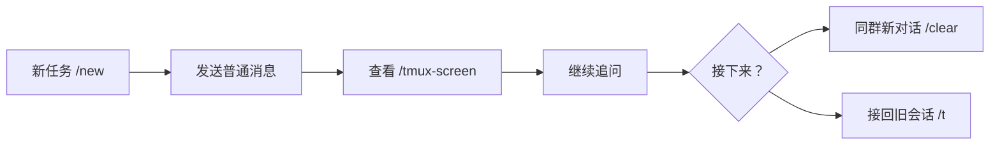

# 5 分钟上手：日常工作流

CodeLark 最常见的用法不是记住一组命令，而是：**为任务创建群聊，直接描述工作，需要时查看本地 TUI，再继续追问或切换会话**。

本页按本地匿名审计中的实际使用优先级组织，只保留最常用的入口。完整会话规则见 [会话与配置工作流](session-workflows.md)。

## 开始前只记住三件事

- **普通消息就是任务输入**：绑定会话后，直接发需求、补充条件或追问即可。
- **一个群聊管理一个任务**：用 `/new` 为新任务建立独立群聊，群名就是任务名。
- **默认使用 tmux**：安装完成后直接开始任务即可，不需要先选择运行方式。

## 一条完整的高频路径



### 1. 为任务创建群聊

在机器人私聊中发送 `/new` 打开表单，或直接指定任务名和项目目录：

```text
/new "修复登录问题" "~/work/my-app"
```

CodeLark 会创建一个新的任务群聊。进入新群后，后续消息都会在同一工作目录和会话里执行。

每个新建群都会收到初始化说明和一张“当前会话”卡片，其中固定提供两个配置入口：

- `/`：查看或修改**当前群**的会话配置。
- `/set`：查看或修改**全局默认配置**。

不需要先配置才能开始任务；默认值已经可用。需要调整时按下面的对应关系选择入口：

| 想修改什么 | 当前群：`/` | 全局默认：`/set` |
| --- | --- | --- |
| 对话名称、当前工作目录 | 修改当前群 | 设置新群默认工作目录 |
| 当前使用的 agent、模型和权限 | 只影响当前群 | 设置新群继承的默认值 |
| tmux 屏幕展示行数 | 只影响当前群 | 设置所有新群的默认行数 |
| Bridge、通道、流式反馈和 @bot 规则 | 不在这里修改 | 在 `/set` 对应分栏修改 |

可以把它理解为：**`/set` 提供默认值，`/` 保存当前群的覆盖值**。当前群的显式设置优先生效；在 `/` 卡片中选择“跟随上层配置”，就会删除该覆盖并重新跟随 `/set`。`/set` 的修改会被新群继承，也会影响尚未单独覆盖该字段的已有群。

如果只是想在当前群开始一段全新的对话，使用：

```text
/clear "继续重构" "~/work/my-app"
```

`/clear` 不删除旧会话，之后仍可通过 `/t` 接回。

### 2. 直接描述任务

像普通聊天一样发送需求即可。一个容易执行的任务通常包含目标、约束和验收方式：

```text
请定位登录接口偶发 500 的原因，修复后补回归测试；不要改公开 API，最后告诉我测试结果。
```

之后直接补充条件或追问。CodeLark 会把消息继续发送到当前会话，并用流式卡片展示思考、工具进度和结果。

### 3. 查看本地 TUI

tmux 屏幕是最常用的观察入口。任务长时间运行、等待选择或看起来卡住时，先查看当前屏幕：

```text
/tmux-screen
```

需要查看更多行或短时间持续刷新：

```text
/tmux-screen 120
/tmux-screen 120 5s
/tmux-screen stop
```

`/tmux-screen` 只读取屏幕，不会额外发送任务。若 TUI 正在等待权限、信任目录或启动选项，CodeLark 通常会发送可直接操作的选择卡片。

如果当前本地 TUI 已退出或需要重新启动，发送 `/p tmux`。它不是每次提问前的必需步骤。

### 4. 继续、停止或换上下文

- **继续当前任务**：直接发送普通消息。
- **停止当前任务**：发送 `/stop`。
- **当前群开启新对话**：发送 `/clear`。
- **找回本地旧会话**：发送 `/t`，再点击卡片或发送 `/t 1`。
- **确认当前绑定和配置**：发送 `/`。

## 复用本地已有会话

如果任务已经在本机 Codex、Claude Code、Kimi Code 或 Cursor Agent 中开始，不必重新创建：

```text
/t
/t 1
```

`/t` 默认展示当前 agent 最近 20 条本地会话；卡片可以切换 agent 和数量。接管后，直接发送普通消息即可继续原会话。

## 让任务自动继续

两个自动化命令覆盖大多数后台工作流：

```text
/then 测试通过后整理变更摘要
/every 30m 检查任务进度；如果失败，说明阻塞原因
```

- `/then`：当前任务完成或中断后，只发送一次后续输入。
- `/every`：按固定间隔复用当前会话发送输入。
- 不带参数发送 `/then` 或 `/every`，可以查看、修改或取消已有任务。

## 常用功能速查

| 使用优先级 | 目标 | 入口 |
| --- | --- | --- |
| 最高 | 提交任务、补充条件、继续追问 | 直接发送普通消息 |
| 很高 | 查看 tmux 中 agent 的真实状态 | `/tmux-screen` |
| 高 | 为新任务创建独立群聊 | `/new` |
| 高 | 当前群开始新对话 | `/clear` |
| 常用 | 接管本地已有会话 | `/t` |
| 常用 | 切换 Codex、Claude、Kimi、Cursor | `/runtime` |
| 常用 | 定时执行或完成后继续 | `/every`、`/then` |
| 按需 | 重启本地 TUI | `/p tmux` |
| 按需 | 停止任务、查看当前状态 | `/stop`、`/`、`/status` |
| 按需 | 发送本地文件、查看历史 | `/file <path>`、`/his` |
| 按需 | 修改当前会话或全局默认值 | `/`、`/set` |

`/hot-update` 主要面向从源码仓库运行 CodeLark 的维护场景，不属于普通 npm 用户的日常流程；npm 用户使用版本提示卡或 `npm install -g codelark@latest` 更新即可。

## 下一步

- 了解 attach、agent 切换和配置继承：[会话与配置工作流](session-workflows.md)
- 配置云文档评论和问题表单：[云文档与交互卡片](cloud-docs-and-cards.md)
- 查看全部命令和能力边界：[命令体系](../product/commands.md)
- 遇到收不到消息或卡片不更新：[排障指南](troubleshooting.md)
